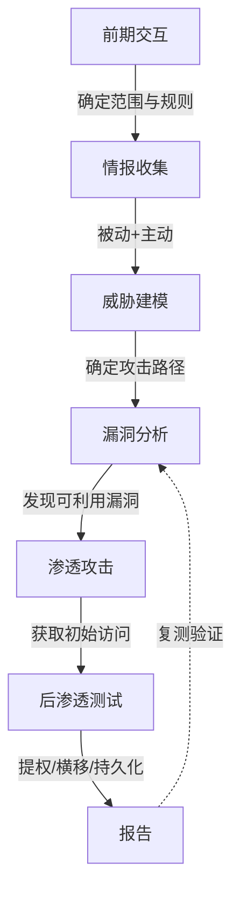

# 渗透测试及 Kali 介绍

## 安全问题

### 根源

> 分工导致认知盲区，人为失误不可避免。
>
> 1. 优点：分工明确，工作效率高
> 2. 缺点：从业人员对系统没有整体的认识，对安全认识较为片面
>
> **最大威胁是人** -- 人都会犯错，安全问题不能100%绝对根除。

### 安全目标

> 先于攻击者发现和防止漏洞出现
>
> 1. **攻击型**：以攻击者的思维发现漏洞、攻击系统
> 2. **防护型**：投入巨大，易有遗漏，不够全面，收效不高

## 渗透测试

> **目的**：尝试破解系统防御机制，发现系统弱点
>
> **注意**：
>
> - 属于攻击型防护思维
> - 从攻击者的角度思考，测量安全防护的有效性
> - **证明问题存在，而不是破坏**
> - 受法律和道德约束
> - 不局限于单台机器，着眼漏洞对整个系统的影响与危害

### 渗透测试标准

参考：[PTES](http://www.pentest-standard.org) | [OWASP Testing Guide](https://owasp.org/www-project-web-security-testing-guide/) | [NIST SP 800-115](https://csrc.nist.gov/publications/detail/sp/800-115/final)

1. **前期交互**：客户沟通，确定渗透测试范围，划分任务
2. **情报收集**：被动收集与主动探测结合，收集目标系统信息
3. **威胁建模**：根据收集到的信息，确定最有效、最可能成功的攻击途径
4. **漏洞分析**：通过版本分析、漏洞扫描，编写或选择漏洞利用代码
5. **渗透攻击**：实施攻击（一般并不像想象中那么顺利，目标系统有防护）
6. **后渗透测试**：以被渗透机器为跳板，进一步渗透整个系统
7. **渗透测试报告**：描述发现和利用过程，提供修复建议

### 渗透测试项目

> 1. **测试范围**：整个应用系统；系统较为庞大时，可分子系统
> 2. **客户授权**：允许攻击还是只做检测取决于客户授权
> 3. **测试方法**：
>    - 是否允许社会工程学攻击
>    - 是否允许 DoS 攻击
>    - 黑盒 / 白盒 / 灰盒测试

### 渗透测试常见误区

> 扫描器就是一切 -- 自动化工具有其局限性，对业务逻辑漏洞无能为力。扫描器应当作为辅助工具使用。

## Kali Linux 介绍

### 概述

> Kali Linux 是基于 Debian 的渗透测试专用发行版，由 Offensive Security 维护，集成了大量信息安全工具。

- 遵循 FHS 标准目录结构
- 定制内核（解决无线渗透等硬件兼容问题）
- 支持多平台：x86/x64、ARM、树莓派、手机端（NetHunter）
- 开源免费

### 版本演进

| 时期 | 版本 | 特点 |
|------|------|------|
| 2006-2012 | BackTrack | Kali 的前身 |
| 2013 | Kali 1.x | 首个 Kali 版本，默认 root |
| 2016 | Kali Rolling | 滚动更新模式 |
| 2020+ | Kali 2020.1+ | **默认非 root 用户**，默认 Xfce 桌面 |
| 2024+ | Kali 2024.x | Python 3 默认，工具持续更新 |

!!! warning "重要变化（2020+）"
    从 Kali 2020.1 开始，**默认用户不再是 root**，而是普通用户 `kali`，需要使用 `sudo` 提权执行特权命令。这是一个重大安全策略变化。

### 默认策略

- 默认非 root 用户（2020+ 版本），需 `sudo` 提权
- 默认关闭所有网络服务，自启动脚本默认关闭
- 更新升级策略（Debian + Kali 官方滚动更新）

## 最后要说的话

> **实践**是最好的老师。Kali 很强大，但不是全部，这仅仅是渗透测试的一个起点。勤于动手，多多实践。
