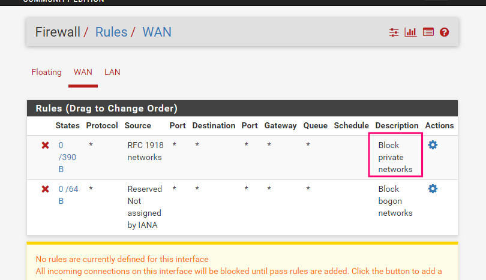
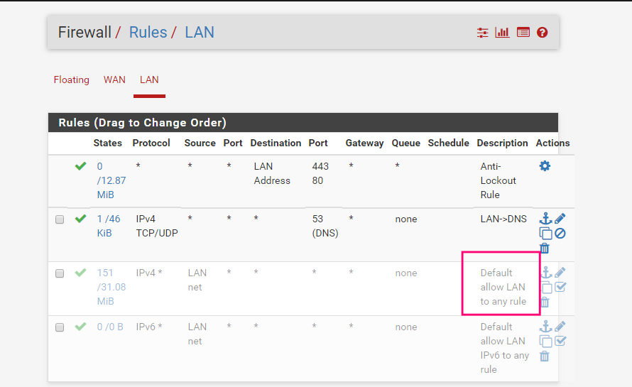

# 模拟网络拓扑


### 模拟网络环境:


#### 安装简单的单层防火墙

利用[M0n0wall防火墙](http://m0n0.ch/wall/downloads.php)

`m0n0安装命令`

-  m0n0wall console setup1

```
1) Interfaces: assign network ports   //接口：分配网络端口
2) Set up LAN IP address              //建立局域网IP地址
3) Reset web GUI password             //web GUI重置密码
4) Rest to factory defaults           //其他工厂默认值
5) Reboot system                      //重新启动系统
6) Ping host                          //Ping主机
7) Install on Hard Drive              //安装在硬盘上

Enter a number: 7

do you want to proceed? (y/n) y
取消硬盘m0n0wall_1.8.1.iso
重启
```

- m0n0wall console setup2

```
1) Interfaces: assign network ports   //接口：分配网络端口
2) Set up LAN IP address              //建立局域网IP地址
3) Reset web GUI password             //web GUI重置密码
4) Rest to factory defaults           //其他工厂默认值
5) Reboot system                      //重新启动系统
6) Ping host                          //Ping主机
7) Install on Hard Drive              //安装在硬盘上

Enter a number: 1

do you want to set up VLANs nows? (y/n)y

Enter the parent interface name for the new VLAN (or nothing if finished):em0
Enter the VLAN tag （1-4091): 10
Enter the parent interface name for the new VLAN (or nothing if finished):em1
Enter the VLAN tag （1-4091): 11
Enter the parent interface name for the new VLAN (or nothing if finished):em2
Enter the VLAN tag （1-4091): 12
回车
Enter the LAN interface name or 'a' for auto-detection: em1
Enter the WAN interface name or 'a' for auto-detection: em0
Enter the Optional 1 interface name or 'a' for auto-detection for nothing if finshed): em2
回车
The interface will be assigned as follows:
LAN  -> em1
WAN  -> em0
OPT1 -> em2
The firewall will reboot after saving the changes.
do you want to proceed? (y/n) y
The firewall is rebooting now.
重启
```

- m0n0wall console setup3

```
1) Interfaces: assign network ports   //接口：分配网络端口
2) Set up LAN IP address              //建立局域网IP地址
3) Reset web GUI password             //web GUI重置密码
4) Rest to factory defaults           //其他工厂默认值
5) Reboot system                      //重新启动系统
6) Ping host                          //Ping主机
7) Install on Hard Drive              //安装在硬盘上

Enter a number: 2

Enter the new LAN IP address: 10.1.1.10

Subnet masks are entered as bit counts (as in CIDR notation) in m0n0wall.
e.g.

​
255.255.255.0= 24
255.255.0.0  = 16
255.0.0.0    = 8
​
Enter the new LAN subnet bit count: 24

DO you want to enable the DHCP server on LAN (y/n) y

Enter the start address of the clinet address range: 10.1.1.20

Enter the end address of the client address range: 10.1.1.100
```


-  m0n0wall console setup4

```
1) Interfaces: assign network ports   //接口：分配网络端口
2) Set up LAN IP address              //建立局域网IP地址
3) Reset web GUI password             //web GUI重置密码
4) Rest to factory defaults           //其他工厂默认值
5) Reboot system                      //重新启动系统
6) Ping host                          //Ping主机
7) Install on Hard Drive              //安装在硬盘上

Enter a number: 3

do you wnat to proceed? (y/n) y

Description OPT1

IP address 10.1.2.10/24

设置防火墙规则
pules------> "+"------>
Protocol: any
Source: LAN subnet
保存

WAN------>勾选"Block private networks"
```

#### 稍复杂点：背靠背防火墙

[Pfsense](http://pfsense.org/)

好文参考:[OPNsense防火墙搭建][21368c1f]


[21368c1f]: http://www.freebuf.com/articles/network/157089.html "防火墙搭建"

#### 利用pfsense配置网络拓扑

1. 首先虚拟几块网卡. 可以如下图
> - 内网网卡虚拟
> 
> - 外网网卡虚拟
> 可以直接使用桥接网络或NAT模式.

2. 将pfsense的iso文件加载, 进行虚拟机安装.
3. 配置网络接口.
这里设计的网络拓扑为


选项2进行网络接口配置, 其中em2是桥接的网卡, em0是自己配置的内网网卡.接下来可以选项3进行内网的配置, 可以配置内网接口允许分配的ip范围及是否启用dhcp服务进行分配等(不过自己配置的时候发现在这里配置完之后, 后面再进web接口进行配置怎么调规则都不能让它的规则生效, 使内网接口主机允许上网,原因不明, 不知道是不是个例. 所以建议还是在web配置接口设置吧).

4. rules设置

这时启动一台win, 网络选择自己配置的那块网卡(预设的内网接口), 如果想上图设置可以发现自己的ip会自己分配为 192.168.1.x, 此时应该是可以上网的. 这时访问`https://192.168.1.1`, 进入防火墙配置界面, 默认用户名: `admin`, 密码: `pfsense`, 第一次进入会有引导设置, 按自己需求设置就好.

几条重要的规则.


WAN:
阻止内网地址访问外网



LAN:
允许内网访问外网



5. 启动kali, 网络接口选择桥接模式即可.

6. 一些坑: 预设的网络接口一点要先提前虚拟好, 不然安装完防火墙再添加虚拟网络接口, 再调配置各种莫名奇妙的问题.
