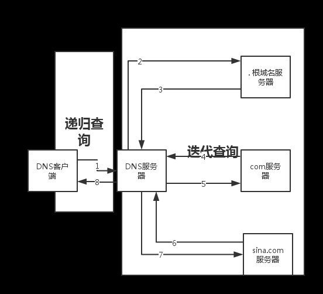
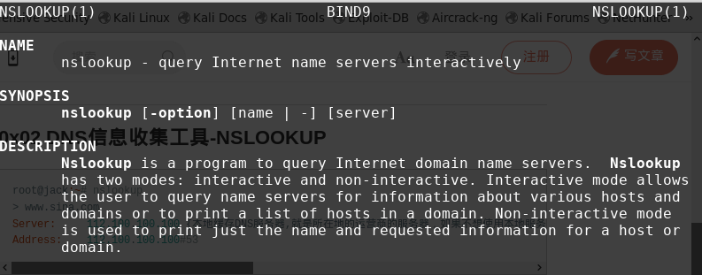

# DNS信息收集

## 0x01 相关概念
DNS: 把域名解析成IP的一种协议

> 对于一个网站最想了解的或许就是域名，比如sina.com这是一个域名(Domain Name)，www.sina.com则是完全限定域名(FQND:Fully Qualified Domain Name),FQND即是是该域名(sina.com)下的一个主机记录，主机记录也叫做A记录，当然也有可能是一个别名记录(C name)。每个域名都一个或者多个域名服务器，用来负责对该域名的解析，而域名服务器地址又是通过DNS里面的NS记录进行定义和注册的。此外每个域名或者也有自己的邮件服务器(MX记录)。而前面所有的解析记录都是将主机名解析成另外一个主机名或者IP地址，但是ptr则是一个反向解析记录的过程，即是将IP地址解析成主机名。


DNS请求方法说明

|方法|说明|
| ---------- | ---------- |
| A   | 地址记录,返回32位IPv4地址，最常用于将主机名映射到主机的IP地址，但也用于DNSBL，在RFC 1101中存 储子网掩码等 |
|CNAME    | 规范名字。这种记录允许您将多个名字映射到同一台计算机 |
| AAAA | IPv6地址记录,返回一个128位的IPv6地址，最常用于将主机名映射到主机的IP地址。 |
|SOA|  权限记录区域,指定关于DNS区域的权威信息，包括主要名称服务器，域管理员的电子邮件，域序列号以及与 刷新区域有关的多个定时器。|
| MX   | 邮件交换记录,将域名映射到该域的邮件传输代理列表。                                                                                                                                                                     
| NS   | 名称服务记录,委派一个DNS区域使用给定的权威名称服务器                                                                                                                                                                                                                                     |
| SPF  | 一个简单的电子邮件验证系统，旨在通过提供一种机制来检测电子邮件欺骗，以允许接收邮件交换者检查来自域的传入邮件来自该域管理员授权的主机                                                                                                                                                     |
| TXT  | 文本记录,可自定任意文本                                                                                                                                                                                                                                                                  |
| PTR  | 指针记录 ，指向规范名称的指针。 与CNAME不同，DNS处理停止，只返回名称。 最常见的用途是实施反向 DNS查询，但其他用途包括DNS-SD等。                                                                                                                                                          |
| SRV  | 服务定位器,通用服务位置记录，用于较新的协议，而不是创建协议特定的记录，如MX                                                                                                                                                                                                              |
| NSEC | Next,NSSEC的一部分,用于证明名称不存在。 使用与(过时的)NXT记录相同的格式                                                                                                                                                                                                                  |
| AXFR | 授权区域传输,将主区域名称服务器上的整个区域文件传输到辅助名称服务器. DNS区域传输通常用于跨多个DNS服务器复制DNS数据，或备份DNS文件. 用户或服务器将执行来自“名称服务器”的特定区域传输请求。如 果名称服务器允许区域传输发生，名称服务器托管的所有DNS名称和IP地址将以可读的ASCII文本形式返回 |
| IXFR | 增量区域传输,将整个区域文件从主名称服务器传输到辅助名称服务器                                                                                                                                                                                                                        |

DNS请求过程:
>   
> DNS 查询以各种不同的方式进行解析。有时，客户端也可使用从先前的查询获得的缓存信息就地应答查询。DNS 服务器可使用其自身的资源记录信息缓存来应答查询。DNS 服务器也可代表请求客户端查询或联系其他 DNS 服务器，以便完全解析该名称，并随后将应答返回至客户端。这个过程称为递归。另外，客户端自己也可尝试联系其他的 DNS 服务器来解析名称。当客户端这么做的时候，它会根据来自服务器的参考答案，使用其他的独立查询。该过程称作迭代。
> 
> 作者：onejustone
> 链接：https://www.jianshu.com/p/cbb05318cea2


**注意:** 现在的互联网上大部分的网站都会采用智能DNS
智能DNS的意思是：终端用户所处的网络不同,DNS查询结果是不一样的

## 0x02 常用查询工具
### nslookup:

  
```shell
#nslookup
> set type=a

> sina.com
Server:		10.211.55.1(本地缓存DNS服务器,就是所在地的运营商的服务器，如果不想使用本地服务商解析，可以更换任意的DNS服务器进行解析，比如:server 8.8.8.8更换为谷歌的DNS服务器进行解析！)
Address:	10.211.55.1#53

Non-authoritative answer:
Name:	sina.com
Address: 66.102.251.33

> www.sina.com 
Server:		10.211.55.1
Address:	10.211.55.1#53

Non-authoritative answer:
www.sina.com	canonical name = us.sina.com.cn.
us.sina.com.cn	canonical name = spool.grid.sinaedge.com.
Name:	spool.grid.sinaedge.com
Address: 116.1.238.73

也可以:
nslookup -q=any sina.com (-q 是type的替换)
```

可以看到www.sina.com并没有被直接解析为一个特定的IP地址，所以www.sina.com不是一个A记录，而是一个C name记录，转而被继续解析成us.sina.com.cn，一直解析知道主机记录。

```
> set type=any
> sina.com

返回:
Address: 66.102.251.33
sina.com    text = "v=spf1 include:spf.sinamail.sina.com.cn -all"
sina.com
    origin = ns1.sina.com.cn
    mail addr = zhihao.staff.sina.com.cn
    serial = 2005042601
    refresh = 900
    retry = 300
    expire = 604800
    minimum = 300
sina.com    nameserver = ns2.sina.com.
sina.com    nameserver = ns3.sina.com.
sina.com    nameserver = ns1.sina.com.cn.
sina.com    nameserver = ns2.sina.com.cn.
sina.com    nameserver = ns1.sina.com.
sina.com    nameserver = ns4.sina.com.cn.
sina.com    nameserver = ns4.sina.com.
sina.com    nameserver = ns3.sina.com.cn.
sina.com    mail exchanger = 10 freemx2.sinamail.sina.com.cn.
sina.com    mail exchanger = 10 freemx3.sinamail.sina.com.cn.
sina.com    mail exchanger = 5 freemx1.sinamail.sina.com.cn.
```
我们可以看到any查询出了sina.com域名的所有记录，ns记录，mail邮件交换记录。除此以为我们可以看到有一条特殊的记录即"text",SPF记录，其作用就是反垃圾邮件的，根据方向解析，获得垃圾邮件的来源地址，对服务器得到ip进行对比，若匹配则判断为正规邮件，不匹配则为垃圾邮件！

### dig
dig(Domain Information Groper),可以实现nslookup所有的功能,并且比其更强大更方便.
```
root@test:~# dig sina.com

; <<>> DiG 9.11.2-P1-1-Debian <<>> sina.com
;; global options: +cmd
;; Got answer:
;; ->>HEADER<<- opcode: QUERY, status: NOERROR, id: 19425
;; flags: qr rd ra; QUERY: 1, ANSWER: 1, AUTHORITY: 8, ADDITIONAL: 5

;; OPT PSEUDOSECTION:
; EDNS: version: 0, flags:; udp: 4096
;; QUESTION SECTION:
;sina.com.			IN	A

;; ANSWER SECTION:
sina.com.		125	IN	A	66.102.251.33

;; AUTHORITY SECTION:
sina.com.		52119	IN	NS	ns4.sina.com.
sina.com.		52119	IN	NS	ns4.sina.com.cn.
sina.com.		52119	IN	NS	ns2.sina.com.cn.
sina.com.		52119	IN	NS	ns3.sina.com.cn.
sina.com.		52119	IN	NS	ns2.sina.com.
sina.com.		52119	IN	NS	ns3.sina.com.
sina.com.		52119	IN	NS	ns1.sina.com.
sina.com.		52119	IN	NS	ns1.sina.com.cn.

;; ADDITIONAL SECTION:
ns1.sina.com.		51459	IN	A	114.134.80.144
ns2.sina.com.		51459	IN	A	114.134.80.145
ns3.sina.com.		51459	IN	A	61.172.201.254
ns4.sina.com.		51459	IN	A	123.125.29.99

;; Query time: 7 msec
;; SERVER: 10.211.55.1#53(10.211.55.1)
;; WHEN: Wed Jan 24 08:26:38 CST 2018
;; MSG SIZE  rcvd: 272
```
输出的信息很详细.
使用参数:
```
查询163邮箱的邮件服务器A记录
root@test:~# dig   +noall +answer A mail.163.com
mail.163.com.		81	IN	CNAME	mail163.ntes53.netease.com.
mail163.ntes53.netease.com. 108	IN	A	220.181.12.207
mail163.ntes53.netease.com. 108	IN	A	220.181.12.208
mail163.ntes53.netease.com. 108	IN	A	220.181.12.209
```
输出结果过滤显示:
```
root@test:~# dig   +noall +answer A mail.163.com | awk '{print $5}'
mail163.ntes53.netease.com.
220.181.12.207
220.181.12.208
220.181.12.209
```
反向域名解析(PTR记录),使用-x参数
```
root@test:~# dig -x 220.181.14.155 +noall +answer

; <<>> DiG 9.11.2-P1-1-Debian <<>> -x 220.181.14.155 +noall +answer
;; global options: +cmd
155.14.181.220.in-addr.arpa. 86400 IN	PTR	m14-155.188.com.
```
**查询DNS bind的版本信息**
大部分的DNS服务器均采用BIND,查询bind的版本信息,有助于直接入侵DNS服务器,或许所有fqdn记录.但不是所有DNS服务器可以查询BIND信息,绝大多数dns服务器都设置了保护模式,无法通过此方式查询.
```
root@test:~# dig +noall +answer sina.com ns
返回:
sina.com.		50204	IN	NS	ns3.sina.com.cn.
sina.com.		50204	IN	NS	ns2.sina.com.
sina.com.		50204	IN	NS	ns3.sina.com.
sina.com.		50204	IN	NS	ns1.sina.com.
sina.com.		50204	IN	NS	ns1.sina.com.cn.
sina.com.		50204	IN	NS	ns4.sina.com.
sina.com.		50204	IN	NS	ns4.sina.com.cn.
sina.com.		50204	IN	NS	ns2.sina.com.cn.
```
```
root@test:~# dig +noall +answer txt chaos VERSION.BIND ns3.sina.com.cn.
;; connection timed out; no servers could be reached
;; connection timed out; no servers could be reached
```
出不来也是很正常的,也有可能显示version为0也是无法查询.

dns查询追踪,并且指定nameserver为谷歌的域名服务器
```
root@test:~# dig +trace baidu.com
返回:
;; Warning: Message parser reports malformed message packet.

; <<>> DiG 9.11.2-P1-1-Debian <<>> +trace baidu.com
;; global options: +cmd
.			70160	IN	NS	k.root-servers.net.
.			70160	IN	NS	c.root-servers.net.
.			70160	IN	NS	a.root-servers.net.
.			70160	IN	NS	h.root-servers.net.
.			70160	IN	NS	e.root-servers.net.
.			70160	IN	NS	f.root-servers.net.
.			70160	IN	NS	l.root-servers.net.
.			70160	IN	NS	d.root-servers.net.
.			70160	IN	NS	j.root-servers.net.
.			70160	IN	NS	i.root-servers.net.
.			70160	IN	NS	b.root-servers.net.
.			70160	IN	NS	g.root-servers.net.
.			70160	IN	NS	m.root-servers.net.
;; Received 512 bytes from 10.211.55.1#53(10.211.55.1) in 8 ms

baidu.com.		248	IN	A	123.125.114.144
baidu.com.		248	IN	A	111.13.101.208
baidu.com.		41540	IN	NS	dns.baidu.com.
baidu.com.		41540	IN	NS	ns4.baidu.com.
baidu.com.		41540	IN	NS	ns2.baidu.com.
baidu.com.		41540	IN	NS	ns3.baidu.com.
baidu.com.		41540	IN	NS	ns7.baidu.com.
;; Received 240 bytes from 199.9.14.201#53(b.root-servers.net) in 7 ms
```
显示的结果为迭代查询的完整过程.


使用不同dns服务器进行查询(查询结果可能会有所不同)
```
root@test:~# dig 163.com any 
返回:
;; Connection to 10.211.55.1#53(10.211.55.1) for 163.com failed: connection refused.
;; Connection to fe80::21c:42ff:fe00:18%2#53(fe80::21c:42ff:fe00:18%2) for 163.com failed: connection refused.


使用谷歌域名服务器查询
root@test:~# dig 163.com any @8.8.8.8
返回:
; <<>> DiG 9.11.2-P1-1-Debian <<>> 163.com any @8.8.8.8
;; global options: +cmd
;; Got answer:
;; ->>HEADER<<- opcode: QUERY, status: NOERROR, id: 43144
;; flags: qr rd ra; QUERY: 1, ANSWER: 15, AUTHORITY: 0, ADDITIONAL: 1

;; OPT PSEUDOSECTION:
; EDNS: version: 0, flags:; udp: 512
;; QUESTION SECTION:
;163.com.			IN	ANY

;; ANSWER SECTION:
163.com.		21599	IN	SOA	ns4.nease.net. admin.nease.net. 20161110 7200 1800 1209600 60
163.com.		599	IN	A	123.58.180.7
163.com.		599	IN	A	123.58.180.8
163.com.		21599	IN	NS	ns6.nease.net.
163.com.		21599	IN	NS	ns1.nease.net.
163.com.		21599	IN	NS	ns4.nease.net.
163.com.		21599	IN	NS	ns5.nease.net.
163.com.		21599	IN	NS	ns3.nease.net.
163.com.		21599	IN	NS	ns2.166.com.
163.com.		21599	IN	NS	ns8.166.com.
163.com.		17999	IN	MX	10 163mx01.mxmail.netease.com.
163.com.		17999	IN	MX	10 163mx02.mxmail.netease.com.
163.com.		17999	IN	MX	10 163mx03.mxmail.netease.com.
163.com.		17999	IN	MX	50 163mx00.mxmail.netease.com.
163.com.		17999	IN	TXT	"v=spf1 include:spf.163.com -all"

;; Query time: 183 msec
;; SERVER: 8.8.8.8#53(8.8.8.8)
;; WHEN: Sat Jan 27 11:11:49 CST 2018
;; MSG SIZE  rcvd: 404
```

## 0x03 DNS区域传输
###  相关概念
> 区域传送简单理解其实把一个域名服务器的所有信息同步到另一个域名服务器.一般只允许同一域的服务器进行同步,如果配置错误,就可能造成所有域名服务器可同步过去,导致泄露DNS服务器的所有信息.
 
### 检测
+ 使用dig

```
root@test:~# dig @ns4.sina.com sina.com axfr

; <<>> DiG 9.11.2-P1-1-Debian <<>> @ns4.sina.com sina.com axfr
; (1 server found)
;; global options: +cmd
; Transfer failed.
```

+ 使用host

```
root@test:~# host -T -l sina.com ns4.sina.com
Using domain server:
Name: ns4.sina.com
Address: 123.125.29.99#53
Aliases: 

Host sina.com not found: 5(REFUSED)
; Transfer failed.
```
host的其它用法可以`man host`或`info host`

## 0x04 其他dns信息收集方式
### 爆破
查找特定工具自有字典或相关文件
`dpkg -L 工具名`
如`dpkg -L fierce`

####  使用fierce

```
fierce -dnsserver 8.8.8.8 -dns sina.com -wordlist /usr/share/fierce/hosts.txt
DNS Servers for sina.com:
	ns1.sina.com.cn
	ns2.sina.com
	ns3.sina.com
	ns2.sina.com.cn
	ns4.sina.com
	ns4.sina.com.cn
	ns1.sina.com
	ns3.sina.com.cn

Trying zone transfer first...

Unsuccessful in zone transfer (it was worth a shot)
Okay, trying the good old fashioned way... brute force

Checking for wildcard DNS...
Nope. Good.
Now performing 2280 test(s)...
```

 #### 使用dnsdict6(最新版没有集成,需要自己安装)
下载地址:[http://www.thc.org/releases/thc-ipv6-2.7.tar.gz](http://www.thc.org/releases/thc-ipv6-2.7.tar.gz)

```
tar xf 压缩包
cd 解压目录
安装依赖:
apt-get install libpcap-dev libssl-dev
编译安装:
make && make install
```

使用帮助
```
root@test:~# dnsdict6 -h
dnsdict6 v2.7 (c) 2014 by van Hauser / THC <vh@thc.org> www.thc.org

Syntax: dnsdict6 [-d4] [-s|-m|-l|-x|-u] [-t THREADS] [-D] domain [dictionary-file]

Enumerates a domain for DNS entries, it uses a dictionary file if supplied
or a built-in list otherwise. This tool is based on dnsmap by gnucitizen.org.

Options:
 -4      do also dump IPv4 addresses
 -t NO   specify the number of threads to use (default: 8, max: 32).
 -D      dump the selected built-in wordlist, no scanning.
 -d      display IPv6 information on NS and MX DNS domain information.
 -e      ignore no NS for domain errors
 -S      perform SRV service name guessing
 -[smlxu] choose the dictionary size by -s(mall=100), -m(edium=1419) (DEFAULT)
           -l(arge=2601), -x(treme=5886) or -u(ber=16724)

举例:
dnsdict6 -4 -d -t 16 -e -x sina.com
```

#### 使用dnsenum 

使用帮助

```
dnsenum -h
dnsenum VERSION:1.2.4
Usage: dnsenum [Options] <domain> 
[Options]:
Note: the brute force -f switch is obligatory.
GENERAL OPTIONS:
  --dnsserver 	<server>
			Use this DNS server for A, NS and MX queries.
  --enum		Shortcut option equivalent to --threads 5 -s 15 -w.
  -h, --help		Print this help message.
  --noreverse		Skip the reverse lookup operations.
  --nocolor		Disable ANSIColor output.
  --private		Show and save private ips at the end of the file domain_ips.txt.
  --subfile <file>	Write all valid subdomains to this file.
  -t, --timeout <value>	The tcp and udp timeout values in seconds (default: 10s).
  --threads <value>	The number of threads that will perform different queries.
  -v, --verbose		Be verbose: show all the progress and all the error messages.
GOOGLE SCRAPING OPTIONS:
  -p, --pages <value>	The number of google search pages to process when scraping names, 
			the default is 5 pages, the -s switch must be specified.
  -s, --scrap <value>	The maximum number of subdomains that will be scraped from Google (default 15).
BRUTE FORCE OPTIONS:
  -f, --file <file>	Read subdomains from this file to perform brute force.
  -u, --update	<a|g|r|z>
			Update the file specified with the -f switch with valid subdomains.
	a (all)		Update using all results.
	g		Update using only google scraping results.
	r		Update using only reverse lookup results.
	z		Update using only zonetransfer results.
  -r, --recursion	Recursion on subdomains, brute force all discovred subdomains that have an NS record.
WHOIS NETRANGE OPTIONS:
  -d, --delay <value>	The maximum value of seconds to wait between whois queries, the value is defined randomly, default: 3s.
  -w, --whois		Perform the whois queries on c class network ranges.
			 **Warning**: this can generate very large netranges and it will take lot of time to performe reverse lookups.
REVERSE LOOKUP OPTIONS:
  -e, --exclude	<regexp>
			Exclude PTR records that match the regexp expression from reverse lookup results, useful on invalid hostnames.
OUTPUT OPTIONS:
  -o --output <file>	Output in XML format. Can be imported in MagicTree (www.gremwell.com)
```

使用举例

```
dnsenum -f /usr/share/dnsenum/dns.txt -dnsserver 8.8.8.8 sina.com -o sina.xml
```

#### dnsmap

使用帮助

```
root@test:~# dnsmap
dnsmap 0.30 - DNS Network Mapper by pagvac (gnucitizen.org)

usage: dnsmap <target-domain> [options]
options:
-w <wordlist-file>
-r <regular-results-file>
-c <csv-results-file>
-d <delay-millisecs>
-i <ips-to-ignore> (useful if you're obtaining false positives)

e.g.:
dnsmap target-domain.foo
dnsmap target-domain.foo -w yourwordlist.txt -r /tmp/domainbf_results.txt
dnsmap target-fomain.foo -r /tmp/ -d 3000
dnsmap target-fomain.foo -r ./domainbf_results.txt
```
用例

```
dnsmap  -w wordlist.txt sina.com
```

 #### dnsrecon 

使用帮助

```
root@test:~# dnsrecon 
Version: 0.8.11
Usage: dnsrecon.py <options>

Options:
   -h, --help                   Show this help message and exit.
   -d, --domain      <domain>   Target domain.
   -r, --range       <range>    IP range for reverse lookup brute force in formats (first-last) or in (range/bitmask).
   -n, --name_server <name>     Domain server to use. If none is given, the SOA of the target will be used.
   -D, --dictionary  <file>     Dictionary file of subdomain and hostnames to use for brute force.
   -f                           Filter out of brute force domain lookup, records that resolve to the wildcard defined
                                IP address when saving records.
   -t, --type        <types>    Type of enumeration to perform (comma separated):
                                std       SOA, NS, A, AAAA, MX and SRV if AXRF on the NS servers fail.
                                rvl       Reverse lookup of a given CIDR or IP range.
                                brt       Brute force domains and hosts using a given dictionary.
                                srv       SRV records.
                                axfr      Test all NS servers for a zone transfer.
                                goo       Perform Google search for subdomains and hosts.
                                bing      Perform Google search for subdomains and hosts.
                                snoop     Perform cache snooping against all NS servers for a given domain, testing
                                          all with file containing the domains, file given with -D option.
                                tld       Remove the TLD of given domain and test against all TLDs registered in IANA.
                                zonewalk  Perform a DNSSEC zone walk using NSEC records.
   -a                           Perform AXFR with standard enumeration.
   -s                           Perform a reverse lookup of IPv4 ranges in the SPF record with standard enumeration.
   -g                           Perform Google enumeration with standard enumeration.
   -b                           Perform Bing enumeration with standard enumeration.
   -w                           Perform deep whois record analysis and reverse lookup of IP ranges found through
                                Whois when doing a standard enumeration.
   -z                           Performs a DNSSEC zone walk with standard enumeration.
   --threads         <number>   Number of threads to use in reverse lookups, forward lookups, brute force and SRV
                                record enumeration.
   --lifetime        <number>   Time to wait for a server to response to a query.
   --db              <file>     SQLite 3 file to save found records.
   --xml             <file>     XML file to save found records.
   --iw                         Continue brute forcing a domain even if a wildcard records are discovered.
   -c, --csv         <file>     Comma separated value file.
   -j, --json        <file>     JSON file.
   -v                           Show attempts in the brute force modes.
```
用例

```
dnsrecon -d sina.com --lifetime 10 -t brt -D usr/share/dnsrecon/namelist.txt -x sina.xml
```

### 利用搜索引擎

#### 可以使用recon-ng,后面会再详细介绍
