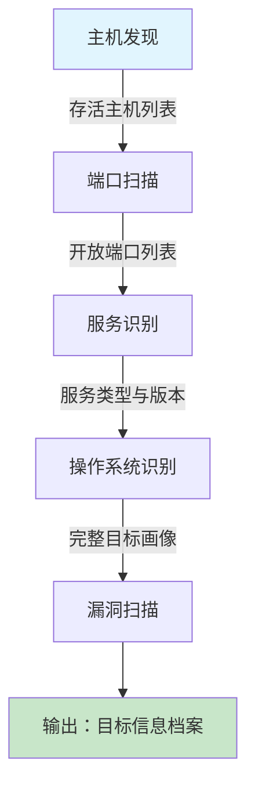

# 主动信息收集简介

## 0x01 简介

### 特点

- 直接与目标系统交互通信
- 无法避免留下访问的痕迹
- 常使用受控的第三方电脑进行探测
    - 使用代理或已被控制的主机
    - 做好被封杀的准备
    - 使用噪声迷惑目标，淹没真实的探测流量

### 实质

发送不同的探测包，根据返回结果判断目标状态。

### 与被动信息收集的对比

| 维度 | 被动收集 | 主动收集 |
|------|----------|----------|
| 交互 | 不直接接触目标 | 直接与目标交互 |
| 痕迹 | 几乎无痕 | 会留下日志记录 |
| 深度 | 表层信息 | 深层技术细节 |
| 风险 | 低 | 可能触发告警/封禁 |
| 工具 | 搜索引擎、WHOIS | Nmap、Masscan |

## 0x02 主动收集流程

1. **主机发现**：确定目标网络中哪些主机存活
2. **端口扫描**：发现存活主机上开放的端口
3. **服务识别**：确定端口上运行的服务及版本
4. **操作系统识别**：判断目标主机的操作系统类型
5. **漏洞扫描**：针对已知服务和版本，查找已知漏洞

## 0x03 常用工具速查

| 阶段 | 工具 | 说明 |
|------|------|------|
| 主机发现 | `nmap -sn` / `masscan` / `arp-scan` | 二层/三层/四层探测 |
| 端口扫描 | `nmap` / `masscan` / `rustscan` | SYN/TCP/UDP 扫描 |
| 服务识别 | `nmap -sV` / `amap` | Banner 抓取与指纹识别 |
| OS 识别 | `nmap -O` / `p0f` | 主动/被动 OS 指纹 |
| 漏洞扫描 | `nmap --script vuln` / `Nessus` / `OpenVAS` | 自动化漏洞检测 |

!!! tip "现代工具推荐"
    - **RustScan**：极速端口扫描器，扫描后自动调用 Nmap 进行服务识别
    - **Masscan**：号称最快的端口扫描器，适合大规模网络
    - **Nuclei**：基于模板的漏洞扫描器，社区模板库持续更新
