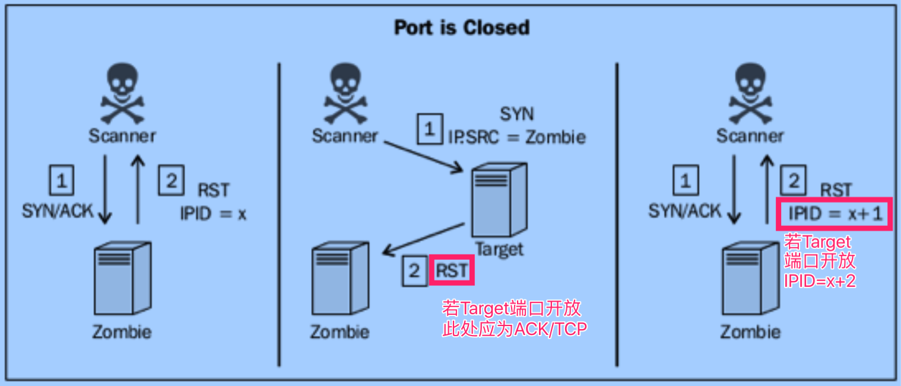

# 端口扫描

## 0x01 简介                
- 端口对应网络服务及应用端程序  
- 服务端程序的漏洞通过端口攻入  
- 目标:发现开放的端口                
- 更具体的攻击面

## 0x02 UDP端口扫描                                               
### 原理  
假设ICMP port-unreachable响应代表端口关闭               
**注意**
目标系统不响应ICMP port-unreachabl时，可能产生误判   
完整的UPD应用层请求的特点       
- 准确性高                                         
- 耗时巨大


### 工具
####  scapy  
udp_scan.py  
这里先说明一下,我用kali用是好使的,Mac的scapy跑,就不好使.
```python
#!/usr/bin/env python
# coding: utf-8

import logging
logging.getLogger("scapy.runtime").setLevel(logging.ERROR)
import subprocess
from scapy.all import *
import time

def Usage():
    if len(sys.argv)!=4:
        print "Usage ./udp_scan.py [start_port end_port]"
        print "Example ./udp_scan.py 1.1.1.1 50 100"
        print "This Example will perform an port scan port 50 to 100 of 1.1.1.1 use udp protocal"
        sys.exit()
    
def udp_scan():
    target = str(sys.argv[1])
    start_port = int(sys.argv[2])
    end_port = int(sys.argv[3])
    for port in range(start_port, end_port):
		ans = sr1(IP(dst=target)/UDP(dport=port), timeout=5, verbose=0)
		time.sleep(1)
		if ans == None:
			print port
		else:
			pass
				
    
if __name__ == '__main__':
    Usage()
    udp_scan()
```
#### namp
```bash
nmap -sU 1.1.1.1 
nmap -sU 1.1.1.1 -p 1-1024 #sk
```  
实现原理也是探测目标端口不可达.

## 0x03 TCP端口扫描
### 简介
基于连接的协议,三次握手保证网络连接质量
分类  
- 全连接扫描
- 隐蔽扫描
- 僵尸扫描

### 全连接扫描
原理  
> 建立完整三次握手
特点  
> 结果最准确,但会被目标主机记录到日志,扫描行为不隐蔽.

### 工具
#### scapy  
**注意:** 当用scapy发完syn包之后.系统会包收到到syn/ack当做没有来头的包,自动回复rst包,导致无法完成完整连接.所以需要使用网络底层命令iptables作一下处理.  
  

```bash
iptables -A OUTPUT -p tcp --tcp-flags RST RST -d localhost -j DROP
```

tcp_scan.py

```python 
#!/usr/bin/env python
# coding: utf-8

import logging
logging.getLogger("scapy.runtime").setLevel(logging.ERROR)
import subprocess
from scapy.all import *
import time

def Usage():
    if len(sys.argv)!=4:
        print "Usage ./tcp_scan.py [start_port end_port]"
        print "Example ./tcp_scan.py 1.1.1.1 50 100"
        print "This Example will perform an port scan port 50 to 100 of 1.1.1.1 use tcp protocal."
        sys.exit()
    
def syn_scan():
    target = str(sys.argv[1])
    start_port = int(sys.argv[2])
    end_port = int(sys.argv[3])
    for port in range(start_port, end_port):
		ans = sr1(IP(dst=target)/TCP(dport=port, flags='S'), timeout=1, verbose=0)
		time.sleep(1)
		if ans:
		    if int(ans[TCP].flags)==18:
			    print port
		else:
			pass	
    
if __name__ == '__main__':
    Usage()
    syn_scan()
```

#### nmap

```bash
默认1000个常用端口
nmap -sT 1.1.1.1 -p 80

nmap -sT 1.1.1.1 -p 80,21,25

nmap -sT 1.1.1.1 -p 80-2000

nmap -sT -iL iplist.txt -p 80
```

### dmitry
> 功能简单，但使用简便, 默认150个最常用的端口 
```bash
dmitry -p 172.16.36.135

dmitry -p 172.16.36.135 -o output
```

### nc
```bash
nc -nv -w 1 -z 192.168.0.199 1-100

for x in $(seq 20 30);do nc -nv -w 1 -z 1.1.1.$x;done 

for x in $(seq 20 30);do nc -nv -w 1 -z 1.1.1.1 $x;done | grep open
```

### 隐蔽扫描
原理
- 发送syn, 目标返回syn/ack之后,不再回应
- 应用日志不记录扫描行为,所以较为隐蔽.

工具  
#### scapy
syn_scan.py
```python
#!/usr/bin/env python
# coding: utf-8

import logging
logging.getLogger("scapy.runtime").setLevel(logging.ERROR)
import subprocess
from scapy.all import *
import time

def Usage():
    if len(sys.argv)!=4:
        print "Usage ./syn_scan.py [start_port end_port]"
        print "Example ./syn_scan.py 1.1.1.1 50 100"
        print "This Example will perform an port scan port 50 to 100 of 1.1.1.1 use tcp protocal"
        sys.exit()
    
def syn_scan():
    target = str(sys.argv[1])
    start_port = int(sys.argv[2])
    end_port = int(sys.argv[3])
    for port in range(start_port, end_port):
		ans = sr1(IP(dst=target)/TCP(dport=port, flags='S'), timeout=1, verbose=0)
		time.sleep(1)
		if ans:
		    if int(ans[TCP].flags)==18:
			    print port
		else:
			pass

				
    
if __name__ == '__main__':
    Usage()
    syn_scan()
```

#### nmap
```bash
nmap -sS 1.1.1.1
nmap -sS 1.1.1.1 -p 0-1024
nmap -sS 1.1.1.1 -p- --open #仅显示开放端口
```

#### hping3
```bash
hping3 1.1.1.1 --scan  80 -S
hping3 1.1.1.1 --scan 1-100 -S
hping3 1.1.1.1 --scan 80,21,22 -S
hping3 -c 10 --spoof 1.1.1.2 -p ++1 1.1.1.3 
# 发10个syn包,伪造源地址1.1.1.2,扫描目标为1.1.1.3,每次端口加1,
当你可以在1.1.1.2的主机抓包才可以看到扫描结果.当然也可做路由的端口镜像到可抓包的主机
```

### 僵尸扫描
可参考
https://www.jianshu.com/p/4dd4398a08ba

特点  
- 极其隐蔽
- 实施条件苛刻
- 需可伪造源地址
- 僵尸机须有如下特点
   - IP的ID顺序递增(Linux/Unix的IPID一般为0, 新版的Window一般随机产生, 一般只有老版Win符合)
   - 系统网络必须闲置

原理  
僵尸机收到syn/ack,IPID增1, 僵尸机收到RS, IPID不变.

**扫描过程**  
1. 最开始扫描者主机对Zombie(僵尸机)发送SYN/ACK包，然后Zombie（假设此时系统产生的IPID为x）会回个主机一个RST，主机将会得到Zombie的IPID；

2. 然后扫描主机向目标机器发送一个SYN包，有所不同的是，此时扫描主机会伪造一个伪装成Zombie的IP(即是x)向目标主机发送SYN包。

3. 如果目标的端口开放，便会向Zombie返回一个SYN/ACK包，但是人家Zombie并没有发送任何的包啊，zombie会觉得莫名其妙，于是向目标主机发送一RST过去询问，此时Zombie的IPID将会增加1(x+1)。若果目标主机的端口并未开放，那么目标主机也会想Zombie发送一个RST包，但是Zombie收到RST包不会有任何反应，所以IPID不会改变(依旧是x)。

4. 最后扫描者主机再向Zombie发送一个SYN/ACK，同样的Zombie会摸不着头脑，然后在懵懂中向扫描者主机发送一个RST包，此时Zombie的IPID将变成(x+2)。最后我们在zombies的迷惘中我们已经知道了我们想知道的。

图解  
  

工具  
#### scapy


```python
#!/usr/bin/python
#-*-coding:utf-8-*-

import logging
logging.getLogger("scapy.runtime").setLevel(logging.ERROR)
from scapy.all import *

def ipid(zombie):#定义一个ipid函数，同时定义一个zombie变量。该函数的作用是探测一主机是否可以作为僵尸机
  reply1 = sr1(IP(dst=zombie)/TCP(flags="SA"), timeout=2,verbose=0)#向zombie发送一个syn/ack包
  send(IP(dst=zombie)/TCP(flags="SA"),verbose=0)#send()与sr1()方法的区别是:sr1发送出去一个包以后会在接收对方的一个回包，而send方法不会接收包
  reply2 = sr1(IP(dst=zombie)/TCP(flags="SA"),timeout=2,verbose=0)#紧接着在向僵尸机发送一个syn/ack包
  if reply2[IP].id == (reply1[IP].id+2):#根据发送的三个来判断僵尸机是否足够空闲,并且ipid序号是否为递增的。
    print("IPID secquence is incremental and target appears to be idle,ZOMBIE LOCATED")
    response = raw_input("Do you want to use this zombie to perform a scan?(Y or N):")
    if response == "Y": #是否使用该僵尸机执行扫描
      target = raw_input("Enter the IP address of the target system:") #输入要扫描的目标主机ip
      zombiescan(target, zombie)
  else:
    print("Either the IPID secquence is not incremental or the target if not idle. NOT A Good zombie")

def zombiescan(target, zombie):
  print("\nScanning target"+target+"with zombie"+zombie)
  print"\n-------Open Ports On Target-----\n"
  for port in range(1,100):#扫描目标1-100的端口
    try:
      start_val = sr1(IP(dst=zombie)/TCP(flags="SA",dport=port),timeout=2,verbose=0)
      send(IP(src=zombie,dst=target)/TCP(flags="S",dport=port),verbose=0)
      end_val = sr1(IP(dst=zombie)/TCP(flags="SA"),timeout=2,verbose=0)
      if end_val[IP].id == (start_val[IP].id+2):
        print(port)
    except:
      pass

#主函数内容
print"------Zombie Scan Suite------\n" #这是僵尸扫描套件程序
print"1.----Identity Zombie Host\n" #识别僵尸机
print"2.----Preform Zombie Scan\n"  #执行扫描过程
aws = raw_input("Select an Option (1 or 2):")
if aws == "1":
  zombie = raw_input("Enter IP address to test IPID sequence:")
  ipid(zombie)
else:
  if aws == "2":
    zombie = raw_input("Enter IP address for zombie System:\n")
    target = raw_input("Enter IP address for Scan Target:\n")
    zombiescan(target,zombie)
```

#### nmap
```bash
检测是否是一个合格的僵尸机
nmap -p445 僵尸主机ip --script=ipidseq.nse
回显:
445/tcp open  microsoft-ds
MAC Address: 00:1C:42:31:84:33 (Parallels)
Host script results:
|_ipidseq: Incremental!


端口扫描
nmap p目标ip -sI 僵尸主机i:端口 -Pn -P 0-100
```
   
