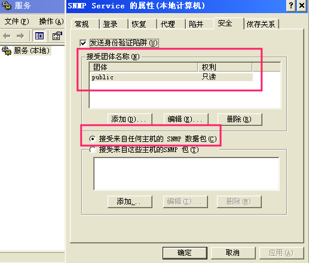

# SNMP

> 简单网络管理协议（SNMP），由一组网络管理的标准组成，包含一个应用层协议（application layer protocol）、数据库模型（database schema）和一组资源对象。该协议能够支持网络管理系统，用以监测连接到网络上的设备是否有任何引起管理上关注的情况。该协议是互联网工程工作小组（IETF，Internet Engineering Task Force）定义的internet协议簇的一部分。SNMP的目标是管理互联网Internet上众多厂家生产的软硬件平台，因此SNMP受Internet标准网络管理框架的影响也很大。SNMP已经出到第三个版本的协议，其功能较以前已经大大地加强和改进了。

- 信息的金矿, 经常被错误配置
- 默认community: public 常用 prtvate / manager

默认选项
  

## 0x01 snmp的配置

windows 为例
```
运行 appwiz.cpl

进入添加删除程序, 添加系统组件, 添加监控组件, 插入安装光盘, 安装组件.

安装完成后
运行 services.msc

进入服务, 会发现
snmp service及相关服务.

进入snmp Service 可以配置一些安全选项.
陷阱可以作为客户端用, 自动推送一些数据给监控服务器.

比较安全的配置
更改community 名称, 只接受特定主机snmp包.
```


## 0x 检查查询工具
### onesixtyone

```
onesixtyone 1.1.1.1 public

onesixtyone -c dict.txt -i hosts -o my.log -w 100

查询系统用户
snmpwalk -c public -v 2c 1.1.1.1 1.3.6.1.4.1.77.1.2.25
```

### snmpwalk 

```
snmpwalk 192.168.20.199 -c public -v 2c
```

### snmp-check

```
snmp-check  192.168.0.157
```
