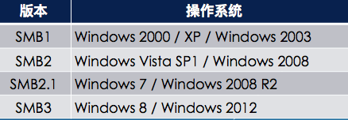

# SMB扫描
> Server Message Block协议 

- 微软历史上出现问题最多的协议
- 实现复杂
- 默认开放
- 文件共享
- 空会话未身份认证访问(SMB1)
  - 密码策略
  - 用户名
  - 组名
  - 机器名
  - 用户、组SID


  

## 0x02 工具
### nmap
```bash
nmap -v -p139,445 192.168.60.1-20

nmap 192.168.60.4 -p139,445 --script=smb-os-discovery.nse

ls /usr/share/nmap/scripts/ | grep smb  # 查看可利用脚本

nmap -v 192.168.0.157 -p 139,445 --script=smb-vuln-ms08-067.nse --script-args=unsafe
```

### nbtscan

#### 特长: 在同一局域网内,即使跨网段, 也可能发现MAC地址.
```bash
nbtscan -r 1.1.1.1

nbtscan -v -s : 192.168.0.1/24
```

### enum4linux

```bash
enum4linux -a 192.168.60.10
```
