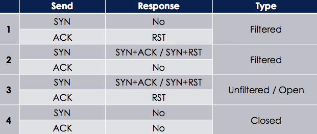

# 其它


## 0x01 防火墙探测工具
> 通过检查回包，可能是被端口是否经过防火墙过滤, 但是设备多种多样，结果存在一定误差 

  

### scapy

Fw_detect.py

```python
#!/usr/bin/env python
import sys
import logging
logging.getLogger("scapy.runtime").setLevel(logging.ERROR)
from scapy.all import *

if len(sys.argv)!=3:
    print "Usage - ./Fw_detect.py [Target-IP] [Target Port]"
    print "Example - ./Fw_detect.py 10.0.0.5 443"
    print "Example will determine if filtering exists on port 443 of host 10.0.0.5"
    sys.exit()

ip = sys.argv[1]
port = int(sys.argv[2])

ACK_response = sr1(IP(dst=ip)/TCP(dport=port,flags='A'),timeout=1,verbose=0)
SYN_response = sr1(IP(dst=ip)/TCP(dport=port,flags='S'),timeout=1,verbose=0)
if (ACK_response == None) and (SYN_response == None):
    print "Port is either unstate filtered or host is down"
elif ((ACK_response == None)or (SYN_response == None)) and not ((ACK_response == None) and (SYN_response == None)):
    print "Staeful filtering in place"
elif int(SYN_response[TCP].flags) == 18:
    print "Port is unfiltered and open"
elif int(SYN_response[TCP].flags) == 20:
    print "Port is unfiltered and closed"
else:
   print "Unable to determine if the port is filtered"

```
### nmap
> Nmap有系类防火墙过滤检测功能

```
可以先发默认syn包, 再发ack, 根据返回结果, 对照表.
nmap -sA 172.16.36.135 -p 22
```

## 0x02 负载均衡识别
> 广域网负载均衡

+ DNS实现负载均衡
+ HTTP-Loadbalancing
  + Nginx
  + APache

### lbd

```
lbd www.baidu.com
```

## 0x03 WAF识别 
> WEB应用防火墙

### wafw00f

```
wafw00f -l #查看支持的waf检查列表

wafw00f http://www.microsoft.com
```

### nmap

```
nmap www.microsoft.com --script=http-waf-detect.nse
```
