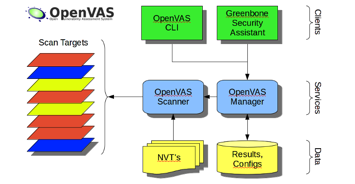
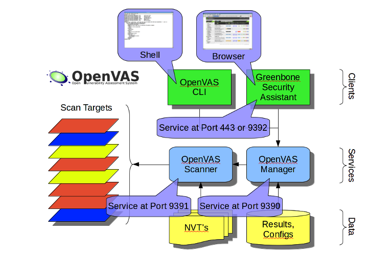
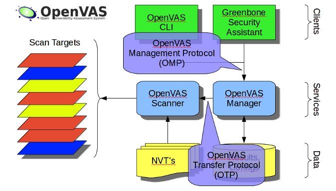
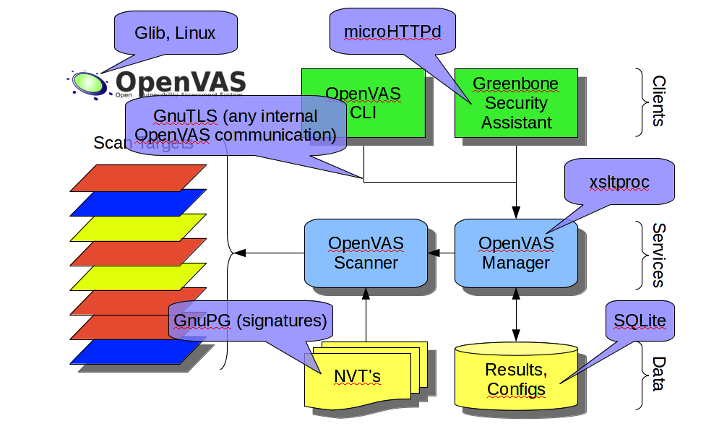
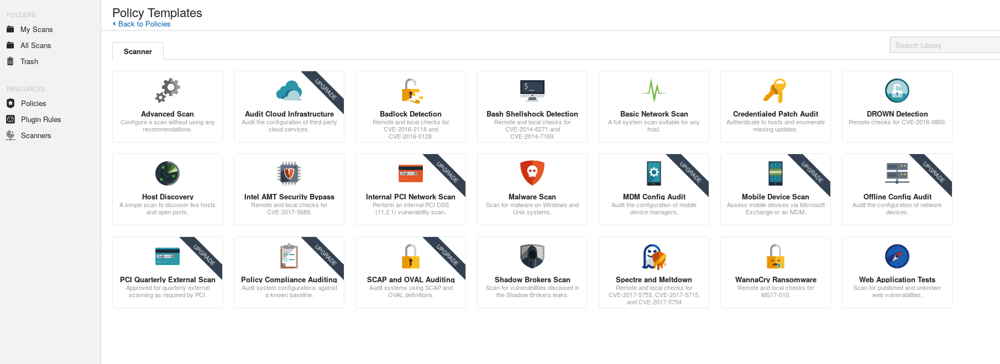
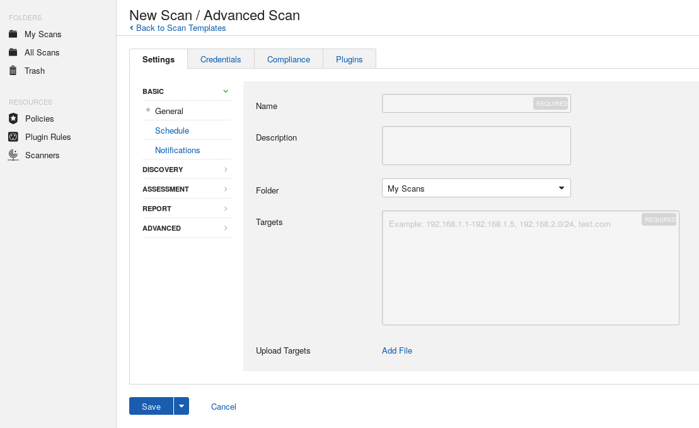

# 工具

## 0x01 nmap
> 利用nmap扫描脚本, 共近600个.

### 查看脚本

```
ls /ur/share/nmap/scripts/

cat /usr/share/nmap/scripts/script.db

grep vuln /usr/share/nmap/scripts/script.db | cut -d "\"" -f 2
```
### 检查点
> 有时很难说什么才是准确的扫描结果, 应综合的看待漏洞威胁

+ 扫描结果确认
+ 目标系统版本
+ 补丁是否安装
+ 是否可被入侵


### 举例
#### smb-vuln-ms10-061.nse
+ Stuxnet蠕虫利用的4个漏洞之一
+ Print Spooler权限不当，打印请求可在系统目录可创建文件、执行任意代码
+ LANMAN API枚举共享打印机
+ 远程共享打印机名称
+ smb-enum-shares枚举共享
  + smb-enum-shares枚举共享

  ```
  nmap 192.168.0.100 -p445 --script=smb-enum-shares.nse --script-args=smbuser=admin,smbpassword=pass

  nmap  -p 445 <target> --script=smb-vuln-ms10-061
  ```

## 0x02 OPENVAS
> Nessus项目分支, 管理目标系统的漏洞, 免费开源, Kali默认安装，但未配置和启动, 更新频繁.


### 简介

总图:



细节:








#### OpenVAS Manager
- 控制scanner和气筒manager的中心组建
- 控制中心数据库，保存用户配置及扫描结果
- 客户点使用基于XML的无状态OMP协议与其通信
- 集中排序筛选，使客户端获得一致展现

#### OpenVAS Scanner
- 具体执行Network Vnlerability Tests (NVTs)
- NVTs每天通过Feed更新
- 受Manager控制

#### OSP Scanner
- 可以统一管理多个scanner
- 将一组scanner作为一个对象交给manager管理

#### Greenbone Security Sssistant (GSA)
> 提供Web service

#### OpenVAS CU
> amp命令行工具，可实现批处理控制manager

### 安装
1. 安装
2. 创建证书
3. 同步弱点数据库
4. 创建客户端证书
5. 重建数据库
6. 备份数据库
7. 启动服务装入插件
8. 创建管理员账号
9. 创建普通用户账号
10. 配置服务侦听端口
11. 安装验证

```
直接执行
openvas-setup
完成上述步骤
```

#### 检查安装结果

```
openvas-check-setup
```

### 查看当前账号

```
openvasmd --get-users
```

### 修改账号密码

```
openvasmd --user=admin --new-password=password
```

### 升级

```
openvas-feed-update
```

### 经验
> 对于老版本启动失败的处理方法

```
vi /usr/bin/openvas-start
Starting OpenVas Services
Starting OpenVas Manager:openvasmd
Starting OpenVas Scanner:openvassd
Starting Greenbone Security Assistant:gsad
```

### 启动
```
openvas-start

https://127.0.0.1:9392
```

### 配置
- 配置扫描目标
- 配置扫描端口列表
- 配置扫描项
- 配置登录尝试
- 报告,调度等配置

### 扫描
- 新建扫描任务
- 向导快速扫描
- 结果显示漏洞细节,安全风险等级和可靠度,修改建议等

### 报告
> 点击扫描task, 进入漏洞报告页面, 可以导出pdf等等报告格式

### 其它功能
- 资产信息
- 安全信息
- 垃圾箱
- 升级更新状态
- 账号管理等等

## 0x03 NESSUS
> 分为专业版和免费版, 区别在于专业版可以无限的并发连接和使用一些扫描策略模板.

- 下载安装: https://www.tenable.com/downloads/nessus (dpkg -i deb包即可), 注册获取激活码: https://www.tenable.com/products/nessus-home
- 启动:

```
service nessusd start
之后可以访问
https://localhost:8834
```

### 策略
> 配置扫描策略, 扫描种类,  等信息
> 重点在**插件**的配置, 可以配置用户名密码进行系统的登录检查.


选中Advance进入自定义配置

### 扫描
> 配置扫描目标, 扫描调度, 及报告邮寄提醒设置等



### 其它设置
> 配置通知邮箱服务, 用户名密码等信息.

## 0x04 NEXPOSE
> Rapid 7打造, 较完美的实现完整的漏洞管理
> 是一款极佳的漏洞扫描工具，跟一般的扫描工具不同，Nexpose自身的功能非常强大。可以更新其漏洞数据库，以保证最新的漏洞被扫描到。可以给出哪那些漏洞可以被Metasploit Exploit，哪些漏洞在Exploit-db里面有exploit的方案。可以生成非常详细的，非常强大的Report，涵盖了很多统计功能和漏洞的详细信息。

### 下载安装

```
建议VM 4G内存
# 下载系统虚拟机
http://download2.rapid7.com/download/NeXpose-v4/NexposeVA.ova

http://IP_addr:3780  (nxadmin / nxpassword)               # 管理页面用户名密码

# 注册获取激活码, 不能用免费邮箱注册,企业邮箱, 学校邮箱可以.139邮箱似乎也行.
http://www.rapid7.com/products/nexpose/virtual-appliance-enterpirse.jsp
操作系统账号密码：nexpose
```

### 使用
>  可以新建扫描模板, 然后再资产新建目标, 之后扫描, 可配置项非常多, 非常细致. 之后可以选择报告, 报告甚至可以设置中文.
