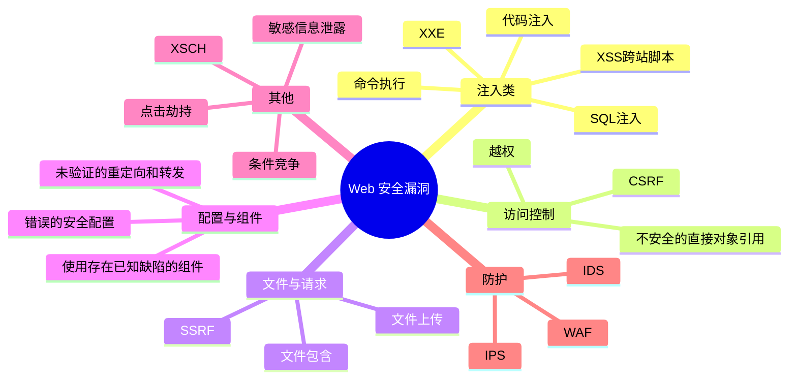

## 0x01 Web渗透介绍

> 即利用Web的漏洞进行攻击, Web正在迅速发展, 所以以Web作为渗透的切入口, 也越来越流行

## 0x02 Web安全词条
> 参考来源：乌云知识库（已关闭）

### SQL注入

> 针对SQL注入的攻击行为可描述为通过在用户可控参数中注入SQL语法，破坏原有SQL结构，达到编写程序时意料之外结果的攻击行为。其成因可以归结为以下两个原因叠加造成的：
> 1. 程序编写者在处理应用程序和数据库交互时，使用字符串拼接的方式构造SQL语句
> 2. 未对用户可控参数进行足够的过滤便将参数内容拼接进入到SQL语句中

### XSS跨站脚本攻击

> 跨站脚本攻击(Cross Site Scripting)，为不和层叠样式表(Cascading Style Sheets, CSS)的缩写混淆，故将跨站脚本攻击缩写为XSS。恶意攻击者往Web页面里插入恶意html代码，当用户浏览该页之时，嵌入其中Web里面的html代码会被执行，从而达到恶意攻击用户的特殊目的。

### 代码注入

> 当应用在调用一些能将字符串转化成代码的函数（如php中的eval）时，没有考虑用户是否能控制这个字符串，将造成代码注入漏洞。 狭义的代码注入通常指将可执行代码注入到当前页面中，如php的eval函数，可以将字符串代表的代码作为php代码执行，当用户能够控制这段字符串时，将产生代码注入漏洞（也称命令执行）。 广义上的代码注入，我觉得可以覆盖大半安全漏洞的分类。只要是用户可以控制的“数据”，被当做“代码”给注入到程序中，就是代码注入漏洞。如，SQL注入漏洞实际上是“数据”被当做SQL语句注入到正常SQL语句中了，XSS漏洞是数据被当做“javascript”被注入到HTML中了，文件包含漏洞是数据（某文件）被当做“脚本文件”被注入当正常脚本流程中了。 这个wiki主要介绍狭义上的代码注入漏洞。

### 命令执行

> 当应用需要调用一些外部程序去处理内容的情况下，就会用到一些执行系统命令的函数。如PHP中的system、exec、shell_exec等，当用户可以控制命令执行函数中的参数时，将可以注入恶意系统命令到正常命令中，造成命令执行攻击。 这里还是主要以PHP为主介绍命令执行漏洞，Java等应用的细节待补充。

### 文件包含

> 如果允许客户端用户输入控制动态包含在服务器端的文件，会导致恶意代码的执行及敏感信息泄露，主要包括本地文件包含和远程文件包含两种形式。

### CSRF

> 跨站请求伪造（Cross-Site Request Forgery，CSRF）是一种使已登录用户在不知情的情况下执行某种动作的攻击。因为攻击者看不到伪造请求的响应结果，所以CSRF攻击主要用来执行动作，而非窃取用户数据。当受害者是一个普通用户时，CSRF可以实现在其不知情的情况下转移用户资金、发送邮件等操作；但是如果受害者是一个具有管理员权限的用户时CSRF则可能威胁到整个Web系统的安全。

### SSRF

> SSRF(Server-Side Request Forgery:服务器端请求伪造) 是一种由攻击者构造形成由服务端发起请求的一个安全漏洞。一般情况下，SSRF攻击的目标是从外网无法访问的内部系统。

### 文件上传

> 在网站的运营过程中，不可避免地要对网站的某些页面或者内容进行更新，这时便需要使用到网站的文件上传的功能。如果不对被上传的文件进行限制或者限制被绕过，该功能便有可能会被利用于上传可执行文件、脚本到服务器上，进而进一步导致服务器沦陷。

### 点击劫持

> Clickjacking（点击劫持）是由互联网安全专家罗伯特·汉森和耶利米·格劳斯曼在2008年首创的。
>
> 是一种视觉欺骗手段，在web端就是iframe嵌套一个透明不可见的页面，让用户在不知情的情况下，点击攻击者想要欺骗用户点击的位置。
>
> 由于点击劫持的出现，便出现了反frame嵌套的方式，因为点击劫持需要iframe嵌套页面来攻击。
>
> 下面代码是最常见的防止frame嵌套的例子：
> ```
> if(top.location!=location)
    > top.location=self.location;
> ```

### URL重定向

> VPS（Virtual Private Server 虚拟专用服务器）技术，将一部服务器分割成多个虚拟专享服务器的优质服务。实现VPS的技术分为容器[1]  技术，和虚拟化技术[2]  。在容器或虚拟机中，每个VPS都可分配独立公网IP地址、独立操作系统、实现不同VPS间磁盘空间、内存、CPU资源、进程和系统配置的隔离，为用户和应用程序模拟出“独占”使用计算资源的体验。VPS可以像独立服务器一样，重装操作系统，安装程序，单独重启服务器。VPS为使用者提供了管理配置的自由，可用于企业虚拟化，也可以用于IDC资源租用。
> IDC资源租用，由VPS提供商提供。不同VPS提供商所使用的硬件VPS软件的差异，及销售策略的不同，VPS的使用体验也有较大差异。尤其是VPS提供商超卖，导致实体服务器超负荷时，VPS性能将受到极大影响。相对来说，容器技术比虚拟机技术硬件使用效率更高，更易于超卖，所以一般来说容器VPS的价格都高于虚拟机VPS的价格。
> 这些VPS主机以最大化的效率共享硬件、软件许可证以及管理资源.。每个VPS主机都可分配独立公网IP地址、独立操作系统、独立超大空间、独立内存、独立CPU资源、独立执行程序和独立系统配置等. VPS主机用户除了可以分配多个虚拟主机及无限企业邮箱外， 更具有独立主机功能, 可自行安装程序, 单独重启主机.

### 条件竞争

> 条件竞争漏洞是一种服务器端的漏洞，由于服务器端在处理不同用户的请求时是并发进行的，因此，如果并发处理不当或相关操作逻辑顺序设计的不合理时，将会导致此类问题的发生。

### XXE

> XXE Injection 即 XML External Entity Injection, 也就是XML外部实体注入攻击.漏洞是在对非安全的外部实体数据进⾏行处理时引发的安全问题.
> 在XML1.0标准⾥里,XML文档结构⾥里定义了实体(entity)这个概念.实体可以通过预定义在文档中调用,实体的标识符可访问本地或远程内容.如果在这个过程中引入了”污染”源,在对XML文档处理后则可能导致信息泄漏等安全问题.

### XSCH

> 由于网站开发者在使用flash、Silverlight等进行开发的过程中的疏忽，没有对跨域策略文件（crossdomain.xml）进行正确的配置导致问题产生。
> 例如：
>
> ```
    > <cross-domain-policy><allow-access-from domain=“*”/></cross-domain-policy>
> ```
> 因为跨域策略文件配置为*，也就指任意域的flash都可以与它交互，导致可以发起请求、获取数据。

### 越权（功能级访问缺失）

> 越权漏洞是Web应用程序中一种常见的安全漏洞。它的威胁在于一个账户即可控制全站用户数据。当然这些数据仅限于存在漏洞功能对应的数据。越权漏洞的成因主要是因为开发人员在对数据进行增、删、改、查询时对客户端请求的数据过分相信而遗漏了权限的判定。所以测试越权就是和开发人员拼细心的过程。

### 敏感信息泄露

> 敏感信息指不为公众所知悉,具有实际和潜在利用价值,丢失、不当使用或未经授权访问对社会、企业或个人造成危害的信息。包括：个人隐私信息、业务经营信息、财务信息、人事信息、IT运维信息等。

### 泄露途径

> Github、百度文库、Googlecode、网站目录、其他途径..

### 错误的安全配置

> (Security Misconfiguration）：有时候，使用默认的安全配置可能会导致应用程序容易遭受多种攻击。在已经部署的应用、Web服务器、数据库服务器、操作系统、代码库以及所有和应用程序相关的组件中，都应该使用现有的最佳安全配置，这一点至关重要。

### 不安全的直接对象引用

> 如果应用程序提供其内部对象的直接引用，并且没有进行正确验证，那么可能会导致攻击者操纵这些引用并访问未经授权的数据。这个内部对象可能是用户账户的参数值、文件名或目录。在访问控制检查完成之前，限制所有用户可访问的内部对象，可以确保对相关的对象的每一次访问都是经过验证的。

### 使用存在已知缺陷的组件

> 由于系统有意无意间使用了组件（自己的组件和第三方的组件，导致了不可预料的问题
> 如以下曾爆发过影响较大的安全问题：
> Open SSL、Struts2、Fck、CMS..

### 未验证的重定向和转发

> 未验证的重定向和转发（Unvalidated Redirects and Forwards）：很多Web应用程序使用动态参数将用户重定向或者转到某个特定的URL上。攻击者可以通过相同的方法伪造一个恶意的URL，将用户重定向到钓鱼网站或恶意站点上。这种攻击方式还可用于请求转发到未经授权的网页上

### Waf

> Web应用防护系统（也称：网站应用级入侵防御系统。英文：Web Application Firewall，简称： WAF）。利用国际上公认的一种说法：Web应用防火墙是通过执行一系列针对HTTP/HTTPS的安全策略来专门为Web应用提供保护的一款产品。

### IDS

> IDS是英文“Intrusion Detection Systems”的缩写，中文意思是“入侵检测系统”。专业上讲就是依照一定的安全策略，通过软、硬件，对网络、系统的运行状况进行监视，尽可能发现各种攻击企图、攻击行为或者攻击结果，以保证网络系统资源的机密性、完整性和可用性。做一个形象的比喻：假如防火墙是一幢大楼的门锁，那么IDS就是这幢大楼里的监视系统。一旦小偷爬窗进入大楼，或内部人员有越界行为，只有实时监视系统才能发现情况并发出警告。

### IPS

> 入侵防御系统(IPS: Intrusion Prevention System)是电脑网络安全设施，是对防病毒软件（Antivirus Programs）和防火墙(Packet Filter, Application Gateway)的补充。 入侵预防系统(Intrusion-prevention system)是一部能够监视网络或网络设备的网络资料传输行为的计算机网络安全设备，能够即时的中断、调整或隔离一些不正常或是具有伤害性的网络资料传输行为。

## 0x03 现代 Web 安全工具推荐

| 工具 | 类型 | 说明 |
|------|------|------|
| **Burp Suite** | 代理/综合平台 | 行业标准 Web 安全测试工具，支持抓包、重放、扫描、插件扩展 |
| **nuclei** | 漏洞扫描 | 基于 YAML 模板的快速漏洞扫描器，社区模板丰富 |
| **ffuf** | 模糊测试 | 高性能 Web 模糊测试工具，支持目录爆破、参数爆破、虚拟主机发现 |
| **sqlmap** | SQL 注入 | 自动化 SQL 注入检测与利用工具 |
| **XSStrike** | XSS 检测 | 专注于跨站脚本漏洞的检测与利用工具 |
