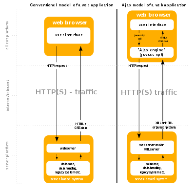

# 重要概念

## AJAX(Asynchronous JavaScript And XML)
> - 是一个概念而非新的编程语言,是现有技术的组合
> - 通过客户端脚本动态更新页面内容,而非整个页面.
> - 降低带宽使用,提高速度
> - 提升用户体验
> - 后台异步访问

### AJAX组件
- JavaScript: ajax的核心组件, 使用XMLHTTPRequest对象接口向服务器发起请求,接受并处理服务器的响应数据.

### Dynamic HTML(DHTML)
- 早于AJAX出现, 通过JavaScript, css等在客户端修改HTML页面, 缺点是完全依赖客户的的代码修改页面,与服务器的交互通过JavaScript Applets 完成, AJAX的XHR弥补了它的缺点(举例: 注册账号的重名检查)

### Document Object Model(DOM)
- 处理html, xml文档对象的框架, DHTML是一个浏览器, DOM作为其一个实现的接口, 定义和管理每个页面元素obj的Properties, method, event

### 基于AJAX的Web应用工作流
- XMLHTTPRequest API 创建xmlhttp对象进行访问
- 多个异步请求独立通信互不依赖.
- 常见的AJAX框架
  - JQuery
  - Dojo Toolkit
  - Google web toolkit (GWT) Microsoft AJAX library
  

### AJAX的安全问题
- 多种技术混合, 增加了攻击面, 每个参数都可能形成独立的攻击过程
- AJAX引擎是全功能的脚本解释器, 访问恶意站点可能后果严重, 虽然浏览器有沙盒和SOP, 但有可能被绕过
- 服务器, 客户端代码结合使用容易混乱, 服务器访问控制不当,可能导致信息泄露
- 可能暴露应用程序逻辑

### AJAX对渗透测试的挑战
- 异步请求数量多且隐蔽
- 触发AJAX请求的条件无规律
- 手动或截断爬网可能产生大量遗漏
- AJAX爬网工具
  - ZAP
- 其它审计方式
- 网页源码审计
- Firebug的HXR

## WebService
> - 面向服务的架构(Service oriented architecture) 便于不同系统集成共享数据和功能
> - 尤其适合不想暴露数据模型和程序逻辑而访问数据的场景
> - 一般无页面

### 两种类型的Web Service
- Simple object access protocal (SOAP)
  - 传统的Web Service 开发方法, xml是唯一的数据交换格式
  - 要求安全性较高的应用更多采用
- RESTful(Requestational State Transfer Architecture)
  - 目前更多被采用的轻量Web Service , Json是首选数据交换格式

  
### Web Service的安全考虑
- 使用API key 或 session token实现验证和跟踪身份
- 身份认证有服务器完成,而非客户端
- API key, 用户名, Session token 永远不要使用url传递
- RESTful 默认不提供任何安全机制, 需要使用ssl/tls保护传输数据的安全
- SOAP提供强于HTTPS的WS-security机制
- 使用OAuth或Hmac进行身份验证
- RESTful应只允许身份认证用户使用PUT, DELETE方法
- 使用随机token防止csrf攻击
- 对用户提交参数是过滤, 建议实施严格白名单
- 报错信息消毒处理
- 直接对象引用应严格身份验证(如以ID作为索引)
