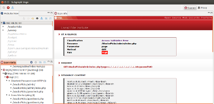

# Vega

> Java编写的开源Web扫描器，跨平台支持（Linux、OS X、Windows），类似于 Paros Proxy、Fiddler、Skipfish 和 ZAProxy。
>
> 下载地址: [https://subgraph.com/vega/download/index.en.html](https://subgraph.com/vega/download/index.en.html)
>
> **注意**：Vega 已从 Kali Linux 工具列表中移除（因依赖已废弃的 libwebkitgtk-1.0-0），项目处于维护状态，建议优先考虑其他现代扫描工具。

## 0x01 主要功能

- **Automated Crawler and Vulnerability Scanner**: 自动爬网与漏洞扫描
- **Intercepting Proxy**: 截断代理模式
- **SSL MITM**: SSL中间人支持（`http://vega/ca.crt` 导入证书）
- **Content Analysis**: 内容分析
- **Extensibility**: 通过 JavaScript Module API 扩展
- **Customizable alerts**: 自定义告警规则

## 0x02 扫描模块

| 模块 | 说明 |
|------|------|
| Cross Site Scripting (XSS) | 跨站脚本检测 |
| SQL Injection | SQL注入检测 |
| Directory Traversal | 目录遍历 |
| URL Injection | URL注入 |
| Error Detection | 错误检测 |
| File Uploads | 文件上传漏洞 |
| Sensitive Data Discovery | 敏感数据发现 |

## 0x03 使用方式

支持两种模式:

1. **扫描模式**: 自动爬站、处理表单、注入测试
2. **代理模式**: 配合浏览器手动测试（推荐使用 autoproxy 等浏览器插件）

