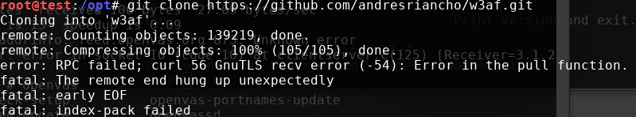
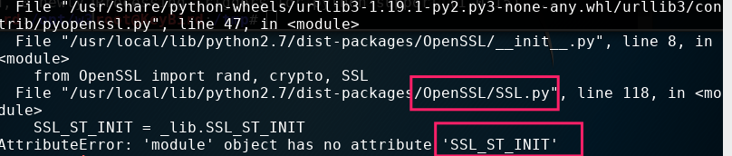
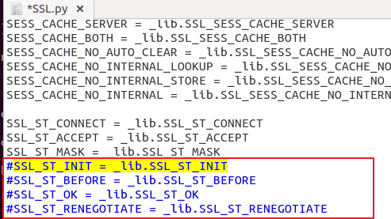
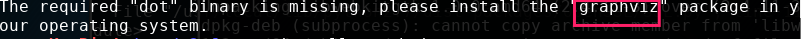
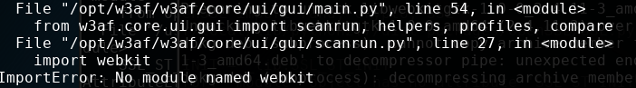
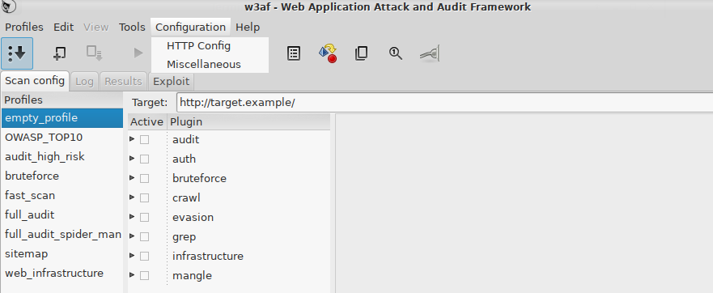

# w3af

## 0x01 简介
> 较著名的Web渗透测试框架, 功能强大, 不过实际使用过程不是太稳定.

## 0x02 安装
```bash
cd /opt/
apt install python-pip
pip install -upgrade pip
```
```bash
git clone https://github.com/andresriancho/w3af.git
```
注意:
这里我自己遇到了一个报错.(出现这个问题可以检查一下当前目录是否还有足够的空间,后面检查发现是当前目录没有足够存储空间造成的)

这里参考了别人的处理办法.
> 这是由于git默认缓存大小不足导致的，使用下面的命令增加缓存大小
```bash
$ git config --global http.postBuffer 2000000000
```
之后再clone就正常了.

继续执行命令
```bash
cd /w3af
./w3af_gui
这里会显示需要安装的依赖项,和安装依赖文件,在/tmp/w3af_dependency_install.sh
可以执行:
/tmp/w3af_dependency_install.sh
但是这样还是会有依赖项错误,所以可以先不执行
```


```bash
apt-get build-dep python-lxml
apt-get install libssl-dev
pip install pybloomfiltermmap==0.3.15
```
然后
```bash
vim /opt/w3af/w3af/core/controllers/dependency_check/requirements.py
修改PIPDependency(‘pybloomfilter’, ‘pybloomfiltermmap’, ‘0.3.14’)
为
PIPDependency(‘pybloomfilter’, ‘pybloomfiltermmap’, ‘0.3.15’)

vim w3af/core/controllers/dependency_check/platforms/mac.py
同样的
MAC_CORE_PIP_PACKAGES.remove(PIPDependency(‘pybloomfilter’, ‘pybloomfiltermmap’, ‘0.3.15’)
```
这时再执行
```bash
/tmp/w3af_dependency_install.sh
```
应该就没有报错了,但是执行
```bash
/opt/w3af/w3af_gui
```
还是会报错,一个一个解决.


处理方式
```bash
geany /usr/local/lib/python2.7/dist-packages/OpenSSL/SSL.py
把这几行注释掉.
```

再有报错

处理方式
```bash
apt install graphviz
```
还有报错

处理方式:
```bash
wget https://ftp.br.debian.org/debian/pool/main/p/pywebkitgtk/python-webkit_1.1.8-3_amd64.deb
然后
dpkg -i python-webkit_1.1.8-3_amd64.deb
报依赖项错误,apt install -f 再执行还是报错,于是手动安装依赖项
```
```bash
wget https://ftp.br.debian.org/debian/pool/main/w/webkitgtk/libjavascriptcoregtk-1.0-0_2.4.11-3_amd64.deb
wget https://ftp.br.debian.org/debian/pool/main/p/python-support/python-support_1.0.15_all.deb
wget https://ftp.br.debian.org/debian/pool/main/w/webkitgtk/libwebkitgtk-1.0-0_2.4.11-3_amd64.deb

dpkg -i libjavascriptcoregtk-1.0-0_2.4.11-3_amd64.deb
dpkg -i python-support_1.0.15_all.deb
dpkg -i libwebkitgtk-1.0-0_2.4.11-3_amd64.deb
```
```bash
dpkg -i python-webkit_1.1.8-3_amd64.deb
还报错,但是执行apt install -f 之后可以自动修复依赖项,这时再执行
dpkg -i python-webkit_1.1.8-3_amd64.deb
```

这时再执行
```bash
/opt/w3af/./w3af_console
/opt/w3af/w3af_gui
```
应该都是OK的.但是,先前已经安装的环境不一,不排除同样的步骤也安装不成功.总之,根据报错信息,一步步处理,应该没有问题.



## 0x03 使用
