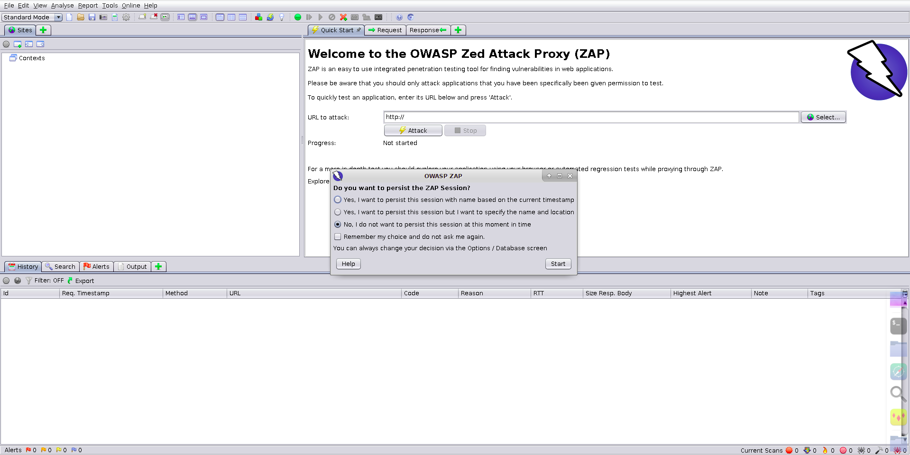

# OWASP ZAP

> Zed Attack Proxy，OWASP出品的Web应用集成渗透测试和漏洞挖掘工具。开源免费、跨平台、简单易用，类似于 Burpsuite 的开源替代。

## 0x01 核心功能

- **截断代理**: 拦截和修改HTTP请求/响应
- **主动扫描**: 主动发送测试请求探测漏洞
- **被动扫描**: 通过正则表达式规则被动分析流经代理的流量，不影响应用运行速度
- **Fuzzy**: 模糊测试
- **暴力破解**: 支持目录扫描和密码爆破
- **API**: 通过 `http://zap/` 访问

## 0x02 基本设置

1. **本地代理**: 菜单栏 → 工具 → 选项 → 本地代理
2. **连接设置**: 工具 → 选项 → Connection（设置超时、网络代理、认证）
3. **Spider 设置**: 工具 → 选项 → Spider（连接线程等）
4. **暴力破解**: 工具 → 选项 → 暴力破解（导入字典文件）
5. **扫描策略**: 分析 → 扫描策略

```bash
# 确认 ZAP 代理端口
netstat -pantu | grep 8080
```

## 0x03 重要配置

| 配置项 | 说明 |
|--------|------|
| **Persist Session** | 持久化会话 |
| **Mode** | safe / Protected / Standard / ATTACK |
| **Scan policy** | 扫描策略配置 |
| **Anti CSRF Tokens** | CSRF Token处理 |
| **HTTPS CA** | CA证书配置 |
| **Scope / Contexts** | 测试范围与上下文 |
| **Http Sessions** | Session Token管理 |
| **Passive scan** | 被动扫描规则 |

## 0x04 标准扫描工作流程

1. **设置代理**: 配置浏览器使用 ZAP 代理
2. **手动爬网**: 手动浏览应用，探索所有功能
3. **自动爬网**: 使用 Spider 发现遗漏的链接
4. **暴力扫描**: 使用字典扫描未引用的文件和目录
5. **主动扫描**: 自动扫描发现基本漏洞
6. **手动测试**: 针对扫描结果进行人工验证和深入测试

## 0x05 模糊测试 (Fuzzer)

大量无效或意外数据提交到目标的技术:

- 菜单栏 → 工具 → 选项 → Fuzzer 导入测试列表
- 可选择默认测试的漏洞类型

## 0x06 升级插件

- 通过 `add-ons` 管理界面安装和更新插件
- 字典文件目录: ZAP安装目录下的 `dirbuster/`


