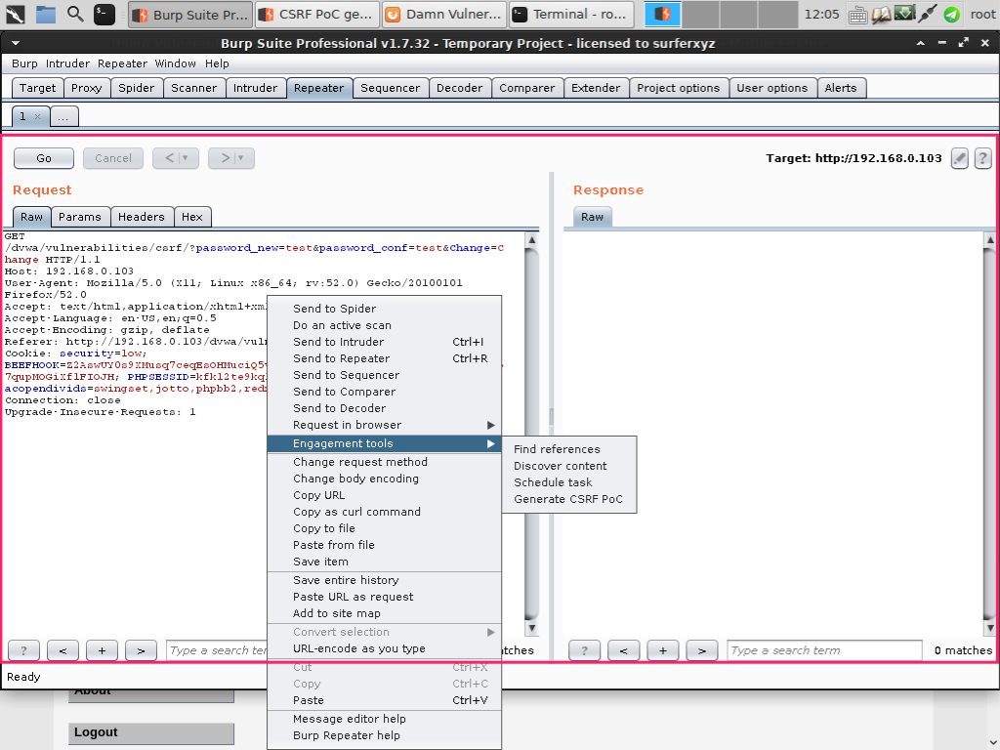
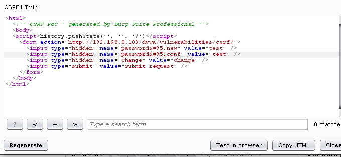

# CSRF 

## 0x01 简介
> 是一种业务逻辑漏洞,形成原因是对关键操作缺少确认机制.自动化扫描工具无法发现此类漏洞.

### CSRF与XSS的区别
> 从信任的角度来区分 
> + xss: 利用用户对站点的信任
> + scrf: 利用站点对已经身份认证的信任

### 主要利用点
+ 结合社工在身份认证会话过程中实现攻击
+ **在用户非自愿、不知情的情况下提交请求**
+ 修改账号密码、个人信息（email、收获地址）
+ 发送伪造的业务请求（网银、购物、投票）
+ 关注他人社交账号、推送博文

### 漏洞利用条件
+ 被害用户已经完成身份认证 
+ 新请求的提交不需要重新身份认证或确认机制
+ 攻击者必须了解Web APP请求的参数构造 
+ 诱使用户触发攻击的指令（社工）

## 0x02 漏洞查找
### Burp scrf Poc Generator
  
  
可以把代码复制到自己的Web网站上访问做测试.

 ### 自动扫描程序的检测方法
 + 在请求和响应过程中检查是否存在anti-CSRF token
 + 检查服务器是否验证anti-CSRF token
 + 检查token中可编辑的字符串
 + 检查referrer头是否可以伪造

## 0x03 对策
+ 二次确认Captcha 验证码
+ 二次确认密码
+ anti-CSRF token
+ 验证Referrer头 
+ 降低会话超时时间
