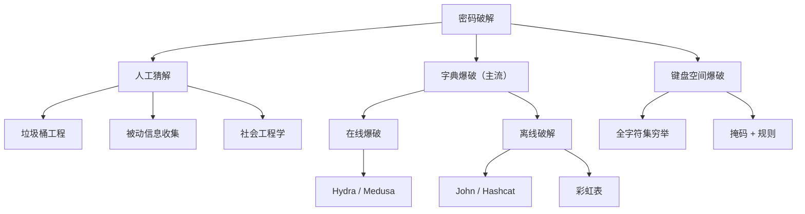

# 认证
> 证明你是你声称的那个人

## 0x01 前言
> 当目标系统实施了强的安全措施
+ 安装了所有补丁
+ 无任何已知漏洞
+ 无应用层漏洞
+ 攻击面最小化 
这时, 我们很难通过漏洞攻击进去,这时, 我们就应该尝试获取合法用户用户身份, 登录进目标系统.

**思路**
+ 社会工程学方法
+ 获取目标系统用户身份
  + 非授权用户不受信, 认证用户可以访问守信资源
  + 已有账号权限受限, 需要提权
  + 不会触发系统报警

## 0x02 身份认证方法
+ 你知道什么(账号密码, pin, passhrase)
+ 你有什么(令牌, token, key, 证书, 密保, 手机验证码)
+ 你是谁(指纹, 视网膜, 虹膜, 掌纹, 面部识别)

基于互联网的身份认证主要为账号密码认证

## 0x03 密码破解方法

+ 人工猜解
  + 垃圾桶工程
  + 被动信息收集
  + 社工
+ 基于字典的爆破(主流)
+ 键盘空间字符爆破
