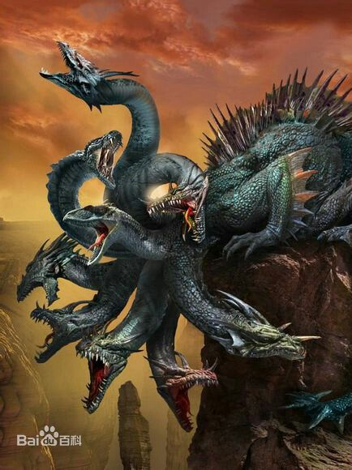

# 暴力破解

## 0x01 字典
主要包括
+ 全键盘空间字符
+ 部分键盘空间字符
+ 数字, 小写字母, 大写字符, 符号, 空格, 瑞典字符, 高位ASCII

### kali中的常用字典
+ /usr/share/wordlist
+ /usr/share/wfuzz
+ /usr/share/seclists

### 字典生成-crunch

```
man crunch

# <charset string> 默认是小写字符
crunch <min-len> <max-len> [<charset string>] [options]

crunch 6 6 0123456789 -o START -d 2 -b 1mb / -c 100

-b 按大小分割字典文件(kb/kib、mb/mib、gb/gib)
-c 每个字典的行数
以上两个参数必须与-o START 结合使用
-d 限制同一字符连贯出现数量

指定字符集
crunch 4 4 -f /usr/share/crunch/charset.lst lalpha-sv -o pass.txt

无重复字符
crunch 1 1 -p 1234567890 | more
-p 必须是最后一个参数
最大、最小字符长度失效，但必须存在
与-s 参数不兼容(-s 指定起始字符串)
crunch 4 4 0123456789 -s 9990

读取文件中每行内容作为基本字符生成字典
crunch 1 1 -q readfile

字典组成规则(掩码方式)
crunch 6 6 -t pass@,%%^^ | more
@:小写字母 lalpha
,:大写字母 ualpha
%:数字 numeric
^:符号 symbols

输出文件压缩
crunch 4 4 -t @,%^ -o 1.txt -z 7z
其他压缩格式:gzip、bzip2、lzma
7z压缩比率最大

其它
crunch 4 4 -f /usr/share/crunch/charset.lst mixalpha- numeric-all-space -o w.txt -t @d@@ -s cdab
crunch 4 5 -p dog cat bird
crunch 5 5 abc DEF + \!@# -t ,@^%,
 + 占位符(这里表示全部数字),  \ 转义符(空格、符号)

crunch 5 5 -t ddd%% -p dog cat bird
任何不同于-p 参数指定的值都是占位符, 所以ddd可以用其它字符替换
crunch 5 5 -d 2@ -t @@@%%

组合应用
crunch 2 4 0123456789 | aircrack-ng a.cap -e MyESSID -w -
crunch 10 10 12345 --stdout | airolib-ng testdb -import passwd -
```

### 字典生成-cupp
> 按个人信息生成字典

```
git clone https://github.com/Mebus/cupp.git
python cupp.py -i
```

###  字典生成-cewl
> 根据爬网结果生成字典(按字符频率生成)

```
cewl 1.1.1.1 -m 3 -d 3 -e -c -v -w pass.txt

-m:最小单词长度
-d:爬网深度
-e:收集包含email地址信息
-c:每个单词出现次数
支持基本、摘要 身份认证
支持代理
```

### 字典生成-用户密码变形

```
- 基于 cewl 的结果进行密码变型 - 末尾增加数字串
- 字母大小写变化
- 字母与符号互相转换
- 字母与数字互相转换
- P@$$w0rd
```

### 字典生成-john
使用 John the Ripper 配置文件实现密码动态变型

```
man john 

改
/etc/john/john.conf

改[List.Rules:Wordlist]
$[0-9]$[0-9]$[0-9]
john --wordlist=cewl.txt --rules --stdout > m.txt


[List.Rules:test]
$[0-9]$[0-9]$[0-9]$[a-zA-Z]$[a-zA-Z]$[a-zA-Z]$[`~!@#$%^&*()\-_=+]
john --wordlist=cewl.txt --rules=test --stdout > m.txt
john --wordlist=ahm.lst --rules=test HASHFILE
```

## 0x02 在线破解

### hydra
> 九头蛇，砍去一个头即长出新头，后为大力神赫拉克勒斯所杀


#### Windows密码破解

```
hydra -l administrator -P pass.lst smb://1.1.1.1/admin$ -vVd
hydra -l administrator -P pass.lst rdp://1.1.1.1 -t 1 -vV
```

#### Linux密码破解

```
hydra -l root -P pass.lst ssh://1.1.1.1 -vV
```

#### 其他服务密码破解

```
hydra -L user.lst -P pass.lst ftp://1.1.1.1 -s 2121 -e nsr -o p.txt -t 8
```

#### HTTP表单身份认证

```
hydra -l admin -P pass.lst 1.1.1.1 http-post-form "/dvwa/login.php:username=^USER^&password=^PASS^&Login=L in:S=index.php" -V

hydra -l admin -P pass.lst 1.1.1.1 http-post-form "/dvwa/login.php:username=^USER^&password=^PASS^&Login=L in:Login Failed" -V

/foo.php:user=^USER^&pass=^PASS^:S=success:C=/page/cookie:H=X-Foo: Foo
C:先访问指定页面取得cookie
H:指定http头
支持: https-post-form、http-get-form、https-get-form
-S:使用SSL连接
```

#### 图形化界面
> xhydra

#### pw-inspector
> 按长度和字符集筛选字典 

```
pw-inspector -i /usr/share/wordlists/nmap.lst -o p.lst -l
pw-inspector -i /usr/share/wordlists/nmap.lst -o P.lst -u
```

#### hydra的密码破解效率
> 不太稳定, 默认16个并发请求, 容易造成密码正确也识别不出, 可以-t参数指定并发

##### 影响因素
+ 密码复杂度(字典命中率)
+ 带宽、协议、服务器性能、客户端性能
+ 锁定阈值
+ 单位时间最大登陆请求次数

#### Hydra 的缺点
- 稳定性差，程序时常崩溃
- 速度控制不好，容易触发服务屏蔽或锁死机制 - 每主机新建进程，每服务新建实例
- 大量目标破解时性能差

### medusa
> 她的头发都是蛇。根据诗人阿波罗多洛斯的《书库》所述，她是戈耳戈女妖之一，外观描述是缠着龙鳞的头，像野猪一般的獠牙，青铜的手爪，金色的翅膀。任何直望美杜莎双眼的人都会变成石像，蛇发女妖美杜莎后来被英雄修柏斯斩除。


#### Medusa 的特点
- 稳定性好
- 速度控制得当
- 基于线程
- 支持模块少于hydra(不支持RDP) - WEB-Form支持存在缺陷(只支持登录失败失败方式)

#### 使用

```
medusa # 直接输入显示帮助
-n:非默认端口
-s:使用SSL连接
-T:并发主机数
-q:Display module's usage information

显示支持协议
medusa -d

破解windows密码
medusa -M smbnt -h 1.1.1.1 -u administrator -P pass.lst -e ns -F

破解Linux SSH密码
medusa -M ssh -h 192.168.20.10 -u root -P pass.lst -e ns -F

其他服务密码破解
medusa -M mysql -h 1.1.1.1 -u root -P pass.lst -e ns -F

medusa -h 1.1.1.1 -u admin -P pass.lst -M web-form -m FORM:"dvwa/login.php" -m DENY-SIGNAL:"login.php" -m FORM- DATA:"post?user=username&pass=password&Login=Login"

medusa -M ftp -q
```


## 0x03 离线破解
> 主要用于hash的破解

### 优势
+ 离线不会触发密码锁定机制
+ 不会产生大量登陆失败日志引起管理员注意

### hash识别
+ hash‐identifier
+ hashid
+ 可能识别错误或无法识别

###  Windows HASH获取

```
利用漏洞:Pwdump、fgdump、 mimikatz、wce

可以物理接触: samdump2
Kali Live 启动
fdisk -l
mount /dev/sda1 /mnt
cd /mnt/Windows/System32/config
samdump2 SYSTEM SAM -o sam.hash

可以利用nc传输HASH

补充: syskey加密了sam的情况
用户使用Bootkey利用RC4算法加密SAM数据库,Bootkey保存于SYSTEM文件中

bkhive工具可以从SYSTEM文件中提取bootkey, 但 Kali 2.0以后 抛弃了bkhive, 建议使用 Kali 1.x , 使用方法
Kali 1.x下:
bkhive SYSTEM key
samdump2 SAM key
```

### Hashcat
+ 开源多线程密码破解工具
+ 支持80多种加密算法破解
+ 基于CPU的计算能力破解
+ 六种模式
  - 0 Straight:字典破解
  - 1 Combination:将字典中密码进行组合(1 2 > 11 22 12 21) 
  - 2 Toggle case:尝试字典中所有密码的大小写字母组合
  - 3 Brute force:指定字符集(或全部字符集)所有组合
  - 4 Permutation:字典中密码的全部字符置换组合(12 21)
  - 5 Table-lookup:程序为字典中所有密码自动生成掩码

#### 使用命令

```
hashcat --help
hashcat -m 1000 sam.dump passwd.lst
hashcat -m 0 hash.txt -a 3 ?l?l?l?l?l?l?l?l?d?d

hashcat -m 100 -a 3 hash -i --increment-min 6 --increment-max 8 ?l?l?l?l?l?l?u?d

?l = abcdefghijklmnopqrstuvwxyz
?u = ABCDEFGHIJKLMNOPQRSTUVWXYZ
?d = 0123456789
?s = !"#$%&'()*+,-./:;<=>?@[\]^_`{|}~
?a = ?l?u?d?s
?b = 0x00 - 0xff
```

### hashcat（GPU 加速）
> 自 hashcat v3.0（2016年）起，oclhashcat 已并入 hashcat，统一使用 `hashcat` 命令。支持 CUDA、OpenCL、Metal（Apple Silicon）等 GPU 加速，免费开源、支持多平台、支持分布式、200+ hash 算法。

#### 硬件支持
+ 虚拟机中通常无法使用 GPU 加速
+ 支持 CUDA 技术的 Nvidia 显卡
+ 支持 OpenCL 技术的 AMD 显卡
+ 支持 Metal（Apple Silicon / M 系列芯片）
+ 需安装相应驱动

#### 限制
+ 现代版本（v6+）密码长度限制已大幅提升，具体以 `hashcat --help` 为准
+ 不同 hash 类型有不同限制

#### 命令

```
hashcat -m 0 hash.txt -a 3 ?a?a?a?a?a?a?a

?l = abcdefghijklmnopqrstuvwxyz
?u = ABCDEFGHIJKLMNOPQRSTUVWXYZ
?d = 0123456789
?s = !"#$%&'()*+,-./:;<=>?@[\]^_`{|}~
?a = ?l?u?d?s
?b = 0x00 - 0xff
```

### 彩虹表破解(rainbowcrack)
+ 基于时间记忆权衡技术生成彩虹表
+ 提前计算密码的HASH值，通过比对HASH值破解密码
+ 计算HASH的速度很慢，修改版支持CUDA GPU(下载地址: https://www.freerainbowtables.com/en/download/，**注意：该站点可能已失效**)
+ KALI 中包含的RainbowCrack工具
  - rtgen:预计算，生成彩虹表，耗时的阶段 
  - rtsort:对rtgen生成的彩虹表进行排序
  - rcrack:查找彩虹表破解密码
  - 以上命令必须顺序使用

#### rtgen
关于
- 支持:LanMan、NTLM、MD5、SHA1、sha255
- rtgen md5 loweralpha 1 5 0 10000 10000 0
- 计算彩虹表时间可能很长

可以直接下载彩虹表
http://www.freerainbowtables.com/en/tables/ ,  http://rainbowtables.shmoo.com/
**警告：以上站点可能已失效，请自行验证可用性。**
#### rtsort

```
cd /usr/share/rainbowcrack
rtsort /md5_loweralpha#1-5_0_1000x1000_0.rt
```
#### rcrack

```
rcrack test.rt -h 5d41402abc4b2a76b9719d911017c592
rcrack test.rt -l hash.txt
```

### John
>  支持众多服务应用的加密破解,甚至支持支持某些对称加密算法破解

#### 模式
- Wordlist:基于规则的字典破解
- Single crack:默认被首先执行，使用Login/GECOS信息尝试破解 
- Incremental:所有或指定字符集的暴力破解
- External:需要在主配配文件中用C语言子集编程

####  破解Linux系统账号密码

```
unshadow /etc/passwd /etc/shadow > pass.txt
john pass.txt
john pass.txt  --wordlist=password.lst
john --show pass
```

#### 破解windows密码

```
john sam.dump --wordlist=password.lst --format=nt
john sam.dump --format=nt --show
```

#### 图形化Johnny
> johnny


### Ophcrack
> 基于彩虹表的LM、NTLM密码破解软件
> 彩虹表下载: https://ophcrack.sourceforge.net/tables.php
