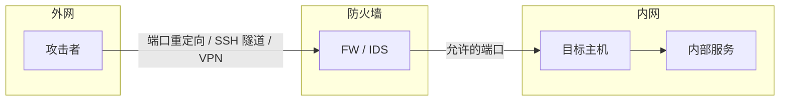

# 流量操作与隧道

## 0x01 Traffic manipulation technique

> 在渗透测试或实际需求经常会遇到访问受限的网络环境. 比如想主动连接一个内网网络, 可以使用隐蔽的手段逃避网络安全检查, 绕过防火墙的规则, 在非受信网络环境下进行加密传输数据等等. 这时就可以巧妙的利用网络操作与隧道技术了.

## 0x02 方式

### 重定向 (Redirect)

- 如利用IP+端口进行nat.

### 隧道 (Tunneling)

- 用于在不受信的网络环境中实现安全的通信
- 可以使用多种加密技术组合进行通信隧道的建立
- 一般分为点到点(IP2IP), 端到端(Port2Port)隧道
- 常规VPN: pptp, l2tp, IPsec, SSL vpn

### 封装 (encapsulation)

- 通常结合在隧道中使用, 使用一种协议封装一种协议
- 可以实现不同类型网络设备的互联互通

## 0x03 常用工具

| 工具 | 类型 | 说明 |
|------|------|------|
| rinetd | 端口重定向 | 简单的 TCP 端口转发 |
| SSH | 隧道 | 本地/远程/动态端口转发 |
| autossh | 隧道 | 自动重连的 SSH 隧道 |
| chisel | 隧道 | 基于 HTTP 的快速 TCP/UDP 隧道 |
| frp | 隧道 | 内网穿透工具 |
| proxychains | 代理链 | 强制程序通过代理 |
| socat | 多用途 | 双向数据流中继 |
