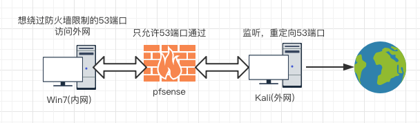
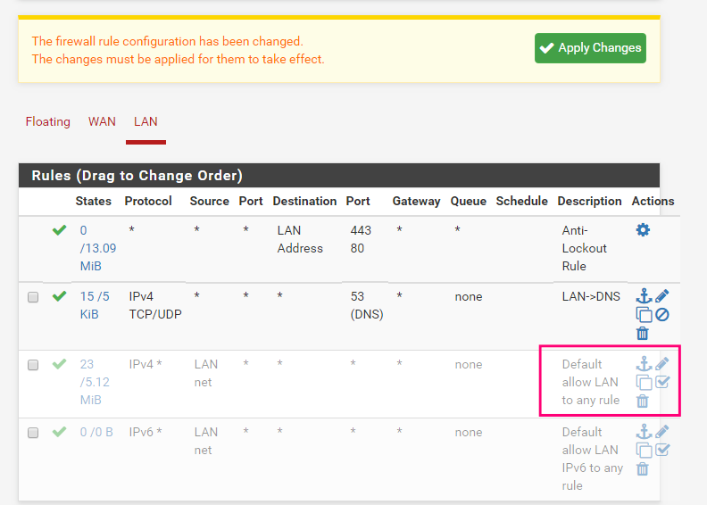
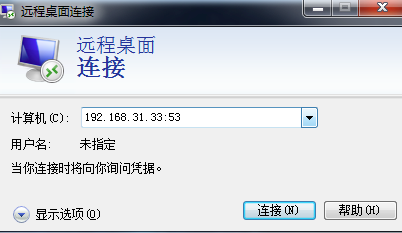
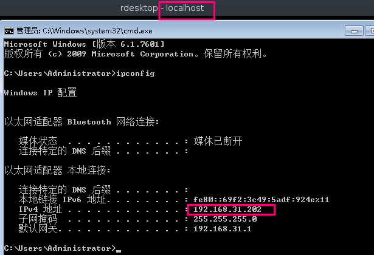
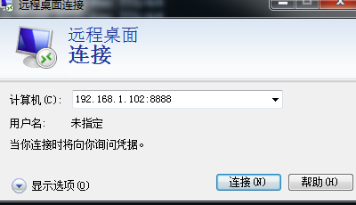
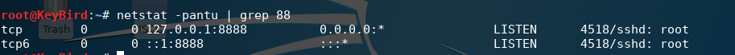
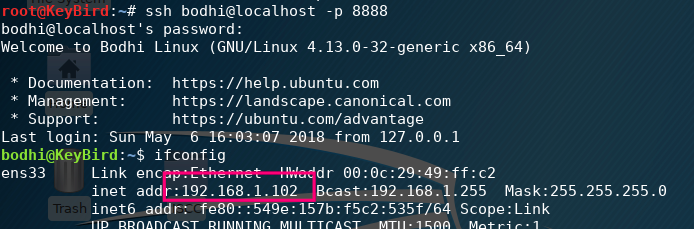
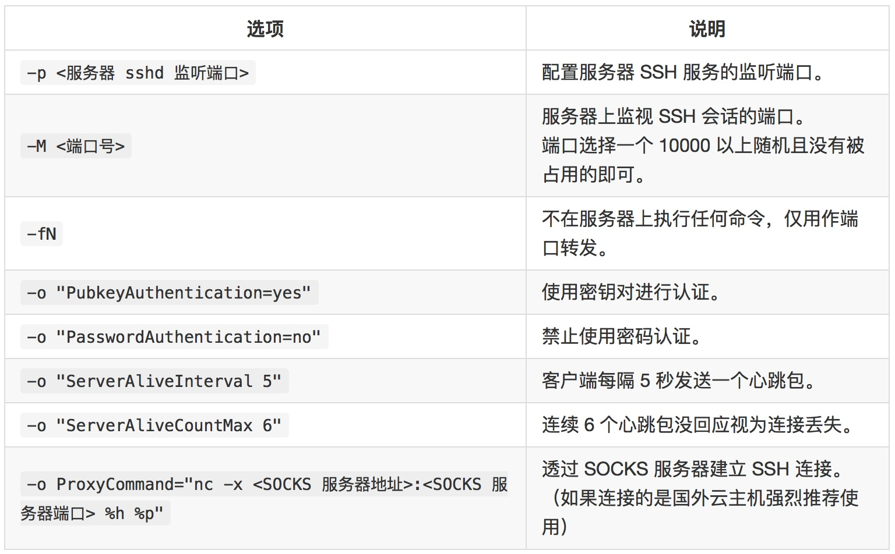

# 简单重定向和SSH隧道

## 0x01 重定向

> 可以应用于不需要加密传输, 防火墙只允许特定端口通过. 可以通定向web流量, 远程桌面协议, nc重定向获得shell, 但是不兼容FTP等二次连接的协议. 列举工具: Rinetd

### 网络结构构建



环境设置简单描述:

+ 防火墙规则
> 只允许通过53端口

WAN的规则可以去掉, LAN的规则可以如下图.



+ 内网Win选择设定内网网卡, DHCP即可
+ 外网Kali选择桥接网卡, DHCP即可

### 实践

#### Kali
> 主机ip: 192.168.31.33

```
apt install rinetd
```

```
vim /etc/rinetd.conf
添加类似内容, 监听所有发到53端口的流量, 转发到192.168.31.33 的3389端口
# bindadress    bindport  connectaddress  connectport
0.0.0.0 53 192.168.31.202 3389


service rinetd restart # 使生效
```

#### Win

```
远程桌面连接
192.168.31.33:53

即可连接到192.168.31.202 的3389的远程桌面
```




 ## 0x02 SSH隧道
 > 参考: https://www.jianshu.com/p/f5bc96f09c25
 > 将其他的TCP端口流量全部通过SSH连接来进行转发, SSH作为传输层协议, 能自动对流量进行加解密, 突破防火墙的访问限制, 也可用于翻墙. 传输隧道是双向的. 端口转发基于建立起来的ssh隧道, 隧道中断则端口转发中断, 而ssh有长时间无动作自动断开机制. 只能在建立隧道时创建转发, 不能为已有隧道增加端口转发.

### 本地端口转发与远程端口转发
> 实际使用时, 侦听端口永远开在应用客户端一侧

#### 本地端口转发

- SSH客户端与应用客户端位于FireWall同一侧
- SSH服务器与应用服务端位于FireWall另一侧
- 即SSH流量与应用流量方向相同

#### 远程端口转发

- SSH客户端与应用客户端位于FireWall两侧
- SSH服务器与应用服务端位于FireWall两侧
- 即SSH流量与应用流量方向相反

### 环境描述
> 防火墙只允许53端口通过


### 配置ssh相关
> 如果需要root登录, 可以按如下修改

##### Kali(设ip为192.168.31.33)等
```
vim /etc/ssh/sshd_config

PasswordAuthentication yes
PermitRootLogin yes
Port 22改为53

service ssh restart
```

### 本地端口转发
> 效果类似于rinetd, 将本地端口于远程服务器建立隧道.

内网有ssh客户端的系统(设ip为192.168.1.102)执行
```
ssh -fCNg -L <listen port>:<remote ip>:<remote port> user@<ssh server> -p <ssh server port>

参数说明:
-f 后台执行
-C 压缩处理
-N 不登录shell
-g 复用访问, 可以作为网关, 支持多主机访问本地侦听端口
-L Local

如:
ssh -fCNg -L 8888:192.168.31.202:3389 root@192.168.31.33 -p 53
此时访问
192.168.1.102的8888端口, 即访问192.168.31.202的3389端口

在本机直接执行
rdesktop localhost:8888
或其它机子访问它的8888端口
```





### 远程端口转发
> 侦听端口在ssh服务器端(这里指的就是Kali)

内网中有ssh客户端的系统执行

```
ssh -fCN -R <listen port>:<remote ip>:<remote port> user@<SSH server> -p <ssh server port>

参数:
-R Remote
注意: 此时是不能加-g参数, 使之成为网关的.

如:
ssh -fCN -R 8888:192.168.1.102:22 root@192.168.31.33 -p 53
此时在192.168.31.33访问
localhost:8888相当于访问192.168.1.102:22
```

在执行命令之后可以看到ssh服务器端的Kali侦听了8888端口





### 动态端口转发
> 本地, 远程端口转发都需要固定应用服务器IP和端口, 在应用端口繁多时, 转发效率低, 且有些应用不固定端口或某些网站不支持IP直接访问, 这时, 本地端口转发和远程端口转发都无法完成任务. 使用动态端口转发可以由SSH server来决定如何转发, 且可以方便的配置客户端进行代理.

在内网ssh客户端执行

```
ssh -CfNg -D [bind_address:]port user@<SSH server> -p <ssh server port>

参数:
-D Dynamic

如:
ssh -CfNg -D 127.0.0.1:1080 root@192.168.31.33 -p 53

之后可以设置如浏览器的socks5代理为127.0.0.1:1080即可, 或可配置Proxychains
```

### 图形化的X协议代理转发
> 允许远程登录执行GUI程序, 所有流量通过隧道绕过防火墙

```
ssh -X user@<SSH server> -p
<ssh server port>

# 可以直接执行firefox等图形化工具
输入firefox即可
```

### 其它
> 主要解决ssh会自动断开和需要交互输入密码的快捷处理方式,利用`autossh`, 主要方式为开机设置自启动, 公钥登录.这里可参考: https://www.jianshu.com/p/f5bc96f09c25



```
apt install autossh

如把本地的 80 端口映射到服务器上的 8080 端口, 当然这里是要先设置好公钥认证的.
autossh -M 10080 -fN -o "PubkeyAuthentication=yes" -o "ServerAliveInterval 5" -o "ServerAliveCountMax 6" -R 0.0.0.0:8080:127.0.0.1:80 user@<SSH server> -p
<ssh server port>

或如
autossh -M 5555 -NR -o "ServerAliveInterval 5" 8888:192.168.1.102:22 root@192.168.31.33 -p 53
```
