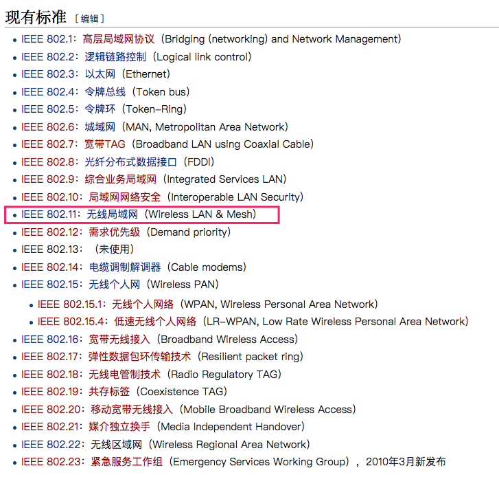
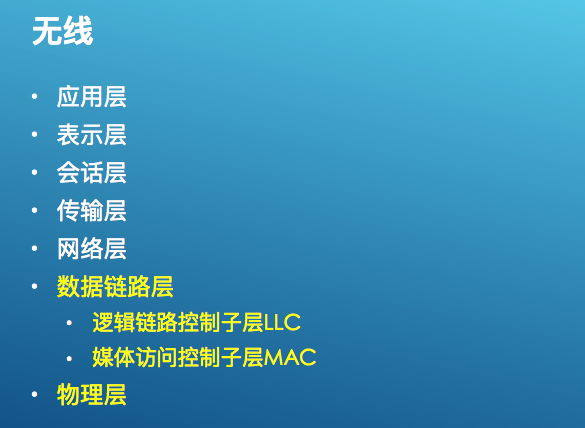
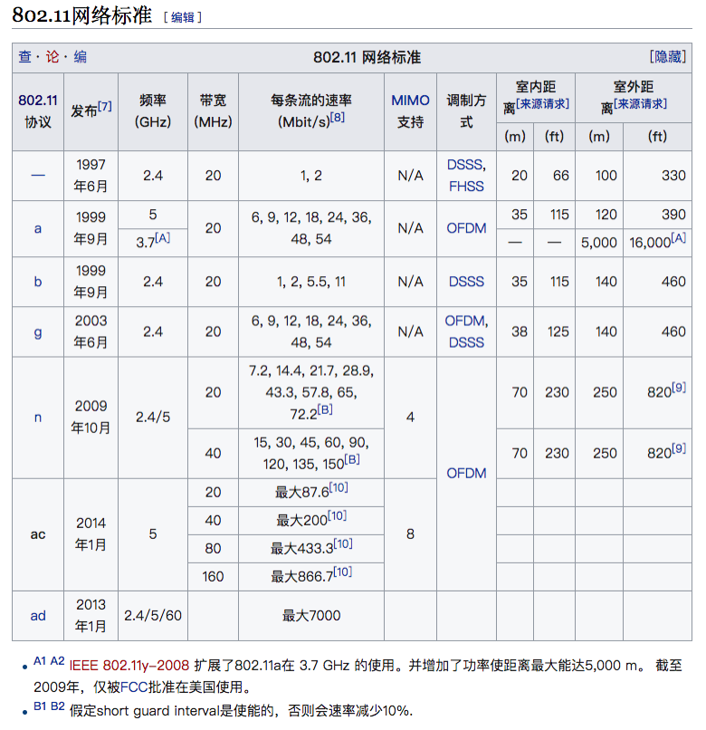
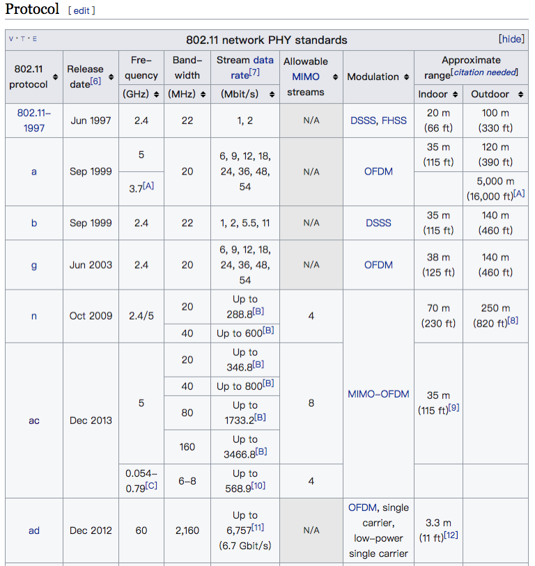

# 无线热点基础知识

## 0x01 无线技术特点
+ 行业迅猛发展
+ 互联网的重要入口
+ 边界模糊
+ 安全措施措施缺失且困难
+ 对技术不了解而容易造成配置不当
+ 企业网络私自接入AP破坏网络边界

## 行业标准(802.11)
### 802工作组
  

### 无线的主要工作层
+ 数据链路层
  - 逻辑链路控制子层LLC
  - 媒体访问控制子层MAC  
+ 物理层
  

### 802.11具体标准
#### 维基百科: https://zh.wikipedia.org/wiki/IEEE_802.11
https://zh.wikipedia.org/wiki/IEEE_802.11ac
https://en.wikipedia.org/wiki/IEEE_802.11 (总感觉英文百科比中文全面)
#### 标准列表  
```
IEEE 802.11，1997年，原始标准（2Mbit/s，播在2.4GHz）。
IEEE 802.11a，1999年，物理层补充（54Mbit/s，播在5GHz）。
IEEE 802.11b，1999年，物理层补充（11Mbit/s，播在2.4GHz）。
IEEE 802.11c，匹配802.1D的媒体接入控制层桥接（MAC Layer Bridging）。
IEEE 802.11d，根据各国无线电规定做的调整。
IEEE 802.11e，对服务等级（Quality of Service, QoS）的支持。
IEEE 802.11f，基站的互连性（IAPP，Inter-Access Point Protocol），2006年2月被IEEE批准撤销。
IEEE 802.11g，2003年，物理层补充（54Mbit/s，播在2.4GHz）。
IEEE 802.11h，2004年，无线覆盖半径的调整，室内（indoor）和室外（outdoor）信道（5GHz频段）。
IEEE 802.11i，2004年，无线网络的安全方面的补充。
IEEE 802.11j，2004年，根据日本规定做的升级。
IEEE 802.11k，该协议规范规定了无线局域网络频谱测量规范。该规范的制订体现了无线局域网络对频谱资源智能化使用的需求。
IEEE 802.11l，预留及准备不使用。
IEEE 802.11m，维护标准；互斥及极限。
IEEE 802.11n，更高传输速率的改善，基础速率提升到72.2Mbit/s，可以使用双倍带宽40MHz，此时速率提升到150Mbit/s。支持多输入多输出技术（Multi-Input Multi-Output，MIMO）。
IEEE 802.11o，针对VOWLAN（Voice over WLAN）而制订，更快速的无限跨区切换，以及读取语音（voice）比数据（Data）有更高的传输优先权。
IEEE 802.11p，这个通信协议主要用在车用电子的无线通信上。它设置上是从IEEE 802.11来扩充延伸，来匹配智能运输系统（Intelligent Transportation Systems，ITS）的相关应用。
IEEE 802.11q
IEEE 802.11r：快速BSS切换（FT）（2008）
IEEE 802.11s：Mesh Networking, Extended Service Set（ESS）（July 2011）
IEEE 802.11t：Wireless Performance Prediction (WPP)—test methods and metrics Recommendation cancelled
IEEE 802.11u：Improvements related to HotSpots and 3rd party authorization of clients, e.g. cellular network offload (February 2011)
IEEE 802.11v：Wireless network management（February 2011）
IEEE 802.11w：Protected Management Frames (September 2009)
IEEE 802.11x
IEEE 802.11y：3650–3700 MHz Operation in the U.S.（2008）
IEEE 802.11z：Extensions to Direct Link Setup (DLS)（September 2010）
IEEE 802.11-2012：A new release of the standard that includes amendments k, n, p, r, s, u, v, w, y and z (March 2012)
IEEE 802.11aa：Robust streaming of Audio Video Transport Streams (June 2012)
IEEE 802.11ab
IEEE 802.11ac，802.11n的潜在继承者，更高传输速率的改善，当使用多基站时将无线速率提高到至少1Gbps，将单信道速率提高到至少500Mbps。使用更高的无线带宽（80MHz-160MHz，802.11n只有40MHz），更多的MIMO流（最多8条流），更好的调制方式（QAM256）。目前是草案标准（draft），预计正式标准于2012年晚些时间推出。Quantenna公司在2011年11月15日推出了世界上第一只采用802.11ac的无线路由器。Broadcom公司于2012年1月5日也发布了它的第一支支持802.11ac的芯片。
IEEE 802.11ad：Very High Throughput 60 GHz (December 2012) - see WiGig
IEEE 802.11ae：Prioritization of Management Frames（2012年3月）
IEEE 802.11af：运用过往电视白区（TV White Space，TVWS）的频段所订立标准，由于使用白区频段（VHS的54MHz～216MHz及UHF的470MHz～698MHz），有时IEEE 802.11af也称为White-Fi（取Wi-Fi一词的派生变化）。
IEEE 802.11ah：用来支持无线感测器网络（Wireless Sensor Network，WSN），以及支持物联网（Internet of Thing，IoT）、智能电网（Smart Grid）的智能电表（Smart Meter）等应用。
IEEE 802.11ai：为IEEE 802.11的修正案，新增部分机制，以及加速创建网络连接的等待时间。
IEEE 802.11aj：为IEEE 802.11ad的增补标准，开放45GHz的未授权带宽带使世界上部分地区可以使用。
IEEE 802.11aq：为IEEE 802.11的修正案，增加网络探索的效率，以加快网络传输速度。
IEEE 802.11ax：以现行的IEEE 802.11ac做为基底的草案，以提供比现行的传输速率加快4倍为目标。
除了上面的IEEE标准，另外有一个被称为IEEE 802.11b+的技术，通过PBCC技术（Packet Binary Convolutional Code）在IEEE 802.11b（2.4GHz频段）基础上提供22Mbit/s的数据传输速率。但这事实上并不是一个IEEE的公开标准，而是一项产权私有的技术，产权属于德州仪器。
```

#### 常用标准
  
上图似乎不太对头,看下图吧.
  

### 常用标准讲解
1. 802.11  

  + 发布于1997
  + 速率为1Mbps或2Mpbs
  + 红外线传输介质并未实现
  + 无线射频信号编码(调制) (Radio Frequencies)
    - Direct-Sequence Spread-Spectrum (DSSS)--直序扩频    
    - Frequency Hopping Spread-Spectrum (FHSS)--跳频扩频

  + 媒体访问方式--CSMA/CA 
    - 根据算法侦听一定时长
    - 发送数据前发包声明
  + RST(Request To Send)/CTS(Clear To Send) 

2. 802.11b
  + Complementary Code Keying(CCK)—补充代码建

    - 5.5 and 11Mbit/s

    - 2.4GHz band (2.4GHz – 2.485GHz)

    - 14个重叠的信道

    - 每个信道22Mhz带宽

    - 只有三个完全不重叠的信道

      ​  

  + 美国信道1-11（2.412GHz-2.462Ghz）

  + 欧洲信道1-13（2.412 GHz – 2.472 GHz）

  + 日本信道 1-14 （2.412 GHz – 2.484 GHz）

3. 802.11a

   + 与802.11b几乎同时发布
     + 因设备价格问题，几乎一直没有得到广泛使用
   + 使用5GHz带宽
     - 2.4Ghz带宽干扰源多（微波，蓝牙， 无绳电话）
     - 5Ghz频率有更多带宽空间，可容纳更多不重叠的信道
     - Orhtogonal Frequency-Division Multiplexing (OFDM)信道调制方式
       * 正交频分复用技术
     - 更高速率54Mbps，每个信道20Mhz带宽
     - 变频
       * 5.15-5.35Ghz室内
       * 5.7-5.8Ghz室外

4. 802.11g

   + 2.4Ghz频率
   + 采用Orhtogonal Frequency-Division Multiplexing (OFDM)信道调制方式
   + 速率与802.11a相同
   + 可全局降速，向后兼容802.11b，并切换为CCK信道调制方法
   + 每个信道20/22Mhz带宽

5. 802.11n

   + 2.4或5Ghz频率
       + 采用Multiple-Input Multiple-Output（MIMO）多进多出通信技术
       + 300Mbps最高600Mpbs
       + 多天线，多无线电波，独立收发信号
       + 可以使用40Mhz信道带宽使数据传输速率翻倍
   + 全802.11n设备网络中，可以使用新报文格式，使速率达到最大
   + 每个信道20/40Mhz带宽

6. 802.11ac (Wi-Fi 5)

   + 5GHz 频率
   + 采用 MIMO 和 MU-MIMO 技术
   + 最高速率 6.93Gbps（理论值，8×8 MIMO + 160MHz 信道）
   + 256-QAM 调制
   + 信道带宽 20/40/80/160MHz
   + 波束成形（Beamforming）技术

7. 802.11ax (Wi-Fi 6 / Wi-Fi 6E)

   + 2.4GHz 和 5GHz 频率（Wi-Fi 6E 扩展到 6GHz）
   + 采用 OFDMA（正交频分多址）技术
   + 最高速率 9.6Gbps（理论值）
   + 1024-QAM 调制
   + TWT（Target Wake Time）节能机制
   + BSS Coloring 减少同频干扰
   + 显著提升高密度环境下的性能

8. 802.11be (Wi-Fi 7)

   + 2.4GHz / 5GHz / 6GHz 三频段
   + 最高速率 46Gbps（理论值）
   + 4096-QAM 调制
   + 320MHz 超宽信道
   + 多链路操作（MLO）
   + 2024年正式发布

!!! info "安全提示"
    现代无线网络应至少使用 WPA3 加密。WEP 和 WPA 已被认为不安全，WPA2 仍可接受但建议迁移到 WPA3。
