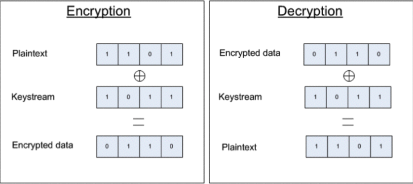
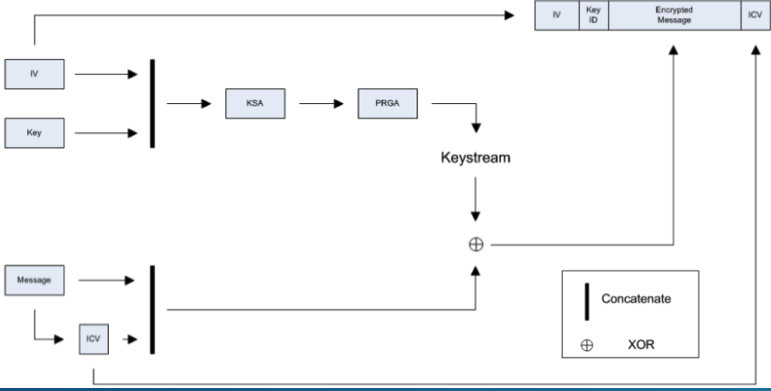
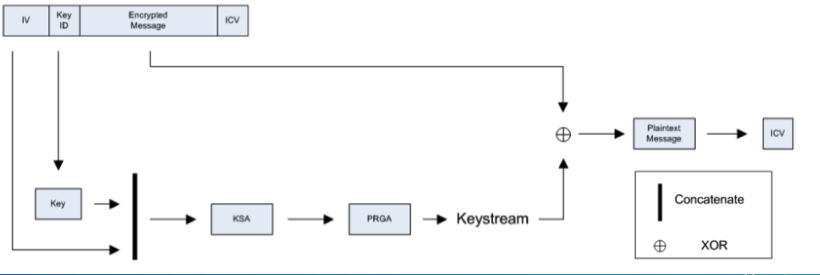

# WEP加密热点

## 0x01 WEP加密
+ 使用Rivest Cipher 4 (RC4)算法加密流量内容，实现机密性
+ CRC32算法检查数据完整性 
+ 标准采用使用24位initialization vector (IV) 
+ 美国加密技术出口限制法律的要求
  - 高于64bit key禁止出口,所以除24bit IV之外真实的key只有40bit的版本被允许出口
  - 出口限制法律撤销后实现了128bit key的WEP版本 (使用相同的24bit IV)

### RC4算法
+ RSA实验室研发的对称加密流算法
+ 特点: 
  - 实现简单
  - 效率高,速度快
+ 加密: 对明文流和密钥流进行XOR计算
+ 解密: 对密文流和密钥流进行XOR计算
  

+ RC4算法key由两个过程生成
  - 合并IV和PSK，利用Key Scheduling Algorithm (KSA)算法生成起始状态表
  - Pseudo-Random Generation Algorithm (PRGA)算法生成最终密钥流
+ 加密流程
  

+ 解密流程
  
