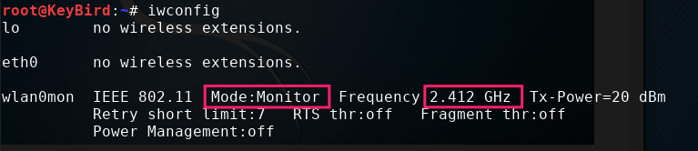

# AIRCRACK

## 0x01 简介
- 无线渗透和审计神器 
- 包含各种功能的工具套件
  - 网络检测
  - 嗅探抓包
  - 包注入
  - 密码破解

## 0x02 基础操作
###  检查可能的干扰项及消灭干扰项

```bash
airmon-ng check
airmon-ng check kill
airmon-ng check
如果还有干扰项可以如:
service network-manager stop
```

### 启动监听模式

```bash
airmon-ng start wlan0 1 # 指定监听信道1

iwconfig # 检查是否进入监听模式

airmon-ng stop wlan0mon #  关闭监听模式
```
  

### 检查网卡支持的信道
```bash
iwlist wlan0mon channel 

回显:
wlan0mon  13 channels in total; available frequencies :
          Channel 01 : 2.412 GHz
          Channel 02 : 2.417 GHz
          Channel 03 : 2.422 GHz
          Channel 04 : 2.427 GHz
          Channel 05 : 2.432 GHz
          Channel 06 : 2.437 GHz
          Channel 07 : 2.442 GHz
          Channel 08 : 2.447 GHz
          Channel 09 : 2.452 GHz
          Channel 10 : 2.457 GHz
          Channel 11 : 2.462 GHz
          Channel 12 : 2.467 GHz
          Channel 13 : 2.472 GHz
          Current Frequency:2.412 GHz (Channel 1)

```

## 0x03 无线抓包(`airodump-ng`)
### 抓取
- 所有信道

```bash
airodump-ng wlan0mon
```

- 指定并写入文件

```bash
airodump-ng wlan0mon -c 1 --bssid 00:06:F4:AA:3B:81 -w file.cap
```

- 指定并仅抓取特定包

```bash
airodump-ng wlan0mon -c 1 --bssid 00:06:F4:AA:3B:81 --ivs -w file.cap
```

### 数据说明
  - BSSID: AP的MAC地址
  - PWR: 网卡接收到的信号强度，距离越近信号越强(-1: 驱动不支持信号强度、STA距离超出信号接受范围)
  - RXQ: 最近10秒成功接收的数据帧的百分比(数据帧、管理帧)，只有固定信道时才会出现
  - Beacons: 接收到此AP发送的beacon帧数量
  - #Data: 抓到的数据帧数量(WEP表示IV数量)，包含广播数据帧
  - #/s: 最近10秒内，每秒平均抓到的帧的数量 
  - CH: 信道好(从beacon帧中获得)，信道重叠时可能发现其他信道
  - MB: AP支持的最大速率
  - ENC: 采用的无线安全技术WEP、WPA、WPA2、OPEN
  - CIPHER: 采用的加密套件CCMP、TKIP、WEP40、WEP104
  - AUTH: 身份验证方法MGT、PSK、SKA、OPEN
  - ESSID: 无线网络名称，隐藏AP此值可能为空,airodump从probe和association request帧中发现隐藏AP
  - STATION: STA的MAC地址
  - Lost: 通过sequence umber判断最近10秒STA发送丢失的数据包数量(管理帧、数据帧)
    - 信号干扰、距离
    - 发包不能收，收包不能发
  - Frames: STA发送的数据包数量
  - Probe: STA探测的ESSID

### `airodump-ng` 排错
  - 不显示任何AP和STA信息
    - 物理机场景下使用笔记本内置无线网卡时，确保BIOS中已经启动无线网卡
    - 先确认无线网卡在managed模式下可以正常工作
    - 尝试禁用network-manager服务
    - 尝试卸载rmmod和重新加载modprobe驱动, 如:

    ```bash
    rmmod ath9k_htc
    modprobe ath9k_htc
    ```
  - 工作一段时间后airodump-ng无法继续抓包
    - airmon-ng check kill
    - 确认wpa_supplicant进程已停止

## 0x04 无线注入包(`aireplay-ng`)
### 说明
- 向无线网络中注入数据包,产生或者加速无线通信流量
  - 伪造身份验证
  - 强制重新身份验证
  - 抓包重放
  - 用于后续WEP和WPA密码破解
  - 支持10种包注入
```
  Attack modes (numbers can still be used):

      --deauth      count : deauthenticate 1 or all stations (-0)
      --fakeauth    delay : fake authentication with AP (-1)
      --interactive       : interactive frame selection (-2)
      --arpreplay         : standard ARP-request replay (-3)
      --chopchop          : decrypt/chopchop WEP packet (-4)
      --fragment          : generates valid keystream   (-5)
      --caffe-latte       : query a client for new IVs  (-6)
      --cfrag             : fragments against a client  (-7)
      --migmode           : attacks WPA migration mode  (-8)
      --test              : tests injection and quality (-9)
```
- 获取包的两种途径 
  1. 指定接口(-i) 
  2. 抓包文件pcap(-r)

### 命令选项
```text
aireplay-ng <options> <replay interface>

Filter options:

      -b bssid  : MAC address, Access Point
      -d dmac   : MAC address, Destination
      -s smac   : MAC address, Source
      -m len    : minimum packet length
      -n len    : maximum packet length
      -u type   : frame control, type    field
      -v subt   : frame control, subtype field
      -t tods   : frame control, To      DS bit
      -f fromds : frame control, From    DS bit
      -w iswep  : frame control, WEP     bit
      -D        : disable AP detection

Replay options:

      -x nbpps  : number of packets per second
      -p fctrl  : set frame control word (hex)
      -a bssid  : set Access Point MAC address
      -c dmac   : set Destination  MAC address
      -h smac   : set Source       MAC address
      -g value  : change ring buffer size (default: 8)
      -F        : choose first matching packet

      Fakeauth attack options:

      -e essid  : set target AP SSID
      -o npckts : number of packets per burst (0=auto, default: 1)
      -q sec    : seconds between keep-alives
      -Q        : send reassociation requests
      -y prga   : keystream for shared key auth
      -T n      : exit after retry fake auth request n time

      Arp Replay attack options:

      -j        : inject FromDS packets

      Fragmentation attack options:

      -k IP     : set destination IP in fragments
      -l IP     : set source IP in fragments

```

### AIREPLAY-NG包注入测试
- 检测网卡是否可以注入包
- 检测AP的响应时间
- 检测回包率(回包率反应链路质量)
- 如果有两个无线网卡，可以检测具体可以注入哪种攻击
- 基本测试检测AP对probe广播的响应
- 向每AP发30包(网卡成功发送并可接收包的能力)
- 可以多测几次,结果不是绝对的.

```bash
aireplay-ng -9 wlan0mon
或 
aireplay-ng --test wlan0mon
```
##### 向隐藏AP/指定SSID注入
```bash
arieplay-ng -9 -e ESSID -a EC:26:CA:FA:02:DC wlan2mon
```
##### card to card注入测试
> 可以获得更详尽的注入测试数据
> - -i作为AP的网卡
> - Attack -5/-7:        Failed (注入MAC和真正MAC相同时或可以正常使用) 
```bash
aireplay-ng -9 -i wlan0mon wlan1mon
```

### `aireplay-ng` 排错
- Aireplay-ng命令挂起没有任何输出
  >  无线网卡与AP工作在不同信道
- 报错"write failed: Cannot allocate memory wi_write():illegal seek"
  > 无线网卡使用Broadcom芯片（bcm43xx),替换为b43驱动可解决
- 可注入但速度很慢，并提示内核消息"rtc:lost some interrupts at 1024Hz" 
  > 没有修正方法，此时可以启动多个aireplay-ng命令提高速度
- 使用-h参数指定注入MAC地址与网卡MAC地址不一致报错
  > 建议保持一致, 可以先使用`macchange `更改mac, 如`macchange -m 00:11:11:11:11:11 wlan2mon`
