### 0x01 前言
> 在黑客活动的追根溯源中, 流量分析总是作为一个非常重要的环节, 现在我以一个流量包为引例带领大家看看通过流量分析进行追根溯源的基本工作. 其中有一些题比较CTF, 不过很多题还是挺切实际的, 值得学习.
> 学习建议: 不看我提供的思路, 自己下载流量包进行分析, 实在不行再参考我提供的思路, 我的思路也仅做参考, 也许各位朋友的思路更好呢.

### 0x02 流量包追根溯源实例分析
> 题目来源: https://betweentwodfirns.blogspot.jp/2017/12/network-forensic-ctf-tufmups-undercover.html
> 所需工具: WireShark, CyberChef(下载地址: https://github.com/gchq/CyberChef), 和kali一些小工具.
>
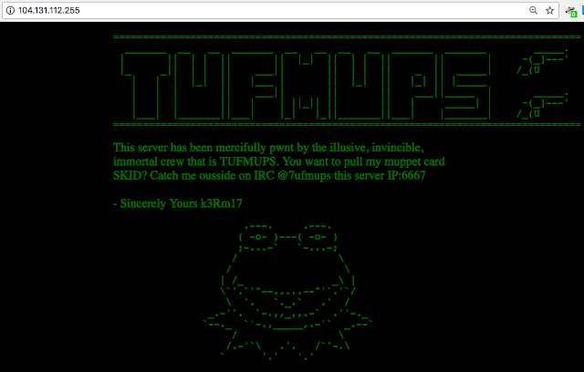
>
> Background: You're an agent with a government law enforcement agency. You've been tracking a group of criminal hackers known as "TufMups". This group either keeps a low profile, your agency's capacity to run investigations on the internet is very poor, or some combination of those two factors. Up until two days ago you had an active relationship with an informant who went by the handle "K3anu". As you walked into your office you received a package containing a flash drive, a printed screenshot (at the top of this blog post) and a very short note.
>
> "Review this PCAP. It will all make sense. Woaaahhhh. - K3anu"
> That package was the last you heard from K3anu.

1. What is the start time of the PCAP ("Date and Time of Day" setting in Wireshark round to nearest second)? **(2017/12/10  17:43:18)**
> 题1题2:
> 统计->抓包文件属性(值得注意的是: 如果自己所在时区和抓包时区不一样时, 需改一下时区, 可以右键数据流, 偏移时间计算正确时差, 这里我后移13h, 时间问题实在是取证分析应该多注意的一个点)
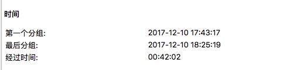

2. What is the end time of the PCAP ("Date and Time of Day" setting in Wireshark round to nearest second)? **(2017/12/10  18:25:20)**
> 见上题

3. How many total packets were sent between the host and the hacker website IP? **(15128)**
> 黑客总是要传输文件的, 尝试过滤ftp, 定位到ip: 104.131.112.255. 题目截图提示也含有这个ip. 统计->对话
>
> 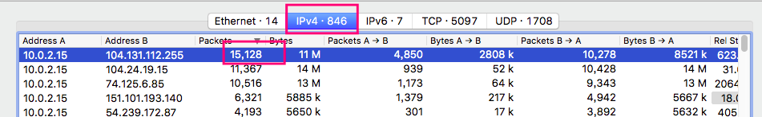

4. What is the hostname of the system the PCAP was recovered from? (all caps) **(MSEDGEWIN10)**
> 抓包监听0.0.0.0 , 过滤 `ip.src == "0.0.0.0" `, DHCP 协议下options选项里有主机名.
>
> 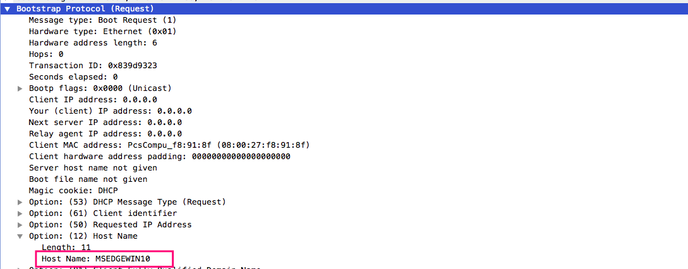

5. What exact version of browser did K3anu use? (exact number only) **(63.0.3239.84)**
> 浏览器关联网站, 关联http, 过滤http, 随便点一个数据流, 右键追踪流. user-agent会透露客户端信息.
>
> 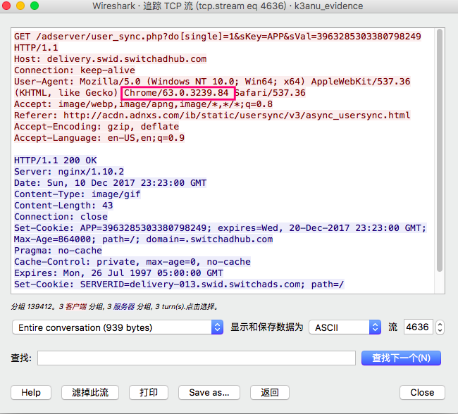

6. What operating system did K3anu use? (Name and number only) **(Windows 10)**
> 同样的user-agent会透露客户端信息.后续的分析也能验证.
>
>
>
> 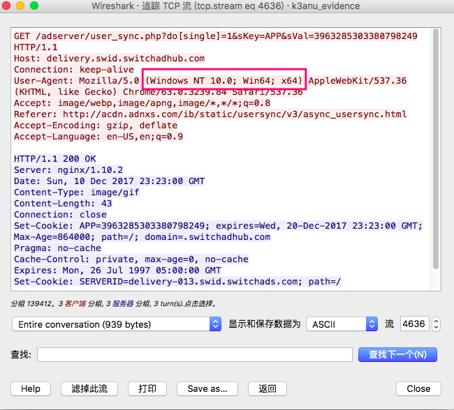
>
> 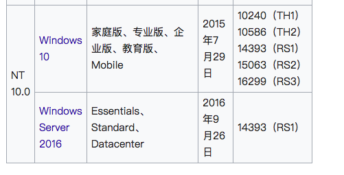

7. How many DNS queries in the PCAP received NXdomain responses? **(5)**
> 首先要理解什么是NXdomain , 摘一段英文解释.
> Non-existent Internet Domain Names Definition
> NXDOMAIN is nothing but non-existent Internet or Intranet domain name. If domain name is unable to resolved using the DNS, a condition called the NXDOMAIN occurred. In this example, try to find out an ip address for the domain called abcquq12examfooltest.com using the nslookup or host command line option:
> nslookup abcquq12examfooltest.com
> OR
> host abcquq12examfooltest.com
> Sample outputs:
>
> Host abcquq12examfooltest.com not found: 3(NXDOMAIN)
>
> 所以过滤: `dns.flags.rcode == 3` 或 `dns.flags.rcode != 3`
>
> 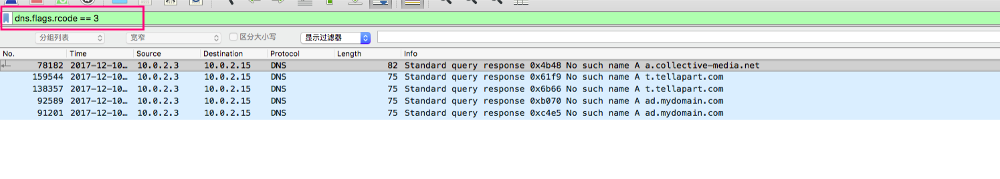

8. What is the hidden message in the TufMups website? (decoded) **(ftp creds are p1ggy / ripgonzo)**
> 根据题目过滤: `ip.addr == 104.131.112.255 and http`, 在网页的注释信息里面.
>
> 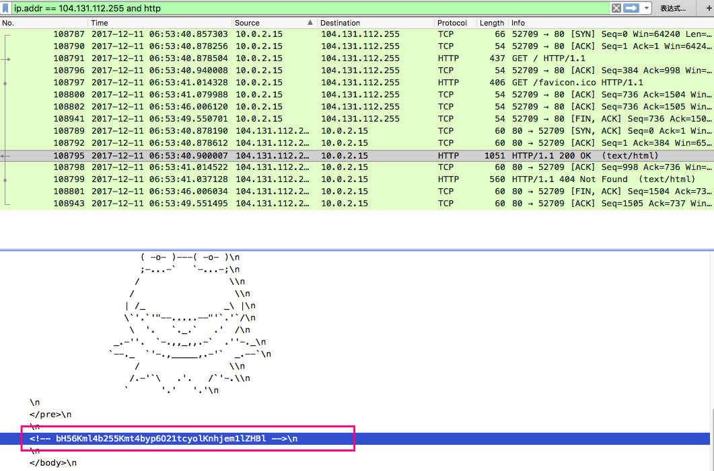
> 然后base64解一下. 再用工具爆破.
>
> 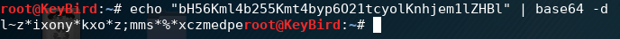
>
> 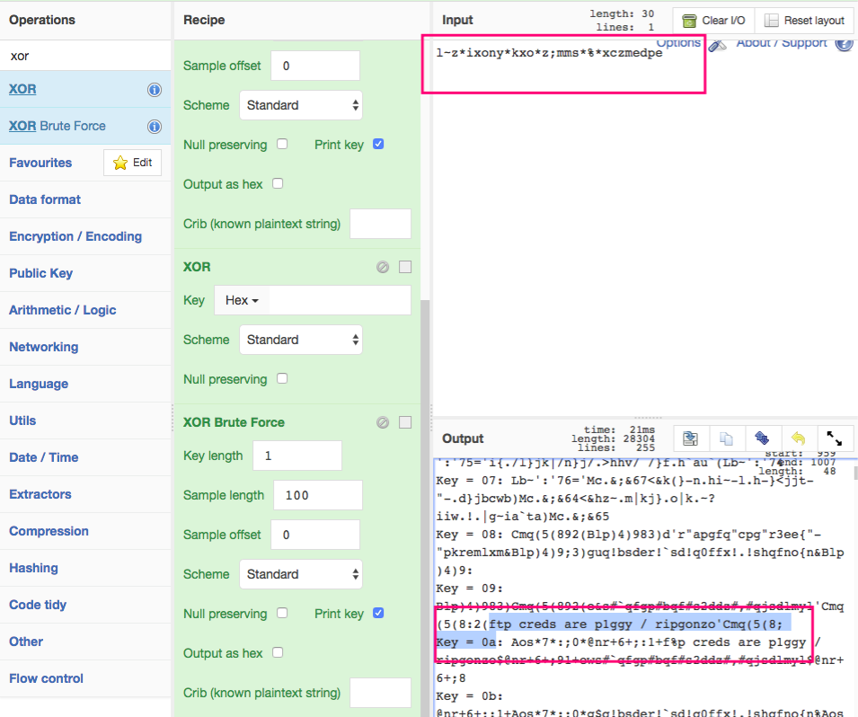

9. What is the key to decode the secret message in the TufMups website? **(0a)**
> 答案见上题吧.

10. How did K3anu get access to the file? (lowercase, just protocol) **(ftp)**
> 这个不知道咋说, 种种暗示指出明明就是 `ftp`
11. What's the nickname of the operator on the IRC channel? **(k3rm1t)**
> 看图吧, 不太清除irc的命令格式.
>
> 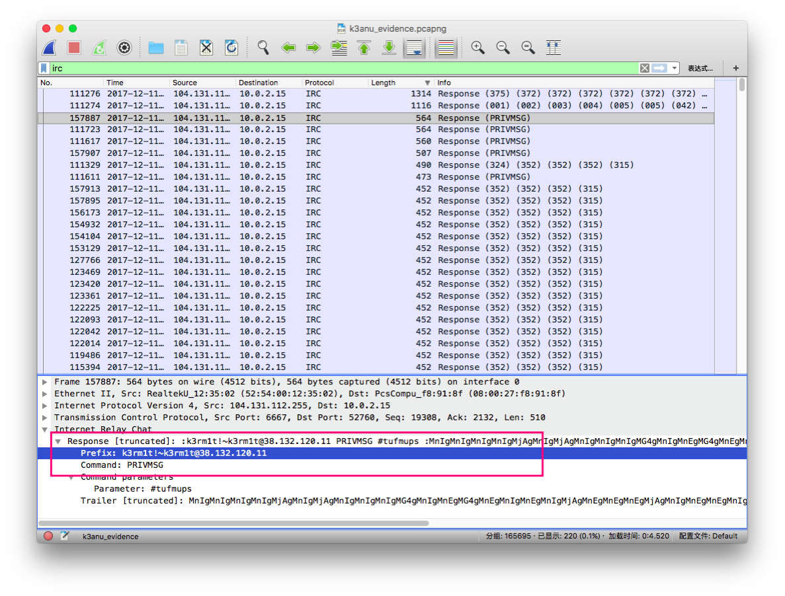

12. What is the 1st operation needed to decode the IRC users "secure" comms? (just the format name) **(base64)**
> 追踪irc数据流
>
> 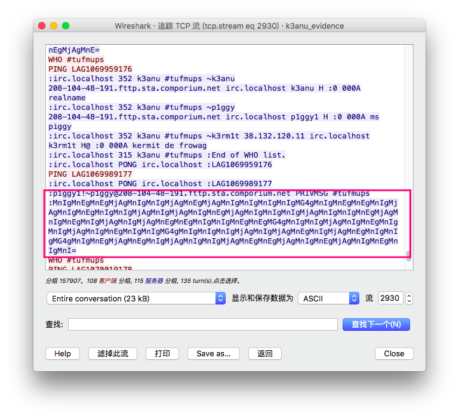
> 复制内容, 尝试解密.根据古典加密或编码的一些特征了.12-15题就全解了. 这里有点CTF了, 不做过多介绍.
>
> 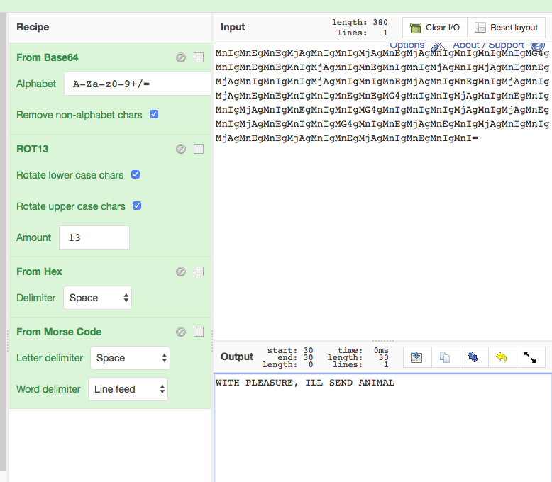

13. What is the 2nd operation needed to decode the IRC users "secure" comms? (just the format name) **(rot13)**
> 见上题图

14. What is the 3rd operation needed to decode the IRC users "secure" comms? (just the format name) **(hex)**
> 见上题图

15. What is the 4th and final operation needed to decode the IRC users "secure" comms? (2 words lowercase) **(morse code)**
> 见上题图

16. What is the password to decrypt the zip file that was downloaded by K3anu? **(fozzie)**
> 首先通过过滤底层协议`tcp contains "zip"` 辨认通过ftp传输. 再使用ftp协议和ftp-data进行过滤. 再按no项进行排序, 再追踪下载文件命令下面的流.
>
> 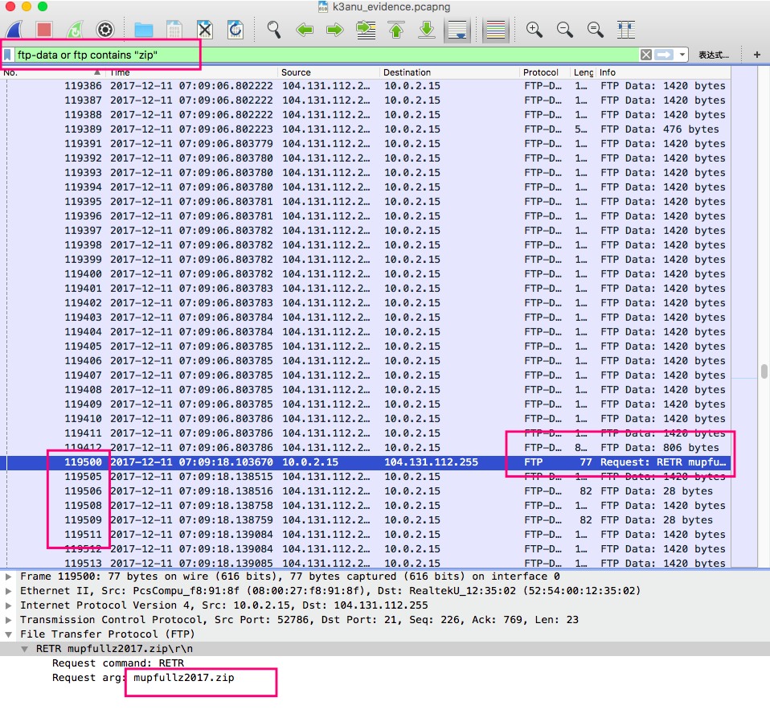
> 可以看到zip的PK头, 然后查看原始数据, save as, 保存文件为xx.zip 再然后就是暴力破解zip文件密码了.
>
> 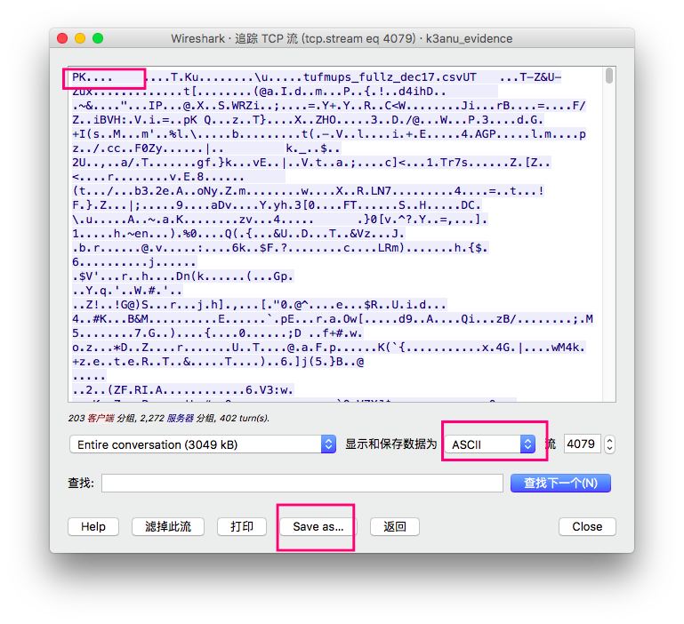
>
> 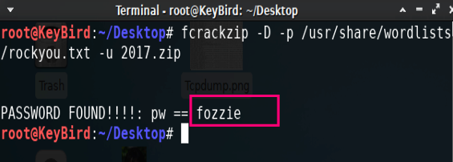

17. How many total rows of "fullz" are represented in the file? **(13377)**
> 答案13377(减去首行)
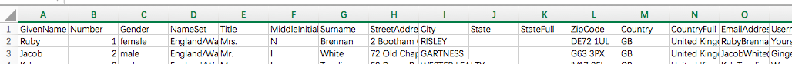
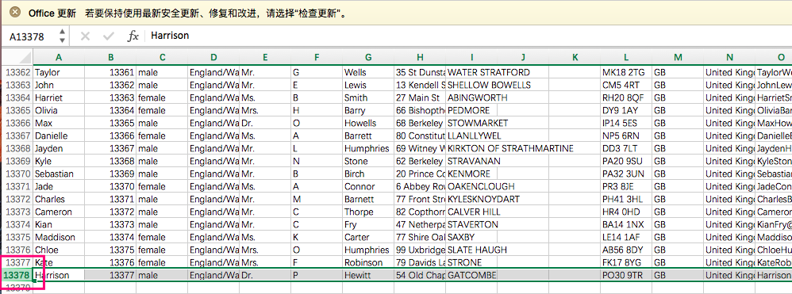

18. How many people in the fullz are named Joshua, have a MasterCard, and use an OS X system? **(12)**
> 所有词过滤一下. 再`wc -l`做统计.
 [](assets/markdown-img-paste-20180402205128508.png)

19. From the previous question (people named Joshua) - what is the most expensive car new in this filtered list? **(2006 Pagani Zonda)**
> ` grep -i "Mastercard" tufmups_fullz_dec17.csv | grep -i "OS X" | grep "Joshua" | cut -d "," -f 32,37 | sort` cut匹配money行和表示汽车的行, 应该就这么过滤的, 可惜没有对上题目作者给出的答案, 不晓得咋回事, 知道的还请指出.

20. What IP and port does the executable connect to? ip:port **(104.131.112.255:1234)**
> 可执行程序可能是是xx.exe, 所以可以这么过滤一下.
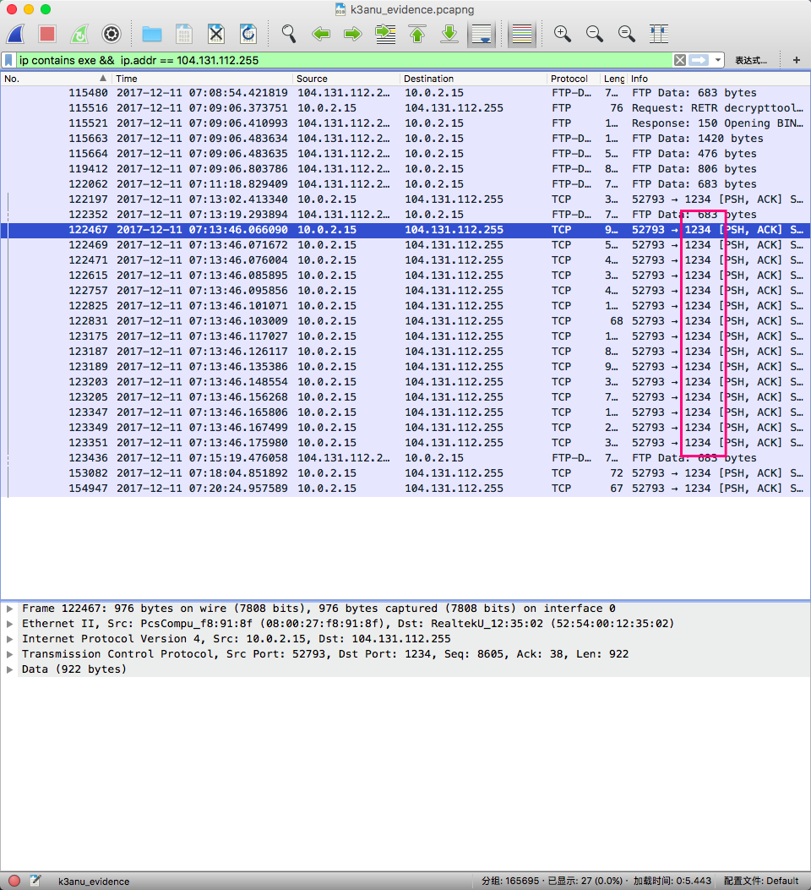

21. What is the MD5 of the executable? **(20422a060c5f8ee5e2c3ba3329de514f)**
> 先follow可执行文件的下一个数据流. 然后保存原始数据为文件tool.exe, 然后计算md5 ,
Unix或Linux下可以
>
> ```
> md5sum tool.exe
> 20422a060c5f8ee5e2c3ba3329de514f  tool.exe
> ```
> 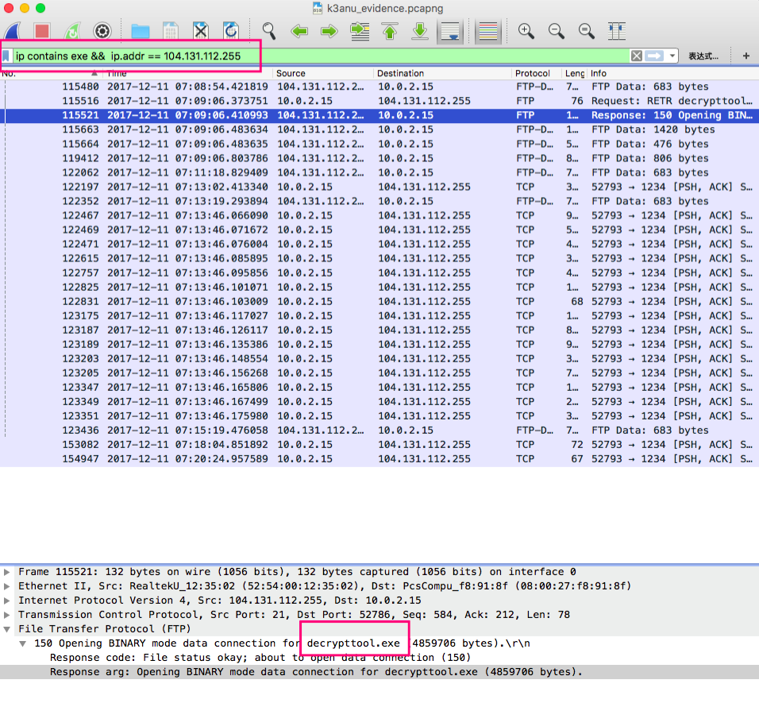

22. What was used to compile the malicious executable? **(pyinstaller)**
> 追踪传输可执行文件的ftp-data流. 估摸着用python写的, 猜pyinster吧,我不太清楚pyinstaller的特征, 熟悉的应该懂的.
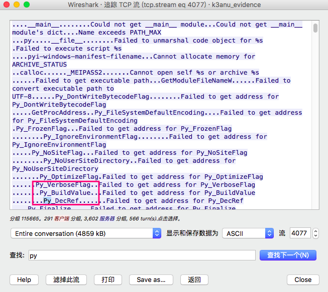

23. What executable did K3anu likely use to download files from the remote server? (exactly as written in source material) **(WinSCP.exe)**
> 种种暗示ftp, win平台, grep 过滤常见ftp软件看看. 或可以`strings k3anu_evidence.pcapng | grep  -i .exe` 看看有运行什么程序, 再筛选其中的ftp客户端.
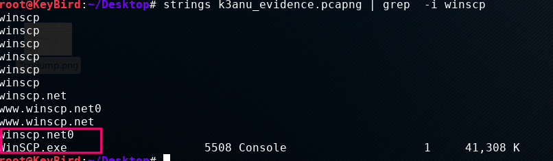

24. What is the host system's exact BIOS version? **(innotek GmbH VirtualBox, 12/1/2006)**
> 这个BIOS查询结果, 似乎不是NETBOIS协议可以找到的. 应该是命令查询输出信息. 上面已经提及, 后门端口是1234, 所以过滤一下端口, 追踪一下流.这个流也能验证解答上面好多题目.
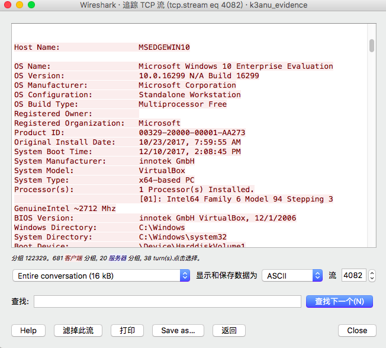

25. What is the filename of the first file taken from K3anu's computer? **(trueidentity.zip)**
> 同上题追踪到的流信息里面
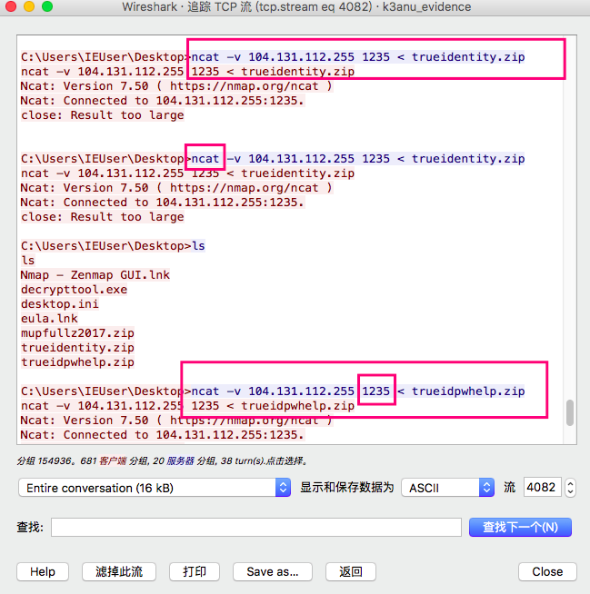

26. What is the filename of the second file taken from K3anu's computer? **(trueidpwhelp.zip)**
> 见上题截图

27. What utility was used to steal the files from K3anu's computer? **(ncat)**
> 见上题截图

28. What destination port was used to steal the files from K3anu's computer? **(1234)**
> 见上题截图

29. What is the password to decrypt the file stolen from K3anu's computer? (it's lowercase) **(molder)**
> 首先已经知道传输端口是1235, 所以过滤一下: `tcp.port == 1235 `, 然后追踪流. 然后查看原始数据, 然后点击save as, 我这里另存为trueidenty.zip. 然后暴力破解zip文件的加密密码.
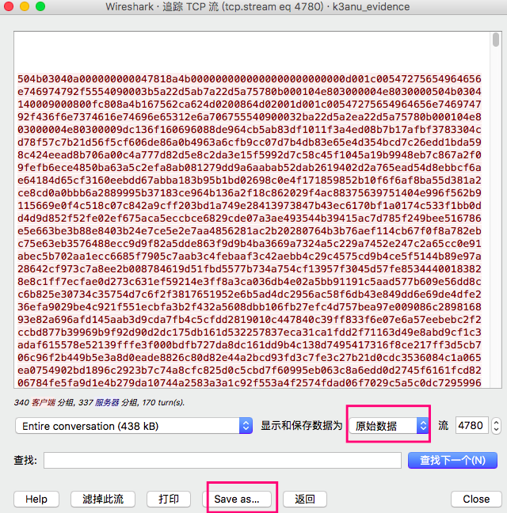
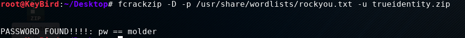

30. What is K3anu's real identity? **(constantine)**
> 根据上题的思路, 先从流量包里面提取出trueidentity.zip和trueidpwhelp.zip, 然后解压分析.在trueidentity.zip解压之后有三个图片. 查看constantine2.gif的文件元可以看到答案.
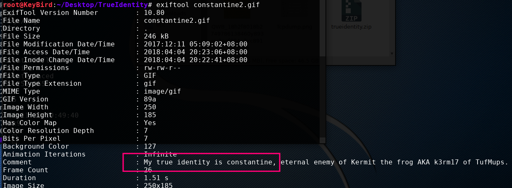

31. What city is K3anu likely to be in? **(Pontevedra)**
> 在trueidentity.zip解压之后有三个图片. 查看constantine3.jpg的文件元可以查看到`Generally the TufMups have their enemies shipped to 42.226391, -8.899541`, 然后去寻找这个GPS定位的这个经纬度.
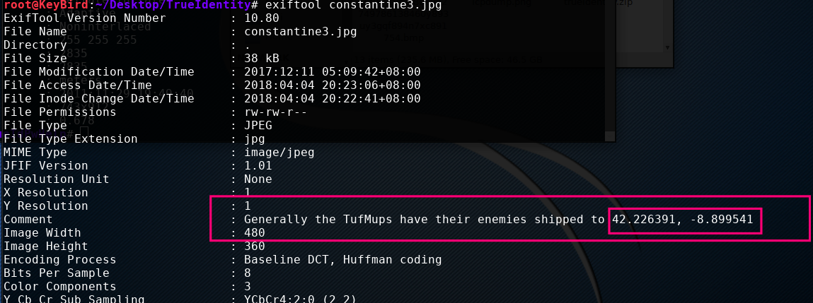
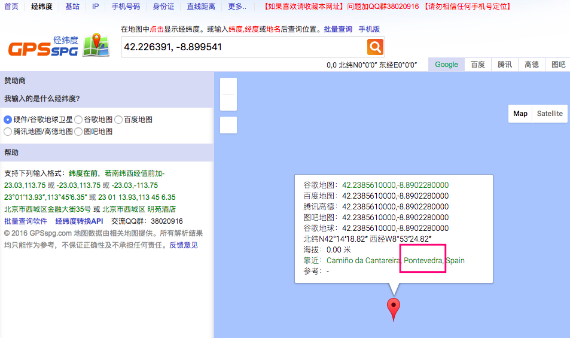

32. What is K3anu's likely status? (lowercase) **(dead)**
> 检查trueidentity.zip解压的图片. 信息在Constantine1.jpg的文件元里查看到答案.
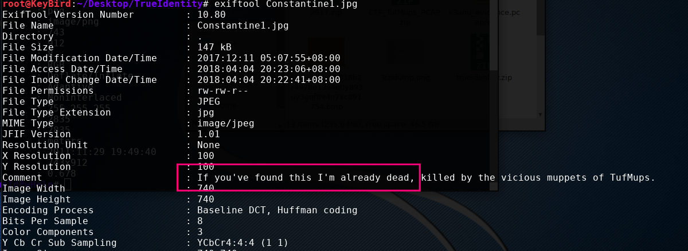

33. What is the address of the restaurant closest to where K3anu is likely to be? (exactly as reported by Google maps) **(Camino C5 Illas Cies, 8, Vigo, Pontevedra, Spain)**
> 打开Google地图: https://www.google.com/maps, 在右上角输入坐标`42.226391, -8.899541`, 双击定位出来的坐标, 查看提示位置可以看到如下图.不得不说, Google地图是真的强.
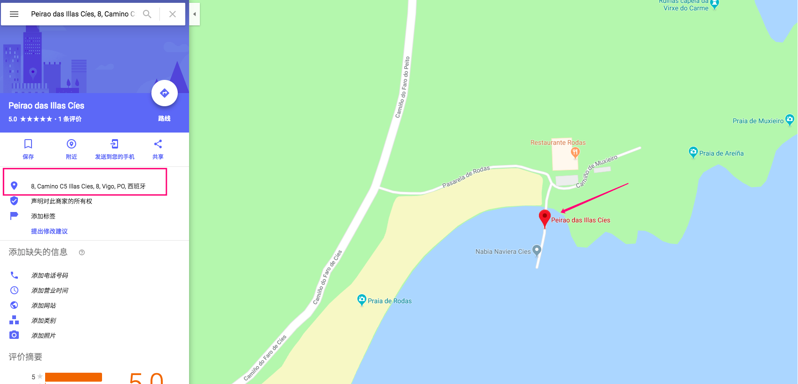
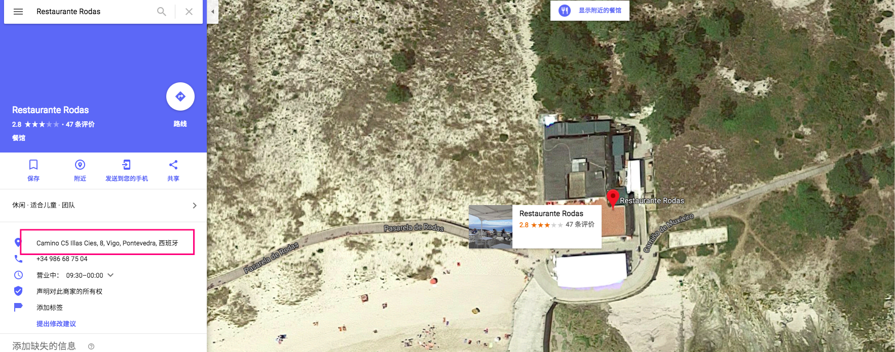

34. The hacker left a message for law enforcement on K3anu's system, what was it? (message only) **(yeah good luck finding this guy cops, great job picking an informant.. real winner with his grilled cheese)**
> 同样是查找黑客通过1234端口连接到线人的电脑进行端口过滤,`tcp.port == 1234` 然后追踪流, 在最下面有答案.
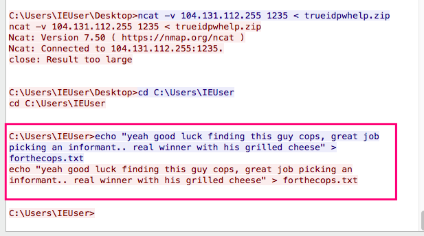

### 0x03 流量追根溯源结果阐述
> 线人先扫描黑客的网站主机, 通过然后通过ftp获取了一些文件, 之后线人被黑客发觉, 然后再线人的电脑植入后门, 再通过ncat传输了线人的一些文件, 之后又留给了线人一条信息. 再然后, 线人或许就die了. 真是一个忧伤的故事.

### 0x04 结语
> 这流量包只是作为追更溯源的一个引例, 很多通过流量追根溯源的知识点技能点都没有提及. 做流量分析最重要的是对网络协议的功能和格式有一定的了解掌握, 其次是对各种网络攻击行为的流量特征有把握, 还有很多应用层的应用的特征了解, 不仅如此, 还需要很多安全技能, 需要自己去领会. 最后推荐一本书:<<黑客大追踪>>, 个人认为在追根溯源方面非常好的一本书.
