## CTF 流量分析专项

### 0x01 涉及流量文件修复
> `pcapfix file.cap`

##### asis-ctf-quals-2014/forensic

地址： https://github.com/ctfs/write-ups-2014/tree/master/asis-ctf-quals-2014/forensic

把文件下载下来, 首先分析是什么文件

```
file forensic_150_d0a3ca9740270f3b30e56c9cfa3050f3

forensic_150_d0a3ca9740270f3b30e56c9cfa3050f3: xz compressed data
```

解压xz文件

```
7z x forensic_150_d0a3ca9740270f3b30e56c9cfa3050f3
```

查看解压出来的文件

```
file forensic_150_d0a3ca9740270f3b30e56c9cfa3050f3~
forensic_150_d0a3ca9740270f3b30e56c9cfa3050f3~: POSIX tar archive

解压: tar xf forensic_150_d0a3ca9740270f3b30e56c9cfa3050f3~
再file查看, 可知是一个流量包. wireshark打开之.
```

查看流量信息没发现太多有用信息, 尝试导出流量包里面的文件.
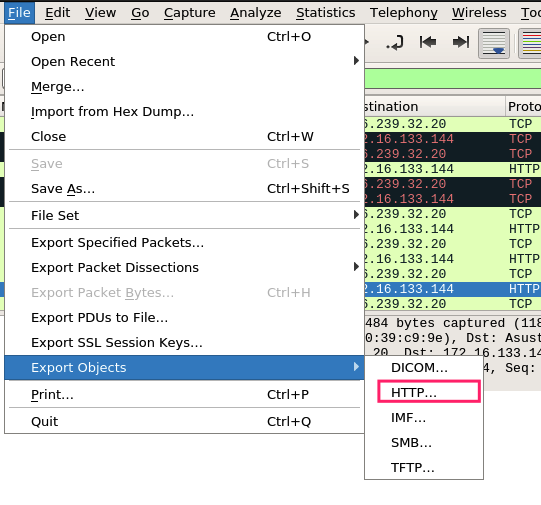
导出所有文件, 之后到导出的文件夹了查看文件,过滤一下可疑文件

```
file * | grep -v "HTML" | grep -v "ASCII" | grep -v "data"

此外还发现有一个名叫writeups的文件.
内容:  <!-- 'inhead' slots: support third party injection of things that
         go into the head -->
```
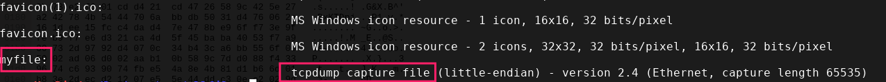

wireshark查看报错
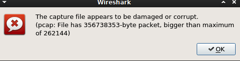

修复一下

```
pcapfix myfile
```

打开fixed_myfile

```
找出关键流的思路
statistics -> conversation -> 根据会话流量大小排序 -> 应用到筛选器. 之后follow流, 保存下来.
```
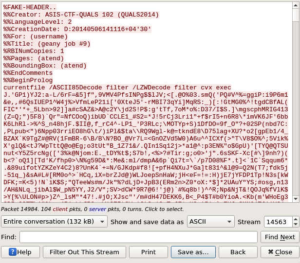

```
我的文件管理器自动的把它识别做MatLab的脚本文件. 实际上它是GhostScript, 执行之.

apt install ghostscript ghostscript-x

ghostscript saved_file 
```
flag就出来了
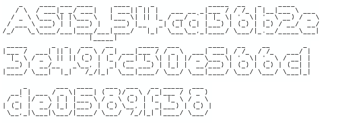

### 0x02 涉及协议分析

#### ssl相关
> 例题: [hack-dat-kiwi-ctf-2015:ssl-sniff-2](https://github.com/ctfs/write-ups-2015/tree/master/hack-dat-kiwi-ctf-2015/forensics/ssl-sniff-2) https://github.com/ctfs/write-ups-2015/tree/master/hack-dat-kiwi-ctf-2015/forensics/ssl-sniff-2

题目给了两个文件, 一个流量包, 一个server.key.insecure. 
解题:wireshark打开之,使用服务器私钥解密.
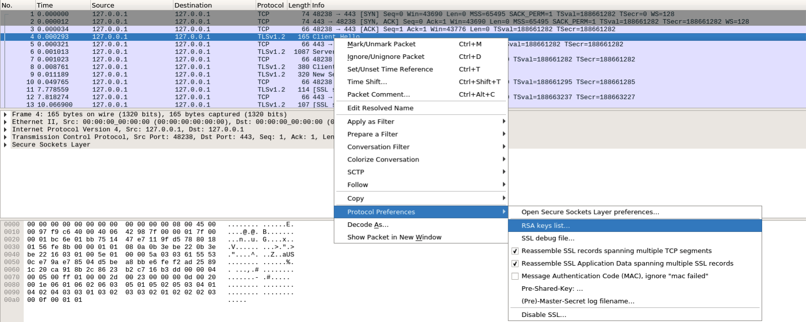  
点击`+ `, 点击`Key file`栏下小框,选择密钥文件.
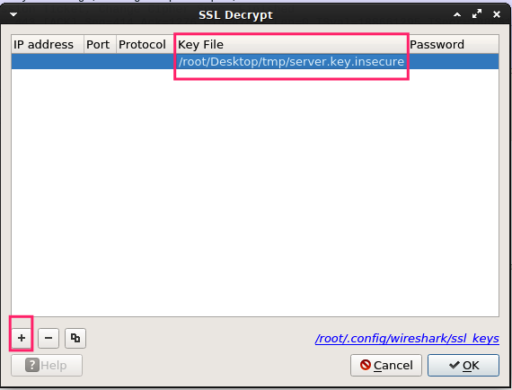
之后 `follow`一下ssl即可得到key`
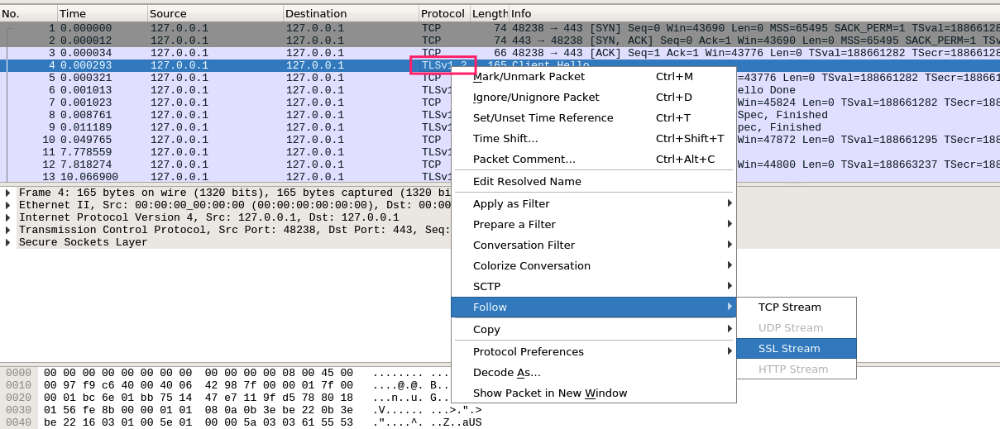

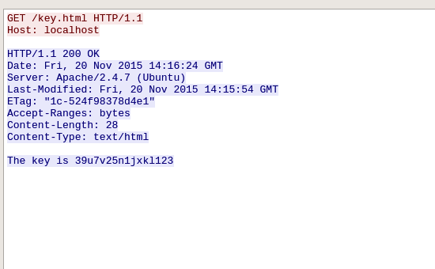


#### dns相关
> 例题: https://github.com/ctfs/write-ups-2017/tree/master/bsidessf-ctf-2017/forensics/dnscap-500

打开流量包整个都是都是dns查询信息, 而且query都是类似十六进制的A记录, 提取之, 根据文件头尾标志提取文件.

```
tshark -r dnscap.pcap -T fields -e dns.qry.name > hex
```
python做后续处理

```python
import re

find = []

with open('hex','rb') as f:
    for i in f:
        text = re.findall(r'([\w\.]+)\.skull',i)
        if text:
            tmp =  text[0].replace('.','')
            find.append(tmp[18:])
last = []

for i in find:
    if i not in last:
        last.append(i)


# print  ''.join(last)

data = ''.join(last)
# print data

data = ''.join(last)
data = re.findall(r'89504e(.+?)6082', data)
data = '89504e' + str(data) + '6082'
data = data.replace('[\'', '')
data_final = ''.join(data.replace('\']', ''))
print data_final

# Hex to binary
image = data_final.decode("hex")
# print image
# print image
# Create the image with the flag
f = open('./file.png', 'w')
f.write(image)
f.close()
print "[+] Result in: file.png"
```

#### WPA相关
> 例题: http://ctf5.shiyanbar.com/misc/shipin.cap
题目提示:

```
他在看什么视频，好像很好看，不知道是什么网站的。
还好我截取了他的数据包，找呀找。
key就是网站名称。格式ctf{key}
```
wireshark打开之, 发现802.11协议, 考虑破解密码.

```
aircrack-ng shipin.cap -w password.lst 
```

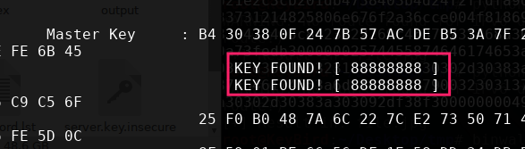

之后解密数据包

```
airdecap-ng -p 88888888 -b 00:1D:0F:5D:D0:EE -e 0719 shipin.cap
```

之后就wireshark 查看解密文件即可. 
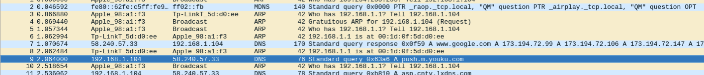


#### usb流量相关
> 只知道有个工具可以直接解密鼠标轨迹, 项目地址 https://github.com/WangYihang/UsbMiceDataHacker

##### Google CTF 2016 Forensic-200
> 题目: https://github.com/ctfs/write-ups-2016/tree/master/google-ctf-2016/forensics/for2-200

wireshark打开都是协议都是显示usb.
使用tshark提取usb.capdata字段数据

```
tshark -r google-2016-foremost2-capture.pcapng -T fields -e usb.capdata > data.txt
```

转化成坐标

```
awk -F: 'function comp(v){if(v>127)v-=256;return v}{x+=comp(strtonum("0x"$2));y+=comp(strtonum("0x"$3))}$1=="01"{print x,y}' data.txt > data2.tx

显示坐标
gnuplot
> plot "data2.txt"
```

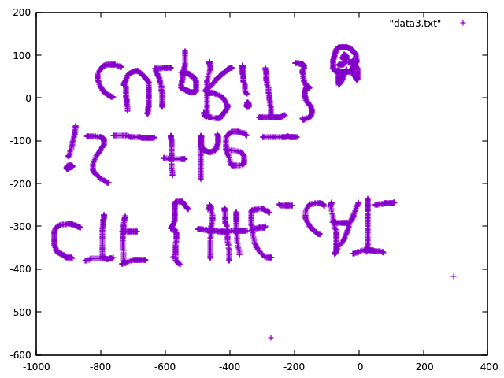

#### tcp.usg 紧急报文
> 例题: https://github.com/ctfs/write-ups-2016/blob/master/google-ctf-2016/forensics/a-cute-stegosaurus-100/stego.pcap
流量包中大量出现usg
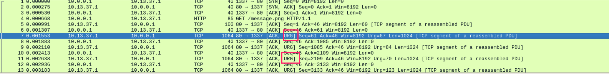
把字段提取出来

```
tshark -r stego.pcap -T fields -e  tcp.urgent_pointer|egrep -vi "^0$"|tr '\n' ','
然后利用python转ascii
```

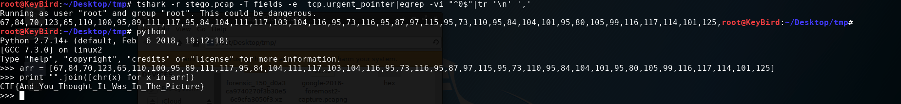

### 0x03 其它
+ strings 文件 | grep flag等文件数据
+ foremost xx.cap提取文件.
+ follow明文协议流量看到flag的.(ASCII看不出来可以尝试Hex查看)
+ 提取出来的文件是加密压缩包,另外在流量包里面找密码的.
+ 还有其它形式,想不起来了

本文参考: https://ctf-wiki.github.io/ctf-wiki/misc/traffic/introduction/
