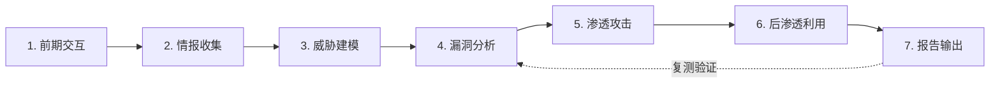
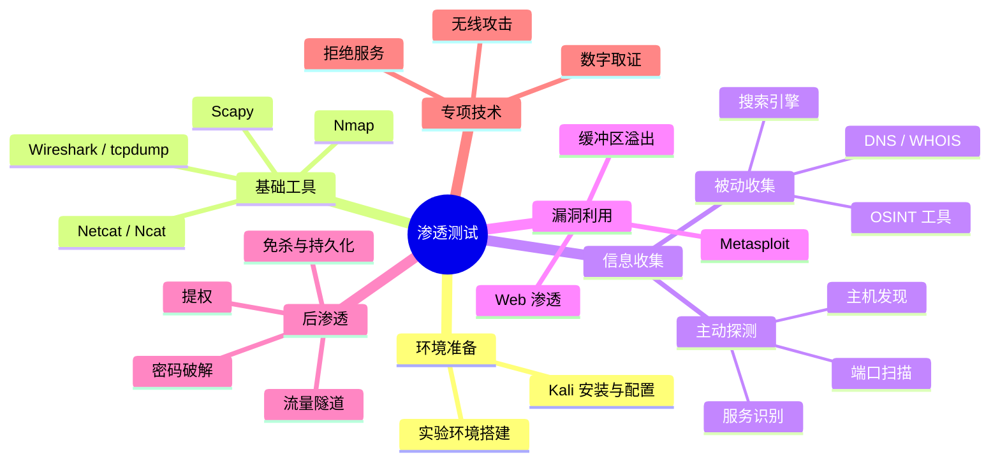

# Security Study Notes

---

#### 欢迎查看七分整理编写的安全相关笔记, 希望对你也能有一点点力量!

**希望在给自己做学习笔记的同时, 能给大家些许参考！**

### 笔记相关技术内容仅作为学习目的，请勿用于违法活动。

---

主要知识框架来自苑老师的 Kali 渗透测试课程（安全牛平台）。

GitHub 仓库地址: [https://github.com/Keybird0/Kali-learning-notes](https://github.com/Keybird0/Kali-learning-notes)

---

## 渗透测试方法论

| 阶段 | 说明 | 对应章节 |
|------|------|----------|
| 前期交互 | 确定范围、规则、授权 | 前言 / 法律法规 |
| 情报收集 | 被动收集 + 主动探测 | 信息收集 |
| 威胁建模 | 确定最可能的攻击路径 | 弱点扫描 |
| 漏洞分析 | 发现并验证漏洞 | Web渗透 / 缓冲区溢出 |
| 渗透攻击 | 实施漏洞利用 | Metasploit / 密码破解 |
| 后渗透利用 | 提权、横向移动、持久化 | 提权 / 免杀 / 流量隧道 |
| 报告输出 | 记录发现并提出修复建议 | 报告 |

## 知识体系总览

